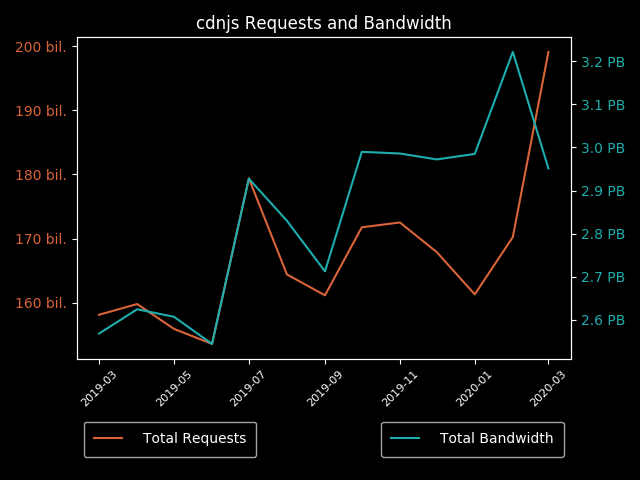

# cdnjs November 2020 Usage Stats

Information provided directly by Cloudflare for the `cdnjs.cloudflare.com` domain. ⛅️

- [Key highlights](#key-highlights)
  - [Library highlights](#library-highlights)
- [Total number of requests](#total-number-of-requests)
- [Total bandwidth usage](#total-bandwidth-usage)
- [Top 100 requested resources](#top-100-requested-resources)

## Key highlights

- cdnjs served **over 215 billion requests** in November 2020. 🖥
- cdnjs used **a huge consumption of 3.80 PB of data** to serve these requests this month. 📤
- That works out to **nearly 127 TB of data and 7.2 billion requests each day** (averaged). 🤯
- In November, **each request to cdnjs used only 17.63 KB of data on average**. 🔍
 
### Library highlights

- **WebFontLoader (1.6.28/webfontloader.js) returned to being the top asset on cdnjs this month with 7.97 billion
  requests for the single file.**
  - This single file accounts for nearly 4% of all cdnjs requests this month, and 1% of the total bandwidth consumed by
    the CDN in November. Compared to last month, this asset had a 194% increase in requests, similar to the jump seen
    between March and April this year with the same asset.
- **jQuery (3.3.1/jquery.min.js) moved down to being in second place with 5.95 billion requests this month, a 16%
  increase on the 5.11 billion seen last month.**
  - The remaining top assets also moved down one place this month, holding their relative positions but allowing for
    WebFontLoader to jump to number 1. FontAwesome (4.7.0/css/font-awesome.min.css) was in 3rd place, with jQuery
    MouseWheel (3.1.13/jquery.mousewheel.min.js) in 4th and FontAwesome's main font file
    (4.7.0/fonts/fontawesome-webfont.woff2) in 5th.
- **jQuery was also once again the top library overall based on the top 100 assets on the CDN, with over 14.5 billion
  requests to the 11 files in the top 100.**
  - jquery received 12.8 billion requests across the 11 files in the top 100 last month, putting it at a 15% increase
    in usage across the library in the last month. GSAP was also once again the second most popular library overall on
    cdnjs this month, receiving 13.4 billion requests across the 21 library files in the top 100 assets. 

| Requests & Bandwidth | Top 5 Resources |
|---|---|
|  |  |

## Total number of requests

> The first important stat that we are given is the total number of requests sent to cdnjs.cloudflare.com.
> 
> Cloudflare provides this number to us at a 1% sample for the whole month, giving 2,153,980,777 at 1%.

When multiplied up to 100%, this results in cdnjs serving approximately 215,398,077,700 requests in November.

**Over 215 billion requests or roughly 7.2 billion requests each day of November**. 📈\
This was a nice increase compared to October, going from 197 billion to 215 billion, a 9% increase in monthly requests.
This is still lower than the total requests seen in September, where we saw the anomalous 223 billion requests.
This appears to be a slightly larger increase in monthly requests than usual, perhaps in part due to the caching changes
 rolling out in Chrome with improved partitioning between every domain.

We can also compare this data to where we were a year ago: In November 2019 we received 173 billion requests during the
 month, putting us at a 25% increase year-on-year. 

## Total bandwidth usage

> Another great stat that Cloudflare has given us again is the bandwidth usage for the cdnjs.cloudflare.com domain.
> 
> This number, like total requests, is provided at a 1% sample for the month and in gigabytes: 37,967.05 GB.

When multiplied up to be 100%, this produces the estimate of 3,796,705.0 GB of bandwidth used for this month by
 cdnjs, or 3.80 PB.

**This gives cdnjs a huge bandwidth consumption of 3.80 petabytes of data for requests this month**. 🤯\
In October we saw 3.64 PB, giving a 4% increase in bandwidth usage this month. Another way to look at this is via the
 average bandwidth consumption per request, which decreased by 5% this month, dropping down to 17.63 KB from 18.51 KB.
Comparing this to one year ago, we consumed exactly 3 PB of bandwidth in November 2019, resulting in roughly a 25%
 increase, matching the year-on-year growth seen in requests.

## Top 100 requested resources

> These are provided at a 1% sample for the whole of November.
> Bandwidth is measured in gigabytes.
> This data, as well as previous months' data, is available in the SQLite data.db file.

| # | Requests | Bandwidth | cdnjs Resource URL |
|---|----------|-----------|--------------------|
| 1   | 79,679,440 |   429.77 | [cdnjs.cloudflare.com/ajax/libs/webfont/1.6.28/webfontloader.js](https://cdnjs.cloudflare.com/ajax/libs/webfont/1.6.28/webfontloader.js)                                                   |
| 2   | 59,566,185 | 3,525.47 | [cdnjs.cloudflare.com/ajax/libs/jquery/3.3.1/jquery.min.js](https://cdnjs.cloudflare.com/ajax/libs/jquery/3.3.1/jquery.min.js)                                                             |
| 3   | 52,308,946 |   332.54 | [cdnjs.cloudflare.com/ajax/libs/font-awesome/4.7.0/css/font-awesome.min.css](https://cdnjs.cloudflare.com/ajax/libs/font-awesome/4.7.0/css/font-awesome.min.css)                           |
| 4   | 39,554,199 |    80.94 | [cdnjs.cloudflare.com/ajax/libs/jquery-mousewheel/3.1.13/jquery.mousewheel.min.js](https://cdnjs.cloudflare.com/ajax/libs/jquery-mousewheel/3.1.13/jquery.mousewheel.min.js)               |
| 5   | 38,811,794 | 2,685.56 | [cdnjs.cloudflare.com/ajax/libs/font-awesome/4.7.0/fonts/fontawesome-webfont.woff2](https://cdnjs.cloudflare.com/ajax/libs/font-awesome/4.7.0/fonts/fontawesome-webfont.woff2)             |
| 6   | 23,887,099 |   644.75 | [cdnjs.cloudflare.com/ajax/libs/jquery/3.4.1/jquery.min.js](https://cdnjs.cloudflare.com/ajax/libs/jquery/3.4.1/jquery.min.js)                                                             |
| 7   | 19,603,448 |   608.45 | [cdnjs.cloudflare.com/ajax/libs/gsap/latest/TweenMax.min.js](https://cdnjs.cloudflare.com/ajax/libs/gsap/latest/TweenMax.min.js)                                                           |
| 8   | 18,473,772 |    29.20 | [cdnjs.cloudflare.com/ajax/libs/jquery-cookie/1.4.1/jquery.cookie.min.js](https://cdnjs.cloudflare.com/ajax/libs/jquery-cookie/1.4.1/jquery.cookie.min.js)                                 |
| 9   | 12,950,623 |    82.90 | [cdnjs.cloudflare.com/ajax/libs/cookieconsent2/3.0.3/cookieconsent.min.js](https://cdnjs.cloudflare.com/ajax/libs/cookieconsent2/3.0.3/cookieconsent.min.js)                               |
| 10  | 12,504,078 |    90.65 | [cdnjs.cloudflare.com/ajax/libs/popper.js/1.14.7/umd/popper.min.js](https://cdnjs.cloudflare.com/ajax/libs/popper.js/1.14.7/umd/popper.min.js)                                             |
| 11  | 11,809,682 |    22.95 | [cdnjs.cloudflare.com/ajax/libs/cookieconsent2/3.0.3/cookieconsent.min.css](https://cdnjs.cloudflare.com/ajax/libs/cookieconsent2/3.0.3/cookieconsent.min.css)                             |
| 12  | 11,790,640 |   407.63 | [cdnjs.cloudflare.com/ajax/libs/gsap/2.1.3/TweenMax.min.js](https://cdnjs.cloudflare.com/ajax/libs/gsap/2.1.3/TweenMax.min.js)                                                             |
| 13  | 11,319,519 |   378.51 | [cdnjs.cloudflare.com/ajax/libs/gsap/2.0.2/TweenMax.min.js](https://cdnjs.cloudflare.com/ajax/libs/gsap/2.0.2/TweenMax.min.js)                                                             |
| 14  | 10,808,228 |    51.44 | [cdnjs.cloudflare.com/ajax/libs/modernizr/2.8.3/modernizr.min.js](https://cdnjs.cloudflare.com/ajax/libs/modernizr/2.8.3/modernizr.min.js)                                                 |
| 15  | 10,791,081 |   320.26 | [cdnjs.cloudflare.com/ajax/libs/jquery/1.12.4/jquery.min.js](https://cdnjs.cloudflare.com/ajax/libs/jquery/1.12.4/jquery.min.js)                                                           |
| 16  | 10,483,974 |   284.31 | [cdnjs.cloudflare.com/ajax/libs/jquery/3.5.1/jquery.min.js](https://cdnjs.cloudflare.com/ajax/libs/jquery/3.5.1/jquery.min.js)                                                             |
| 17  | 9,356,283  |    54.61 | [cdnjs.cloudflare.com/ajax/libs/postscribe/2.0.8/postscribe.min.js](https://cdnjs.cloudflare.com/ajax/libs/postscribe/2.0.8/postscribe.min.js)                                             |
| 18  | 8,802,622  |   229.63 | [cdnjs.cloudflare.com/ajax/libs/jquery/2.2.4/jquery.min.js](https://cdnjs.cloudflare.com/ajax/libs/jquery/2.2.4/jquery.min.js)                                                             |
| 19  | 8,558,178  |    58.15 | [cdnjs.cloudflare.com/ajax/libs/popper.js/1.12.9/umd/popper.min.js](https://cdnjs.cloudflare.com/ajax/libs/popper.js/1.12.9/umd/popper.min.js)                                             |
| 20  | 8,508,505  |    60.02 | [cdnjs.cloudflare.com/ajax/libs/popper.js/1.14.3/umd/popper.min.js](https://cdnjs.cloudflare.com/ajax/libs/popper.js/1.14.3/umd/popper.min.js)                                             |
| 21  | 8,132,143  |   177.66 | [cdnjs.cloudflare.com/ajax/libs/gsap/3.5.1/gsap.min.js](https://cdnjs.cloudflare.com/ajax/libs/gsap/3.5.1/gsap.min.js)                                                                     |
| 22  | 8,129,822  |   215.10 | [cdnjs.cloudflare.com/ajax/libs/jquery/3.2.1/jquery.min.js](https://cdnjs.cloudflare.com/ajax/libs/jquery/3.2.1/jquery.min.js)                                                             |
| 23  | 8,069,128  |    16.67 | [cdnjs.cloudflare.com/ajax/libs/jquery-mousewheel/3.1.12/jquery.mousewheel.min.js](https://cdnjs.cloudflare.com/ajax/libs/jquery-mousewheel/3.1.12/jquery.mousewheel.min.js)               |
| 24  | 7,828,003  |   264.11 | [cdnjs.cloudflare.com/ajax/libs/gsap/1.19.1/TweenMax.min.js](https://cdnjs.cloudflare.com/ajax/libs/gsap/1.19.1/TweenMax.min.js)                                                           |
| 25  | 7,774,888  |    51.33 | [cdnjs.cloudflare.com/ajax/libs/cookieconsent2/3.1.0/cookieconsent.min.js](https://cdnjs.cloudflare.com/ajax/libs/cookieconsent2/3.1.0/cookieconsent.min.js)                               |
| 26  | 7,751,301  |    10.89 | [cdnjs.cloudflare.com/ajax/libs/slick-carousel/1.6.0/slick.min.css](https://cdnjs.cloudflare.com/ajax/libs/slick-carousel/1.6.0/slick.min.css)                                             |
| 27  | 7,734,881  |    78.28 | [cdnjs.cloudflare.com/ajax/libs/slick-carousel/1.9.0/slick.min.js](https://cdnjs.cloudflare.com/ajax/libs/slick-carousel/1.9.0/slick.min.js)                                               |
| 28  | 7,659,430  |    14.40 | [cdnjs.cloudflare.com/ajax/libs/gsap/1.18.5/plugins/TextPlugin.min.js](https://cdnjs.cloudflare.com/ajax/libs/gsap/1.18.5/plugins/TextPlugin.min.js)                                       |
| 29  | 7,384,589  |    14.44 | [cdnjs.cloudflare.com/ajax/libs/cookieconsent2/3.1.0/cookieconsent.min.css](https://cdnjs.cloudflare.com/ajax/libs/cookieconsent2/3.1.0/cookieconsent.min.css)                             |
| 30  | 7,176,391  |    88.94 | [cdnjs.cloudflare.com/ajax/libs/lodash.js/4.17.11/lodash.core.min.js](https://cdnjs.cloudflare.com/ajax/libs/lodash.js/4.17.11/lodash.core.min.js)                                         |
| 31  | 6,855,758  |    29.72 | [cdnjs.cloudflare.com/ajax/libs/animate.css/3.5.2/animate.min.css](https://cdnjs.cloudflare.com/ajax/libs/animate.css/3.5.2/animate.min.css)                                               |
| 32  | 6,792,591  |     5.08 | [cdnjs.cloudflare.com/ajax/libs/tinymce/3.5.8/plugins/example/langs/en.min.js](https://cdnjs.cloudflare.com/ajax/libs/tinymce/3.5.8/plugins/example/langs/en.min.js)                       |
| 33  | 6,775,535  |   485.87 | [cdnjs.cloudflare.com/ajax/libs/jqueryui/1.12.1/jquery-ui.min.js](https://cdnjs.cloudflare.com/ajax/libs/jqueryui/1.12.1/jquery-ui.min.js)                                                 |
| 34  | 6,488,248  |    16.63 | [cdnjs.cloudflare.com/ajax/libs/cookieconsent2/1.0.9/cookieconsent.min.js](https://cdnjs.cloudflare.com/ajax/libs/cookieconsent2/1.0.9/cookieconsent.min.js)                               |
| 35  | 6,468,961  |   451.73 | [cdnjs.cloudflare.com/ajax/libs/font-awesome/5.11.2/webfonts/fa-solid-900.woff2](https://cdnjs.cloudflare.com/ajax/libs/font-awesome/5.11.2/webfonts/fa-solid-900.woff2)                   |
| 36  | 6,094,866  |   143.50 | [cdnjs.cloudflare.com/ajax/libs/jquery/2.1.4/jquery.min.js](https://cdnjs.cloudflare.com/ajax/libs/jquery/2.1.4/jquery.min.js)                                                             |
| 37  | 6,091,975  |    40.64 | [cdnjs.cloudflare.com/ajax/libs/font-awesome/4.7.0/css/font-awesome.css](https://cdnjs.cloudflare.com/ajax/libs/font-awesome/4.7.0/css/font-awesome.css)                                   |
| 38  | 6,020,942  |   154.51 | [cdnjs.cloudflare.com/ajax/libs/jquery/2.1.3/jquery.min.js](https://cdnjs.cloudflare.com/ajax/libs/jquery/2.1.3/jquery.min.js)                                                             |
| 39  | 5,984,346  |   197.34 | [cdnjs.cloudflare.com/ajax/libs/gsap/1.20.2/TweenMax.min.js](https://cdnjs.cloudflare.com/ajax/libs/gsap/1.20.2/TweenMax.min.js)                                                           |
| 40  | 5,814,624  |    58.12 | [cdnjs.cloudflare.com/ajax/libs/fingerprintjs2/2.1.0/fingerprint2.min.js](https://cdnjs.cloudflare.com/ajax/libs/fingerprintjs2/2.1.0/fingerprint2.min.js)                                 |
| 41  | 5,574,192  |   118.09 | [cdnjs.cloudflare.com/ajax/libs/gsap/3.2.6/gsap.min.js](https://cdnjs.cloudflare.com/ajax/libs/gsap/3.2.6/gsap.min.js)                                                                     |
| 42  | 5,495,417  |   558.71 | [cdnjs.cloudflare.com/ajax/libs/video.js/7.7.5/video.min.js](https://cdnjs.cloudflare.com/ajax/libs/video.js/7.7.5/video.min.js)                                                           |
| 43  | 5,492,296  |    15.30 | [cdnjs.cloudflare.com/ajax/libs/spin.js/2.3.2/spin.min.js](https://cdnjs.cloudflare.com/ajax/libs/spin.js/2.3.2/spin.min.js)                                                               |
| 44  | 5,395,845  |     7.65 | [cdnjs.cloudflare.com/ajax/libs/slick-carousel/1.9.0/slick.min.css](https://cdnjs.cloudflare.com/ajax/libs/slick-carousel/1.9.0/slick.min.css)                                             |
| 45  | 5,322,915  |    31.86 | [cdnjs.cloudflare.com/ajax/libs/underscore.js/1.8.3/underscore-min.js](https://cdnjs.cloudflare.com/ajax/libs/underscore.js/1.8.3/underscore-min.js)                                       |
| 46  | 5,289,585  |    20.65 | [cdnjs.cloudflare.com/ajax/libs/animate.css/3.7.2/animate.min.css](https://cdnjs.cloudflare.com/ajax/libs/animate.css/3.7.2/animate.min.css)                                               |
| 47  | 5,282,666  |   182.78 | [cdnjs.cloudflare.com/ajax/libs/gsap/2.1.2/TweenMax.min.js](https://cdnjs.cloudflare.com/ajax/libs/gsap/2.1.2/TweenMax.min.js)                                                             |
| 48  | 5,149,909  |    48.82 | [cdnjs.cloudflare.com/ajax/libs/video.js/7.7.5/video-js.min.css](https://cdnjs.cloudflare.com/ajax/libs/video.js/7.7.5/video-js.min.css)                                                   |
| 49  | 5,029,029  |    53.32 | [cdnjs.cloudflare.com/ajax/libs/OwlCarousel2/2.3.4/owl.carousel.min.js](https://cdnjs.cloudflare.com/ajax/libs/OwlCarousel2/2.3.4/owl.carousel.min.js)                                     |
| 50  | 5,026,769  |   472.76 | [cdnjs.cloudflare.com/ajax/libs/gsap/1.14.2/TweenMax.min.js](https://cdnjs.cloudflare.com/ajax/libs/gsap/1.14.2/TweenMax.min.js)                                                           |
| 51  | 4,962,951  |     8.18 | [cdnjs.cloudflare.com/ajax/libs/slick-carousel/1.6.0/slick-theme.min.css](https://cdnjs.cloudflare.com/ajax/libs/slick-carousel/1.6.0/slick-theme.min.css)                                 |
| 52  | 4,901,741  |   140.16 | [cdnjs.cloudflare.com/ajax/libs/jquery/1.9.1/jquery.min.js](https://cdnjs.cloudflare.com/ajax/libs/jquery/1.9.1/jquery.min.js)                                                             |
| 53  | 4,899,786  |    44.91 | [cdnjs.cloudflare.com/ajax/libs/twitter-bootstrap/3.3.7/js/bootstrap.min.js](https://cdnjs.cloudflare.com/ajax/libs/twitter-bootstrap/3.3.7/js/bootstrap.min.js)                           |
| 54  | 4,880,729  |   160.01 | [cdnjs.cloudflare.com/ajax/libs/gsap/1.20.5/TweenMax.min.js](https://cdnjs.cloudflare.com/ajax/libs/gsap/1.20.5/TweenMax.min.js)                                                           |
| 55  | 4,851,772  |    68.48 | [cdnjs.cloudflare.com/ajax/libs/gsap/latest/plugins/CSSPlugin.min.js](https://cdnjs.cloudflare.com/ajax/libs/gsap/latest/plugins/CSSPlugin.min.js)                                         |
| 56  | 4,809,781  |    82.31 | [cdnjs.cloudflare.com/ajax/libs/mathjax/2.7.1/MathJax.js](https://cdnjs.cloudflare.com/ajax/libs/mathjax/2.7.1/MathJax.js)                                                                 |
| 57  | 4,738,813  |   158.73 | [cdnjs.cloudflare.com/ajax/libs/gsap/1.20.3/TweenMax.min.js](https://cdnjs.cloudflare.com/ajax/libs/gsap/1.20.3/TweenMax.min.js)                                                           |
| 58  | 4,688,973  |    79.87 | [cdnjs.cloudflare.com/ajax/libs/mathjax/2.7.5/MathJax.js](https://cdnjs.cloudflare.com/ajax/libs/mathjax/2.7.5/MathJax.js)                                                                 |
| 59  | 4,604,643  |    80.93 | [cdnjs.cloudflare.com/ajax/libs/twitter-bootstrap/3.3.7/css/bootstrap.min.css](https://cdnjs.cloudflare.com/ajax/libs/twitter-bootstrap/3.3.7/css/bootstrap.min.css)                       |
| 60  | 4,598,659  |     6.91 | [cdnjs.cloudflare.com/ajax/libs/jqueryui-touch-punch/0.2.3/jquery.ui.touch-punch.min.js](https://cdnjs.cloudflare.com/ajax/libs/jqueryui-touch-punch/0.2.3/jquery.ui.touch-punch.min.js)   |
| 61  | 4,396,944  |    95.50 | [cdnjs.cloudflare.com/ajax/libs/gsap/3.4.2/gsap.min.js](https://cdnjs.cloudflare.com/ajax/libs/gsap/3.4.2/gsap.min.js)                                                                     |
| 62  | 4,352,925  |     7.56 | [cdnjs.cloudflare.com/ajax/libs/js-cookie/2.2.0/js.cookie.min.js](https://cdnjs.cloudflare.com/ajax/libs/js-cookie/2.2.0/js.cookie.min.js)                                                 |
| 63  | 4,314,924  |     8.04 | [cdnjs.cloudflare.com/ajax/libs/OwlCarousel2/2.3.4/assets/owl.carousel.min.css](https://cdnjs.cloudflare.com/ajax/libs/OwlCarousel2/2.3.4/assets/owl.carousel.min.css)                     |
| 64  | 4,293,094  |    45.12 | [cdnjs.cloudflare.com/ajax/libs/font-awesome/5.11.2/css/all.min.css](https://cdnjs.cloudflare.com/ajax/libs/font-awesome/5.11.2/css/all.min.css)                                           |
| 65  | 4,257,858  |    18.77 | [cdnjs.cloudflare.com/ajax/libs/jquery-migrate/1.4.1/jquery-migrate.min.js](https://cdnjs.cloudflare.com/ajax/libs/jquery-migrate/1.4.1/jquery-migrate.min.js)                             |
| 66  | 4,193,272  |    40.91 | [cdnjs.cloudflare.com/ajax/libs/slick-carousel/1.8.1/slick.min.js](https://cdnjs.cloudflare.com/ajax/libs/slick-carousel/1.8.1/slick.min.js)                                               |
| 67  | 4,189,266  |   112.13 | [cdnjs.cloudflare.com/ajax/libs/jquery/3.1.1/jquery.min.js](https://cdnjs.cloudflare.com/ajax/libs/jquery/3.1.1/jquery.min.js)                                                             |
| 68  | 4,161,142  |   143.23 | [cdnjs.cloudflare.com/ajax/libs/gsap/1.19.0/TweenMax.min.js](https://cdnjs.cloudflare.com/ajax/libs/gsap/1.19.0/TweenMax.min.js)                                                           |
| 69  | 4,123,655  |    11.16 | [cdnjs.cloudflare.com/ajax/libs/gsap/latest/easing/EasePack.min.js](https://cdnjs.cloudflare.com/ajax/libs/gsap/latest/easing/EasePack.min.js)                                             |
| 70  | 4,107,770  |    47.22 | [cdnjs.cloudflare.com/ajax/libs/font-awesome/5.13.0/css/all.min.css](https://cdnjs.cloudflare.com/ajax/libs/font-awesome/5.13.0/css/all.min.css)                                           |
| 71  | 4,069,082  |    23.42 | [cdnjs.cloudflare.com/ajax/libs/font-awesome/4.4.0/css/font-awesome.min.css](https://cdnjs.cloudflare.com/ajax/libs/font-awesome/4.4.0/css/font-awesome.min.css)                           |
| 72  | 3,983,257  |    22.98 | [cdnjs.cloudflare.com/ajax/libs/bxslider/4.1.2/jquery.bxslider.min.js](https://cdnjs.cloudflare.com/ajax/libs/bxslider/4.1.2/jquery.bxslider.min.js)                                       |
| 73  | 3,916,043  |    82.41 | [cdnjs.cloudflare.com/ajax/libs/gsap/3.2.4/gsap.min.js](https://cdnjs.cloudflare.com/ajax/libs/gsap/3.2.4/gsap.min.js)                                                                     |
| 74  | 3,848,745  |   110.18 | [cdnjs.cloudflare.com/ajax/libs/Swiper/4.5.0/js/swiper.min.js](https://cdnjs.cloudflare.com/ajax/libs/Swiper/4.5.0/js/swiper.min.js)                                                       |
| 75  | 3,819,151  |   126.92 | [cdnjs.cloudflare.com/ajax/libs/gsap/1.20.4/TweenMax.min.js](https://cdnjs.cloudflare.com/ajax/libs/gsap/1.20.4/TweenMax.min.js)                                                           |
| 76  | 3,790,010  |    19.43 | [cdnjs.cloudflare.com/ajax/libs/crypto-js/3.1.2/rollups/aes.js](https://cdnjs.cloudflare.com/ajax/libs/crypto-js/3.1.2/rollups/aes.js)                                                     |
| 77  | 3,724,598  |     7.90 | [cdnjs.cloudflare.com/ajax/libs/jquery.lazyload/1.9.1/jquery.lazyload.min.js](https://cdnjs.cloudflare.com/ajax/libs/jquery.lazyload/1.9.1/jquery.lazyload.min.js)                         |
| 78  | 3,701,342  |     6.14 | [cdnjs.cloudflare.com/ajax/libs/slick-carousel/1.9.0/slick-theme.min.css](https://cdnjs.cloudflare.com/ajax/libs/slick-carousel/1.9.0/slick-theme.min.css)                                 |
| 79  | 3,690,118  |    12.73 | [cdnjs.cloudflare.com/ajax/libs/Swiper/4.5.0/css/swiper.min.css](https://cdnjs.cloudflare.com/ajax/libs/Swiper/4.5.0/css/swiper.min.css)                                                   |
| 80  | 3,651,113  |    40.06 | [cdnjs.cloudflare.com/ajax/libs/font-awesome/5.11.2/css/all.css](https://cdnjs.cloudflare.com/ajax/libs/font-awesome/5.11.2/css/all.css)                                                   |
| 81  | 3,632,807  |    15.17 | [cdnjs.cloudflare.com/ajax/libs/videojs-youtube/2.6.0/Youtube.min.js](https://cdnjs.cloudflare.com/ajax/libs/videojs-youtube/2.6.0/Youtube.min.js)                                         |
| 82  | 3,621,029  |   115.13 | [cdnjs.cloudflare.com/ajax/libs/gsap/1.18.2/TweenMax.min.js](https://cdnjs.cloudflare.com/ajax/libs/gsap/1.18.2/TweenMax.min.js)                                                           |
| 83  | 3,594,756  |     8.45 | [cdnjs.cloudflare.com/ajax/libs/jquery-cookie/1.4.1/jquery.cookie.js](https://cdnjs.cloudflare.com/ajax/libs/jquery-cookie/1.4.1/jquery.cookie.js)                                         |
| 84  | 3,555,069  |     5.98 | [cdnjs.cloudflare.com/ajax/libs/normalize/3.0.3/normalize.min.css](https://cdnjs.cloudflare.com/ajax/libs/normalize/3.0.3/normalize.min.css)                                               |
| 85  | 3,554,456  |    32.86 | [cdnjs.cloudflare.com/ajax/libs/gsap/latest/TweenLite.min.js](https://cdnjs.cloudflare.com/ajax/libs/gsap/latest/TweenLite.min.js)                                                         |
| 86  | 3,530,324  |     7.96 | [cdnjs.cloudflare.com/ajax/libs/magnific-popup.js/1.1.0/magnific-popup.min.css](https://cdnjs.cloudflare.com/ajax/libs/magnific-popup.js/1.1.0/magnific-popup.min.css)                     |
| 87  | 3,524,449  |     8.56 | [cdnjs.cloudflare.com/ajax/libs/jquery-easing/1.3/jquery.easing.min.js](https://cdnjs.cloudflare.com/ajax/libs/jquery-easing/1.3/jquery.easing.min.js)                                     |
| 88  | 3,518,872  |    13.22 | [cdnjs.cloudflare.com/ajax/libs/clipboard.js/2.0.0/clipboard.min.js](https://cdnjs.cloudflare.com/ajax/libs/clipboard.js/2.0.0/clipboard.min.js)                                           |
| 89  | 3,459,836  |    47.66 | [cdnjs.cloudflare.com/ajax/libs/moment.js/2.22.2/moment.min.js](https://cdnjs.cloudflare.com/ajax/libs/moment.js/2.22.2/moment.min.js)                                                     |
| 90  | 3,459,082  |    38.93 | [cdnjs.cloudflare.com/ajax/libs/jqueryui/1.12.1/jquery-ui.min.css](https://cdnjs.cloudflare.com/ajax/libs/jqueryui/1.12.1/jquery-ui.min.css)                                               |
| 91  | 3,431,172  |    69.40 | [cdnjs.cloudflare.com/ajax/libs/gsap/3.0.5/gsap.min.js](https://cdnjs.cloudflare.com/ajax/libs/gsap/3.0.5/gsap.min.js)                                                                     |
| 92  | 3,274,098  |    48.48 | [cdnjs.cloudflare.com/ajax/libs/moment.js/2.24.0/moment.min.js](https://cdnjs.cloudflare.com/ajax/libs/moment.js/2.24.0/moment.min.js)                                                     |
| 93  | 3,273,813  |   240.11 | [cdnjs.cloudflare.com/ajax/libs/font-awesome/5.13.0/webfonts/fa-solid-900.woff2](https://cdnjs.cloudflare.com/ajax/libs/font-awesome/5.13.0/webfonts/fa-solid-900.woff2)                   |
| 94  | 3,270,882  |     8.43 | [cdnjs.cloudflare.com/ajax/libs/cookieconsent2/1.0.10/cookieconsent.min.js](https://cdnjs.cloudflare.com/ajax/libs/cookieconsent2/1.0.10/cookieconsent.min.js)                             |
| 95  | 3,268,027  |    13.59 | [cdnjs.cloudflare.com/ajax/libs/json3/3.3.2/json3.min.js](https://cdnjs.cloudflare.com/ajax/libs/json3/3.3.2/json3.min.js)                                                                 |
| 96  | 3,169,875  |    18.15 | [cdnjs.cloudflare.com/ajax/libs/jquery.form/3.32/jquery.form.min.js](https://cdnjs.cloudflare.com/ajax/libs/jquery.form/3.32/jquery.form.min.js)                                           |
| 97  | 3,159,676  |    23.31 | [cdnjs.cloudflare.com/ajax/libs/magnific-popup.js/1.1.0/jquery.magnific-popup.min.js](https://cdnjs.cloudflare.com/ajax/libs/magnific-popup.js/1.1.0/jquery.magnific-popup.min.js)         |
| 98  | 3,072,030  |    16.52 | [cdnjs.cloudflare.com/ajax/libs/iframe-resizer/3.5.15/iframeResizer.contentWindow.min.js](https://cdnjs.cloudflare.com/ajax/libs/iframe-resizer/3.5.15/iframeResizer.contentWindow.min.js) |
| 99  | 3,030,018  |    89.79 | [cdnjs.cloudflare.com/ajax/libs/jquery/1.11.1/jquery.min.js](https://cdnjs.cloudflare.com/ajax/libs/jquery/1.11.1/jquery.min.js)                                                           |
| 100 | 2,986,440  |    18.38 | [cdnjs.cloudflare.com/ajax/libs/font-awesome/4.6.3/css/font-awesome.min.css](https://cdnjs.cloudflare.com/ajax/libs/font-awesome/4.6.3/css/font-awesome.min.css)                           |

Author: [Matt (IPv4) Cowley](https://mattcowley.co.uk) - If there are any errors, please let me know and I will
 endeavour to correct them.
