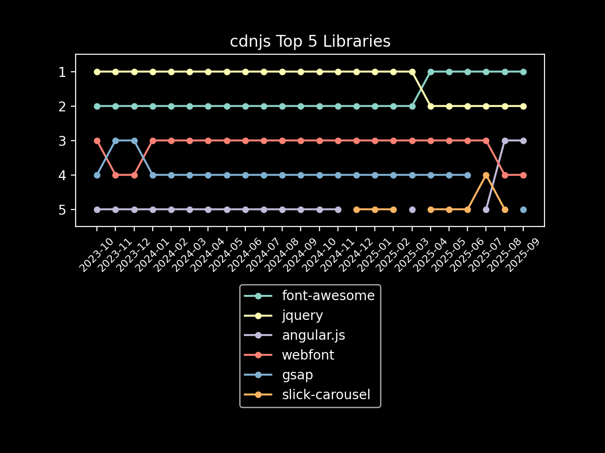

# cdnjs June 2021 Usage Stats

Information provided directly by Cloudflare for the `cdnjs.cloudflare.com` domain. ⛅️

- [Key highlights](#key-highlights)
  - [Library highlights](#library-highlights)
- [Total number of requests](#total-number-of-requests)
- [Total bandwidth usage](#total-bandwidth-usage)
- [Top 100 requested resources](#top-100-requested-resources)

## Key highlights

- cdnjs served **over 205 billion requests** in June 2021. 🖥
- cdnjs used **a huge consumption of 3.80 PB of data** to serve these requests this month. 📤
- That's **nearly 127 terabytes of data and 6.8 billion requests every day** (averaged). 🤯
- In June, **each request to cdnjs used only 18.53 KB of data on average**. 🔍
 
### Library highlights

- **The trend continued once again this month with the top five resources on the CDN remaining the same, for the seventh
  month in a row**
  - WebFontLoader (1.6.28/webfontloader.js) takes the lead with 7.5 billion requests this month, followed by jQuery
    (3.3.1/jquery.min.js) and then FontAwesome's main CSS (4.7.0/css/font-awesome.min.css) and font file
    (4.7.0/fonts/fontawesome-webfont.woff2), with jQuery MouseWheel (3.1.13/jquery.mousewheel.min.js) taking fifth place.
- **The top libraries overall in the top 100 assets also remained the same this month, for the third month running.**
  - jQuery took first place overall in the top 100 assets this month, with 14.5 billion requests to its 11 files in the
    top 100, followed by FontAwesome with 13.4 billion requests. In third was GSAP, with WebFontLoader and jQuery
    MouseWheel taking fourth and fifth respectively.

| Total Requests & Bandwidth | Avg. Daily Requests & Bandwidth |
|---|---|
|  |  |

| Top 5 Resources | Top 5 Libraries |
|---|---|
|  |  |

## Total number of requests

> The first important stat that we are given is the total number of requests sent to cdnjs.cloudflare.com.
> 
> Cloudflare provides this number to us at a 1% sample for the whole month, giving 2,050,986,181 at 1%.

When multiplied up to 100%, this results in cdnjs serving approximately 205,098,618,100 requests in June.

**Over 205 billion requests or roughly 6.8 billion requests every day of June**. 📈\
cdnjs saw a drop in overall requests to the CDN this month, matching the trend that can be seen since the start of the
year when comparing average daily requests each month. In May cdnjs received an average of 6.9 billion requests per day,
and this dropped to 6.8 billion in June.

## Total bandwidth usage

> Another great stat that Cloudflare has given us again is the bandwidth usage for the cdnjs.cloudflare.com domain.
> 
> This number, like total requests, is provided at a 1% sample for the month and in gigabytes: 37,997.97 GB.

When multiplied up to be 100%, this produces the estimate of 3,799,797.0 GB of bandwidth used for this month by
 cdnjs, or 3.80 PB.

**This gives cdnjs a huge bandwidth consumption of 3.80 petabytes of data for requests this month**. 🤯\
Although requests to cdnjs dropped this month, the average daily bandwidth consumed this month remained almost identical
to what was seen in May, with an average of 126.6 TB each day. The overall bandwidth consumed did dip this month, from
3.93 PB to 3.80 PB, but this is to be expected as June was a shorter month.

## Top 100 requested resources

> These are provided at a 1% sample for the whole of June.
> Bandwidth is measured in gigabytes.
> This data, as well as previous months' data, is available in the SQLite data.db file.

| # | Requests | Bandwidth | cdnjs Resource URL |
|---|----------|-----------|--------------------|
| 1   | 75,340,382 |   412.85 | [cdnjs.cloudflare.com/ajax/libs/webfont/1.6.28/webfontloader.js](https://cdnjs.cloudflare.com/ajax/libs/webfont/1.6.28/webfontloader.js)                                                 |
| 2   | 56,484,464 | 3,564.63 | [cdnjs.cloudflare.com/ajax/libs/jquery/3.3.1/jquery.min.js](https://cdnjs.cloudflare.com/ajax/libs/jquery/3.3.1/jquery.min.js)                                                           |
| 3   | 53,958,806 |   345.94 | [cdnjs.cloudflare.com/ajax/libs/font-awesome/4.7.0/css/font-awesome.min.css](https://cdnjs.cloudflare.com/ajax/libs/font-awesome/4.7.0/css/font-awesome.min.css)                         |
| 4   | 38,758,489 | 2,705.32 | [cdnjs.cloudflare.com/ajax/libs/font-awesome/4.7.0/fonts/fontawesome-webfont.woff2](https://cdnjs.cloudflare.com/ajax/libs/font-awesome/4.7.0/fonts/fontawesome-webfont.woff2)           |
| 5   | 32,641,711 |    69.47 | [cdnjs.cloudflare.com/ajax/libs/jquery-mousewheel/3.1.13/jquery.mousewheel.min.js](https://cdnjs.cloudflare.com/ajax/libs/jquery-mousewheel/3.1.13/jquery.mousewheel.min.js)             |
| 6   | 20,610,216 |   549.19 | [cdnjs.cloudflare.com/ajax/libs/jquery/3.4.1/jquery.min.js](https://cdnjs.cloudflare.com/ajax/libs/jquery/3.4.1/jquery.min.js)                                                           |
| 7   | 18,840,529 |   501.74 | [cdnjs.cloudflare.com/ajax/libs/jquery/3.5.1/jquery.min.js](https://cdnjs.cloudflare.com/ajax/libs/jquery/3.5.1/jquery.min.js)                                                           |
| 8   | 15,348,516 |    25.31 | [cdnjs.cloudflare.com/ajax/libs/jquery-cookie/1.4.1/jquery.cookie.min.js](https://cdnjs.cloudflare.com/ajax/libs/jquery-cookie/1.4.1/jquery.cookie.min.js)                               |
| 9   | 13,360,246 |   414.01 | [cdnjs.cloudflare.com/ajax/libs/gsap/latest/TweenMax.min.js](https://cdnjs.cloudflare.com/ajax/libs/gsap/latest/TweenMax.min.js)                                                         |
| 10  | 13,330,322 |   167.92 | [cdnjs.cloudflare.com/ajax/libs/lodash.js/4.17.11/lodash.core.min.js](https://cdnjs.cloudflare.com/ajax/libs/lodash.js/4.17.11/lodash.core.min.js)                                       |
| 11  | 11,121,836 |   330.50 | [cdnjs.cloudflare.com/ajax/libs/jquery/1.12.4/jquery.min.js](https://cdnjs.cloudflare.com/ajax/libs/jquery/1.12.4/jquery.min.js)                                                         |
| 12  | 11,039,024 |    80.02 | [cdnjs.cloudflare.com/ajax/libs/popper.js/1.14.7/umd/popper.min.js](https://cdnjs.cloudflare.com/ajax/libs/popper.js/1.14.7/umd/popper.min.js)                                           |
| 13  | 10,949,218 |   238.62 | [cdnjs.cloudflare.com/ajax/libs/gsap/3.5.1/gsap.min.js](https://cdnjs.cloudflare.com/ajax/libs/gsap/3.5.1/gsap.min.js)                                                                   |
| 14  | 10,138,669 |    64.56 | [cdnjs.cloudflare.com/ajax/libs/cookieconsent2/3.0.3/cookieconsent.min.js](https://cdnjs.cloudflare.com/ajax/libs/cookieconsent2/3.0.3/cookieconsent.min.js)                             |
| 15  | 9,835,005  |    66.78 | [cdnjs.cloudflare.com/ajax/libs/popper.js/1.12.9/umd/popper.min.js](https://cdnjs.cloudflare.com/ajax/libs/popper.js/1.12.9/umd/popper.min.js)                                           |
| 16  | 9,412,571  |    55.70 | [cdnjs.cloudflare.com/ajax/libs/postscribe/2.0.8/postscribe.min.js](https://cdnjs.cloudflare.com/ajax/libs/postscribe/2.0.8/postscribe.min.js)                                           |
| 17  | 9,328,595  |    18.75 | [cdnjs.cloudflare.com/ajax/libs/cookieconsent2/3.0.3/cookieconsent.min.css](https://cdnjs.cloudflare.com/ajax/libs/cookieconsent2/3.0.3/cookieconsent.min.css)                           |
| 18  | 8,764,194  |    42.11 | [cdnjs.cloudflare.com/ajax/libs/modernizr/2.8.3/modernizr.min.js](https://cdnjs.cloudflare.com/ajax/libs/modernizr/2.8.3/modernizr.min.js)                                               |
| 19  | 8,702,600  |    61.15 | [cdnjs.cloudflare.com/ajax/libs/popper.js/1.14.3/umd/popper.min.js](https://cdnjs.cloudflare.com/ajax/libs/popper.js/1.14.3/umd/popper.min.js)                                           |
| 20  | 8,389,798  |    85.18 | [cdnjs.cloudflare.com/ajax/libs/fingerprintjs2/2.1.2/fingerprint2.min.js](https://cdnjs.cloudflare.com/ajax/libs/fingerprintjs2/2.1.2/fingerprint2.min.js)                               |
| 21  | 8,262,589  |   209.83 | [cdnjs.cloudflare.com/ajax/libs/jquery/2.2.4/jquery.min.js](https://cdnjs.cloudflare.com/ajax/libs/jquery/2.2.4/jquery.min.js)                                                           |
| 22  | 7,733,680  |   265.78 | [cdnjs.cloudflare.com/ajax/libs/gsap/2.1.3/TweenMax.min.js](https://cdnjs.cloudflare.com/ajax/libs/gsap/2.1.3/TweenMax.min.js)                                                           |
| 23  | 7,411,920  |   699.17 | [cdnjs.cloudflare.com/ajax/libs/gsap/1.14.2/TweenMax.min.js](https://cdnjs.cloudflare.com/ajax/libs/gsap/1.14.2/TweenMax.min.js)                                                         |
| 24  | 7,153,235  |   249.28 | [cdnjs.cloudflare.com/ajax/libs/gsap/1.19.1/TweenMax.min.js](https://cdnjs.cloudflare.com/ajax/libs/gsap/1.19.1/TweenMax.min.js)                                                         |
| 25  | 7,034,968  |    10.55 | [cdnjs.cloudflare.com/ajax/libs/slick-carousel/1.6.0/slick.min.css](https://cdnjs.cloudflare.com/ajax/libs/slick-carousel/1.6.0/slick.min.css)                                           |
| 26  | 6,896,061  |    14.80 | [cdnjs.cloudflare.com/ajax/libs/jquery-mousewheel/3.1.12/jquery.mousewheel.min.js](https://cdnjs.cloudflare.com/ajax/libs/jquery-mousewheel/3.1.12/jquery.mousewheel.min.js)             |
| 27  | 6,873,644  |   179.13 | [cdnjs.cloudflare.com/ajax/libs/jquery/3.2.1/jquery.min.js](https://cdnjs.cloudflare.com/ajax/libs/jquery/3.2.1/jquery.min.js)                                                           |
| 28  | 6,566,698  |   377.80 | [cdnjs.cloudflare.com/ajax/libs/jqueryui/1.12.1/jquery-ui.min.js](https://cdnjs.cloudflare.com/ajax/libs/jqueryui/1.12.1/jquery-ui.min.js)                                               |
| 29  | 6,276,120  |    24.80 | [cdnjs.cloudflare.com/ajax/libs/animate.css/3.5.2/animate.min.css](https://cdnjs.cloudflare.com/ajax/libs/animate.css/3.5.2/animate.min.css)                                             |
| 30  | 6,270,886  |    42.09 | [cdnjs.cloudflare.com/ajax/libs/font-awesome/4.7.0/css/font-awesome.css](https://cdnjs.cloudflare.com/ajax/libs/font-awesome/4.7.0/css/font-awesome.css)                                 |
| 31  | 6,175,018  |   432.87 | [cdnjs.cloudflare.com/ajax/libs/font-awesome/5.11.2/webfonts/fa-solid-900.woff2](https://cdnjs.cloudflare.com/ajax/libs/font-awesome/5.11.2/webfonts/fa-solid-900.woff2)                 |
| 32  | 6,037,165  |   199.55 | [cdnjs.cloudflare.com/ajax/libs/gsap/1.20.2/TweenMax.min.js](https://cdnjs.cloudflare.com/ajax/libs/gsap/1.20.2/TweenMax.min.js)                                                         |
| 33  | 5,646,965  |    37.66 | [cdnjs.cloudflare.com/ajax/libs/cookieconsent2/3.1.0/cookieconsent.min.js](https://cdnjs.cloudflare.com/ajax/libs/cookieconsent2/3.1.0/cookieconsent.min.js)                             |
| 34  | 5,646,459  |    34.48 | [cdnjs.cloudflare.com/ajax/libs/underscore.js/1.8.3/underscore-min.js](https://cdnjs.cloudflare.com/ajax/libs/underscore.js/1.8.3/underscore-min.js)                                     |
| 35  | 5,564,556  |    58.50 | [cdnjs.cloudflare.com/ajax/libs/OwlCarousel2/2.3.4/owl.carousel.min.js](https://cdnjs.cloudflare.com/ajax/libs/OwlCarousel2/2.3.4/owl.carousel.min.js)                                   |
| 36  | 5,531,200  |   142.29 | [cdnjs.cloudflare.com/ajax/libs/jquery/2.1.3/jquery.min.js](https://cdnjs.cloudflare.com/ajax/libs/jquery/2.1.3/jquery.min.js)                                                           |
| 37  | 5,459,529  |    55.16 | [cdnjs.cloudflare.com/ajax/libs/slick-carousel/1.9.0/slick.min.js](https://cdnjs.cloudflare.com/ajax/libs/slick-carousel/1.9.0/slick.min.js)                                             |
| 38  | 5,403,489  |   119.35 | [cdnjs.cloudflare.com/ajax/libs/gsap/3.6.0/gsap.min.js](https://cdnjs.cloudflare.com/ajax/libs/gsap/3.6.0/gsap.min.js)                                                                   |
| 39  | 5,339,060  |     9.33 | [cdnjs.cloudflare.com/ajax/libs/slick-carousel/1.6.0/slick-theme.min.css](https://cdnjs.cloudflare.com/ajax/libs/slick-carousel/1.6.0/slick-theme.min.css)                               |
| 40  | 5,319,547  |    10.88 | [cdnjs.cloudflare.com/ajax/libs/cookieconsent2/3.1.0/cookieconsent.min.css](https://cdnjs.cloudflare.com/ajax/libs/cookieconsent2/3.1.0/cookieconsent.min.css)                           |
| 41  | 5,278,396  |   117.75 | [cdnjs.cloudflare.com/ajax/libs/gsap/3.6.1/gsap.min.js](https://cdnjs.cloudflare.com/ajax/libs/gsap/3.6.1/gsap.min.js)                                                                   |
| 42  | 4,913,600  |   109.56 | [cdnjs.cloudflare.com/ajax/libs/jquery/2.1.4/jquery.min.js](https://cdnjs.cloudflare.com/ajax/libs/jquery/2.1.4/jquery.min.js)                                                           |
| 43  | 4,893,481  |    44.58 | [cdnjs.cloudflare.com/ajax/libs/twitter-bootstrap/3.3.7/js/bootstrap.min.js](https://cdnjs.cloudflare.com/ajax/libs/twitter-bootstrap/3.3.7/js/bootstrap.min.js)                         |
| 44  | 4,888,326  |   167.41 | [cdnjs.cloudflare.com/ajax/libs/gsap/2.1.2/TweenMax.min.js](https://cdnjs.cloudflare.com/ajax/libs/gsap/2.1.2/TweenMax.min.js)                                                           |
| 45  | 4,808,293  |    13.80 | [cdnjs.cloudflare.com/ajax/libs/spin.js/2.3.2/spin.min.js](https://cdnjs.cloudflare.com/ajax/libs/spin.js/2.3.2/spin.min.js)                                                             |
| 46  | 4,784,619  |     9.23 | [cdnjs.cloudflare.com/ajax/libs/OwlCarousel2/2.3.4/assets/owl.carousel.min.css](https://cdnjs.cloudflare.com/ajax/libs/OwlCarousel2/2.3.4/assets/owl.carousel.min.css)                   |
| 47  | 4,760,271  |    10.42 | [cdnjs.cloudflare.com/ajax/libs/jquery.lazyload/1.9.1/jquery.lazyload.min.js](https://cdnjs.cloudflare.com/ajax/libs/jquery.lazyload/1.9.1/jquery.lazyload.min.js)                       |
| 48  | 4,662,776  |    12.35 | [cdnjs.cloudflare.com/ajax/libs/cookieconsent2/1.0.9/cookieconsent.min.js](https://cdnjs.cloudflare.com/ajax/libs/cookieconsent2/1.0.9/cookieconsent.min.js)                             |
| 49  | 4,567,770  |    37.73 | [cdnjs.cloudflare.com/ajax/libs/font-awesome/5.15.3/css/all.min.css](https://cdnjs.cloudflare.com/ajax/libs/font-awesome/5.15.3/css/all.min.css)                                         |
| 50  | 4,548,694  |    98.59 | [cdnjs.cloudflare.com/ajax/libs/gsap/3.4.2/gsap.min.js](https://cdnjs.cloudflare.com/ajax/libs/gsap/3.4.2/gsap.min.js)                                                                   |
| 51  | 4,543,742  |   152.09 | [cdnjs.cloudflare.com/ajax/libs/gsap/2.0.2/TweenMax.min.js](https://cdnjs.cloudflare.com/ajax/libs/gsap/2.0.2/TweenMax.min.js)                                                           |
| 52  | 4,531,510  |    47.85 | [cdnjs.cloudflare.com/ajax/libs/font-awesome/5.11.2/css/all.min.css](https://cdnjs.cloudflare.com/ajax/libs/font-awesome/5.11.2/css/all.min.css)                                         |
| 53  | 4,494,174  |     7.12 | [cdnjs.cloudflare.com/ajax/libs/jqueryui-touch-punch/0.2.3/jquery.ui.touch-punch.min.js](https://cdnjs.cloudflare.com/ajax/libs/jqueryui-touch-punch/0.2.3/jquery.ui.touch-punch.min.js) |
| 54  | 4,458,260  |   125.94 | [cdnjs.cloudflare.com/ajax/libs/jquery/1.9.1/jquery.min.js](https://cdnjs.cloudflare.com/ajax/libs/jquery/1.9.1/jquery.min.js)                                                           |
| 55  | 4,407,865  |     6.62 | [cdnjs.cloudflare.com/ajax/libs/slick-carousel/1.9.0/slick.min.css](https://cdnjs.cloudflare.com/ajax/libs/slick-carousel/1.9.0/slick.min.css)                                           |
| 56  | 4,380,818  |   145.35 | [cdnjs.cloudflare.com/ajax/libs/gsap/1.20.4/TweenMax.min.js](https://cdnjs.cloudflare.com/ajax/libs/gsap/1.20.4/TweenMax.min.js)                                                         |
| 57  | 4,340,247  |     3.54 | [cdnjs.cloudflare.com/ajax/libs/tinymce/3.5.8/plugins/example/langs/en.min.js](https://cdnjs.cloudflare.com/ajax/libs/tinymce/3.5.8/plugins/example/langs/en.min.js)                     |
| 58  | 4,288,456  |    19.18 | [cdnjs.cloudflare.com/ajax/libs/jquery-migrate/1.4.1/jquery-migrate.min.js](https://cdnjs.cloudflare.com/ajax/libs/jquery-migrate/1.4.1/jquery-migrate.min.js)                           |
| 59  | 4,179,229  |    45.89 | [cdnjs.cloudflare.com/ajax/libs/font-awesome/5.13.0/css/all.min.css](https://cdnjs.cloudflare.com/ajax/libs/font-awesome/5.13.0/css/all.min.css)                                         |
| 60  | 4,170,039  |    21.47 | [cdnjs.cloudflare.com/ajax/libs/crypto-js/3.1.2/rollups/aes.js](https://cdnjs.cloudflare.com/ajax/libs/crypto-js/3.1.2/rollups/aes.js)                                                   |
| 61  | 4,146,411  |    13.22 | [cdnjs.cloudflare.com/ajax/libs/animate.css/3.7.2/animate.min.css](https://cdnjs.cloudflare.com/ajax/libs/animate.css/3.7.2/animate.min.css)                                             |
| 62  | 4,063,687  |   110.22 | [cdnjs.cloudflare.com/ajax/libs/jquery/3.6.0/jquery.min.js](https://cdnjs.cloudflare.com/ajax/libs/jquery/3.6.0/jquery.min.js)                                                           |
| 63  | 3,992,875  |    68.08 | [cdnjs.cloudflare.com/ajax/libs/mathjax/2.7.5/MathJax.js](https://cdnjs.cloudflare.com/ajax/libs/mathjax/2.7.5/MathJax.js)                                                               |
| 64  | 3,934,875  |    38.20 | [cdnjs.cloudflare.com/ajax/libs/slick-carousel/1.8.1/slick.min.js](https://cdnjs.cloudflare.com/ajax/libs/slick-carousel/1.8.1/slick.min.js)                                             |
| 65  | 3,870,345  |   102.86 | [cdnjs.cloudflare.com/ajax/libs/jquery/3.1.1/jquery.min.js](https://cdnjs.cloudflare.com/ajax/libs/jquery/3.1.1/jquery.min.js)                                                           |
| 66  | 3,821,158  |    20.16 | [cdnjs.cloudflare.com/ajax/libs/animate.css/4.1.1/animate.min.css](https://cdnjs.cloudflare.com/ajax/libs/animate.css/4.1.1/animate.min.css)                                             |
| 67  | 3,759,800  |     6.46 | [cdnjs.cloudflare.com/ajax/libs/normalize/8.0.0/normalize.min.css](https://cdnjs.cloudflare.com/ajax/libs/normalize/8.0.0/normalize.min.css)                                             |
| 68  | 3,720,950  |    79.19 | [cdnjs.cloudflare.com/ajax/libs/gsap/3.2.6/gsap.min.js](https://cdnjs.cloudflare.com/ajax/libs/gsap/3.2.6/gsap.min.js)                                                                   |
| 69  | 3,673,495  |   101.37 | [cdnjs.cloudflare.com/ajax/libs/Swiper/4.5.0/js/swiper.min.js](https://cdnjs.cloudflare.com/ajax/libs/Swiper/4.5.0/js/swiper.min.js)                                                     |
| 70  | 3,664,995  |    78.38 | [cdnjs.cloudflare.com/ajax/libs/gsap/3.2.4/gsap.min.js](https://cdnjs.cloudflare.com/ajax/libs/gsap/3.2.4/gsap.min.js)                                                                   |
| 71  | 3,629,347  |    47.14 | [cdnjs.cloudflare.com/ajax/libs/moment.js/2.24.0/moment.min.js](https://cdnjs.cloudflare.com/ajax/libs/moment.js/2.24.0/moment.min.js)                                                   |
| 72  | 3,573,673  |    26.42 | [cdnjs.cloudflare.com/ajax/libs/magnific-popup.js/1.1.0/jquery.magnific-popup.min.js](https://cdnjs.cloudflare.com/ajax/libs/magnific-popup.js/1.1.0/jquery.magnific-popup.min.js)       |
| 73  | 3,522,542  |     7.87 | [cdnjs.cloudflare.com/ajax/libs/magnific-popup.js/1.1.0/magnific-popup.min.css](https://cdnjs.cloudflare.com/ajax/libs/magnific-popup.js/1.1.0/magnific-popup.min.css)                   |
| 74  | 3,520,098  |    12.42 | [cdnjs.cloudflare.com/ajax/libs/Swiper/4.5.0/css/swiper.min.css](https://cdnjs.cloudflare.com/ajax/libs/Swiper/4.5.0/css/swiper.min.css)                                                 |
| 75  | 3,480,655  |    41.05 | [cdnjs.cloudflare.com/ajax/libs/tiny-slider/2.9.2/min/tiny-slider.js](https://cdnjs.cloudflare.com/ajax/libs/tiny-slider/2.9.2/min/tiny-slider.js)                                       |
| 76  | 3,444,943  |    20.20 | [cdnjs.cloudflare.com/ajax/libs/bxslider/4.1.2/jquery.bxslider.min.js](https://cdnjs.cloudflare.com/ajax/libs/bxslider/4.1.2/jquery.bxslider.min.js)                                     |
| 77  | 3,443,881  |   111.17 | [cdnjs.cloudflare.com/ajax/libs/gsap/1.19.0/TweenMax.min.js](https://cdnjs.cloudflare.com/ajax/libs/gsap/1.19.0/TweenMax.min.js)                                                         |
| 78  | 3,431,620  |     8.54 | [cdnjs.cloudflare.com/ajax/libs/jquery-easing/1.3/jquery.easing.min.js](https://cdnjs.cloudflare.com/ajax/libs/jquery-easing/1.3/jquery.easing.min.js)                                   |
| 79  | 3,427,174  |   108.70 | [cdnjs.cloudflare.com/ajax/libs/gsap/1.18.2/TweenMax.min.js](https://cdnjs.cloudflare.com/ajax/libs/gsap/1.18.2/TweenMax.min.js)                                                         |
| 80  | 3,418,813  |    54.19 | [cdnjs.cloudflare.com/ajax/libs/twitter-bootstrap/3.3.7/css/bootstrap.min.css](https://cdnjs.cloudflare.com/ajax/libs/twitter-bootstrap/3.3.7/css/bootstrap.min.css)                     |
| 81  | 3,410,272  |     6.70 | [cdnjs.cloudflare.com/ajax/libs/gsap/1.18.5/plugins/TextPlugin.min.js](https://cdnjs.cloudflare.com/ajax/libs/gsap/1.18.5/plugins/TextPlugin.min.js)                                     |
| 82  | 3,359,534  |   175.11 | [cdnjs.cloudflare.com/ajax/libs/font-awesome/5.15.3/webfonts/fa-solid-900.woff2](https://cdnjs.cloudflare.com/ajax/libs/font-awesome/5.15.3/webfonts/fa-solid-900.woff2)                 |
| 83  | 3,289,475  |    19.45 | [cdnjs.cloudflare.com/ajax/libs/font-awesome/4.4.0/css/font-awesome.min.css](https://cdnjs.cloudflare.com/ajax/libs/font-awesome/4.4.0/css/font-awesome.min.css)                         |
| 84  | 3,247,728  |    36.58 | [cdnjs.cloudflare.com/ajax/libs/font-awesome/5.15.1/css/all.min.css](https://cdnjs.cloudflare.com/ajax/libs/font-awesome/5.15.1/css/all.min.css)                                         |
| 85  | 3,229,977  |    55.81 | [cdnjs.cloudflare.com/ajax/libs/mathjax/2.7.1/MathJax.js](https://cdnjs.cloudflare.com/ajax/libs/mathjax/2.7.1/MathJax.js)                                                               |
| 86  | 3,227,095  |    13.61 | [cdnjs.cloudflare.com/ajax/libs/json3/3.3.2/json3.min.js](https://cdnjs.cloudflare.com/ajax/libs/json3/3.3.2/json3.min.js)                                                               |
| 87  | 3,214,436  |    20.77 | [cdnjs.cloudflare.com/ajax/libs/popper.js/1.11.0/umd/popper.min.js](https://cdnjs.cloudflare.com/ajax/libs/popper.js/1.11.0/umd/popper.min.js)                                           |
| 88  | 3,179,953  |    30.37 | [cdnjs.cloudflare.com/ajax/libs/video.js/7.11.7/alt/video-js-cdn.min.css](https://cdnjs.cloudflare.com/ajax/libs/video.js/7.11.7/alt/video-js-cdn.min.css)                               |
| 89  | 3,161,346  |   232.49 | [cdnjs.cloudflare.com/ajax/libs/font-awesome/5.13.0/webfonts/fa-solid-900.woff2](https://cdnjs.cloudflare.com/ajax/libs/font-awesome/5.13.0/webfonts/fa-solid-900.woff2)                 |
| 90  | 3,139,049  |     7.57 | [cdnjs.cloudflare.com/ajax/libs/jquery-modal/0.9.1/jquery.modal.min.js](https://cdnjs.cloudflare.com/ajax/libs/jquery-modal/0.9.1/jquery.modal.min.js)                                   |
| 91  | 3,082,903  |    33.93 | [cdnjs.cloudflare.com/ajax/libs/font-awesome/5.11.2/css/all.css](https://cdnjs.cloudflare.com/ajax/libs/font-awesome/5.11.2/css/all.css)                                                 |
| 92  | 3,037,445  |   365.43 | [cdnjs.cloudflare.com/ajax/libs/video.js/7.11.7/video.min.js](https://cdnjs.cloudflare.com/ajax/libs/video.js/7.11.7/video.min.js)                                                       |
| 93  | 3,033,486  |    58.16 | [cdnjs.cloudflare.com/ajax/libs/fancybox/3.5.7/jquery.fancybox.min.js](https://cdnjs.cloudflare.com/ajax/libs/fancybox/3.5.7/jquery.fancybox.min.js)                                     |
| 94  | 3,022,725  |     6.53 | [cdnjs.cloudflare.com/ajax/libs/jquery-cookie/1.4.1/jquery.cookie.js](https://cdnjs.cloudflare.com/ajax/libs/jquery-cookie/1.4.1/jquery.cookie.js)                                       |
| 95  | 2,994,905  |    62.29 | [cdnjs.cloudflare.com/ajax/libs/gsap/3.1.1/gsap.min.js](https://cdnjs.cloudflare.com/ajax/libs/gsap/3.1.1/gsap.min.js)                                                                   |
| 96  | 2,963,571  |     7.49 | [cdnjs.cloudflare.com/ajax/libs/jquery-modal/0.9.1/jquery.modal.min.css](https://cdnjs.cloudflare.com/ajax/libs/jquery-modal/0.9.1/jquery.modal.min.css)                                 |
| 97  | 2,958,672  |     5.26 | [cdnjs.cloudflare.com/ajax/libs/js-cookie/2.2.0/js.cookie.min.js](https://cdnjs.cloudflare.com/ajax/libs/js-cookie/2.2.0/js.cookie.min.js)                                               |
| 98  | 2,945,436  |    21.26 | [cdnjs.cloudflare.com/ajax/libs/jqueryui/1.12.1/jquery-ui.min.css](https://cdnjs.cloudflare.com/ajax/libs/jqueryui/1.12.1/jquery-ui.min.css)                                             |
| 99  | 2,914,523  |    29.02 | [cdnjs.cloudflare.com/ajax/libs/fingerprintjs2/2.1.0/fingerprint2.min.js](https://cdnjs.cloudflare.com/ajax/libs/fingerprintjs2/2.1.0/fingerprint2.min.js)                               |
| 100 | 2,897,810  |     8.90 | [cdnjs.cloudflare.com/ajax/libs/jquery.lazy/1.7.9/jquery.lazy.min.js](https://cdnjs.cloudflare.com/ajax/libs/jquery.lazy/1.7.9/jquery.lazy.min.js)                                       |

Author: [Matt (IPv4) Cowley](https://mattcowley.co.uk) - If there are any errors, please let me know and I will
 endeavour to correct them.
