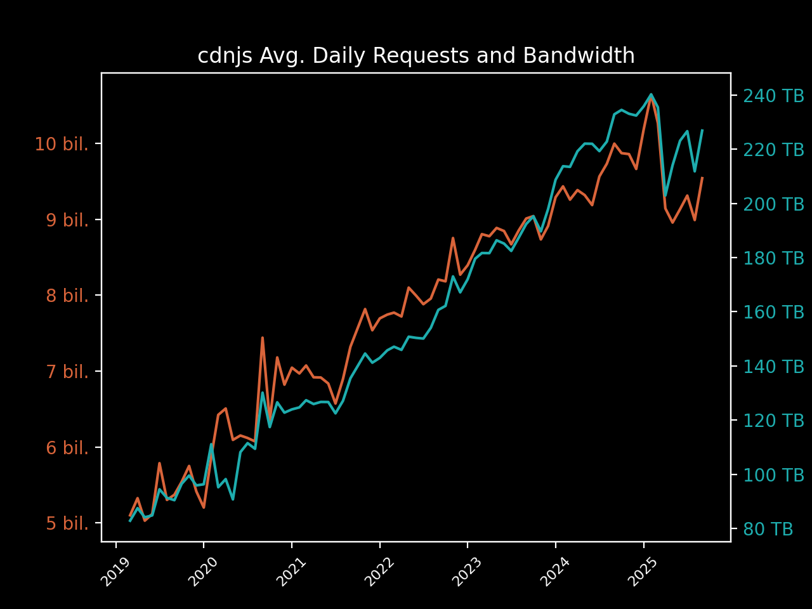

# cdnjs April 2023 Usage Stats

Information provided directly by Cloudflare for the `cdnjs.cloudflare.com` domain. ⛅️

- [Key highlights](#key-highlights)
  - [Library highlights](#library-highlights)
- [Total number of requests](#total-number-of-requests)
- [Total bandwidth usage](#total-bandwidth-usage)
- [Top 100 requested resources](#top-100-requested-resources)

## Key highlights

- This month (April 2023), cdnjs served **over 263 billion requests**. 🖥
- This month, cdnjs used **a huge consumption of 5.45 PB of data** to serve these requests. 📤
- That's **nearly 182 terabytes of data and 8.8 billion requests each day** (averaged). 🤯
- In April, **each request to cdnjs (on average) used only 20.70 KB of data**. 🔍
 
### Library highlights

- The top libraries overall (in the top 100 assets) this month were jquery, font-awesome,
  and webfont.
  - Across the 23.79 billion requests for jquery,
    1,056.37 TB of bandwidth was consumed.
  - font-awesome received 15.93 billion requests and consumed 484.78 TB
    of bandwidth, with webfont assets in the top 100 getting 10.94 billion requests and
    using 58.34 TB of bandwidth to be served.
  - gsap came in 4th this month with 9.01 billion requests, and
    angular.js in 5th with 4.26 billion.
- The top asset on the CDN this month was webfontloader.js from version 1.6.28 of
  webfont, reaching a total of 10.94 billion requests and using 58.34 TB
  of bandwidth to serve the file.
  - jquery (3.3.1/jquery.min.js) came in second with
    9.35 billion requests, followed by font-awesome
    (4.7.0/css/font-awesome.min.css) with 6.02 billion requests.

| Total Requests & Bandwidth | Avg. Daily Requests & Bandwidth |
|---|---|
|  |  |

| Top 5 Resources | Top 5 Libraries |
|---|---|
|  |  |

## Total number of requests

> The first important stat that we are given is the total number of requests sent to cdnjs.cloudflare.com.
> 
> Cloudflare provides this number to us at a 1% sample for the whole month, giving 2,632,907,752 at 1%.

When multiplied up to 100%, this results in cdnjs serving approximately 263,290,775,200 requests in April.

**Over 263 billion requests or approximately 8.8 billion requests every single day of April**. 📈

## Total bandwidth usage

> Another great stat that Cloudflare has given us again is the bandwidth usage for the cdnjs.cloudflare.com domain.
> 
> This number, like total requests, is provided at a 1% sample for the month and in gigabytes: 54,490.13 GB.

When multiplied up to be 100%, this produces the estimate of 5,449,013.0 GB of bandwidth used for this month by
 cdnjs, or 5.45 PB.

**This gives cdnjs a huge bandwidth consumption of 5.45 petabytes of data for requests this month**. 🤯

## Top 100 requested resources

> These are provided at a 1% sample for the whole of April.
> Bandwidth is measured in gigabytes.
> This data, as well as previous months' data, is available in the SQLite data.db file.

| # | Requests | Bandwidth | cdnjs Resource URL |
|---|----------|-----------|--------------------|
| 1   | 109,445,732 |   583.41 | [cdnjs.cloudflare.com/ajax/libs/webfont/1.6.28/webfontloader.js](https://cdnjs.cloudflare.com/ajax/libs/webfont/1.6.28/webfontloader.js)                                                   |
| 2   | 93,478,509  | 6,714.25 | [cdnjs.cloudflare.com/ajax/libs/jquery/3.3.1/jquery.min.js](https://cdnjs.cloudflare.com/ajax/libs/jquery/3.3.1/jquery.min.js)                                                             |
| 3   | 60,231,459  |   378.78 | [cdnjs.cloudflare.com/ajax/libs/font-awesome/4.7.0/css/font-awesome.min.css](https://cdnjs.cloudflare.com/ajax/libs/font-awesome/4.7.0/css/font-awesome.min.css)                           |
| 4   | 54,085,451  | 1,429.29 | [cdnjs.cloudflare.com/ajax/libs/jquery/3.6.0/jquery.min.js](https://cdnjs.cloudflare.com/ajax/libs/jquery/3.6.0/jquery.min.js)                                                             |
| 5   | 42,504,249  | 2,982.93 | [cdnjs.cloudflare.com/ajax/libs/font-awesome/4.7.0/fonts/fontawesome-webfont.woff2](https://cdnjs.cloudflare.com/ajax/libs/font-awesome/4.7.0/fonts/fontawesome-webfont.woff2)             |
| 6   | 30,340,266  |    59.02 | [cdnjs.cloudflare.com/ajax/libs/jquery-mousewheel/3.1.13/jquery.mousewheel.min.js](https://cdnjs.cloudflare.com/ajax/libs/jquery-mousewheel/3.1.13/jquery.mousewheel.min.js)               |
| 7   | 24,278,687  |   652.74 | [cdnjs.cloudflare.com/ajax/libs/jquery/3.4.1/jquery.min.js](https://cdnjs.cloudflare.com/ajax/libs/jquery/3.4.1/jquery.min.js)                                                             |
| 8   | 21,726,332  |   559.88 | [cdnjs.cloudflare.com/ajax/libs/jquery/3.5.1/jquery.min.js](https://cdnjs.cloudflare.com/ajax/libs/jquery/3.5.1/jquery.min.js)                                                             |
| 9   | 19,506,937  |    29.05 | [cdnjs.cloudflare.com/ajax/libs/jquery-cookie/1.4.1/jquery.cookie.min.js](https://cdnjs.cloudflare.com/ajax/libs/jquery-cookie/1.4.1/jquery.cookie.min.js)                                 |
| 10  | 19,380,073  |   566.76 | [cdnjs.cloudflare.com/ajax/libs/jquery/1.12.4/jquery.min.js](https://cdnjs.cloudflare.com/ajax/libs/jquery/1.12.4/jquery.min.js)                                                           |
| 11  | 15,276,381  |   191.42 | [cdnjs.cloudflare.com/ajax/libs/lodash.js/4.17.11/lodash.core.min.js](https://cdnjs.cloudflare.com/ajax/libs/lodash.js/4.17.11/lodash.core.min.js)                                         |
| 12  | 14,242,685  |    60.92 | [cdnjs.cloudflare.com/ajax/libs/jquery-migrate/1.4.1/jquery-migrate.min.js](https://cdnjs.cloudflare.com/ajax/libs/jquery-migrate/1.4.1/jquery-migrate.min.js)                             |
| 13  | 14,071,058  |   448.82 | [cdnjs.cloudflare.com/ajax/libs/webcomponentsjs/2.6.0/webcomponents-bundle.js](https://cdnjs.cloudflare.com/ajax/libs/webcomponentsjs/2.6.0/webcomponents-bundle.js)                       |
| 14  | 12,997,606  |   130.41 | [cdnjs.cloudflare.com/ajax/libs/fingerprintjs2/2.1.2/fingerprint2.min.js](https://cdnjs.cloudflare.com/ajax/libs/fingerprintjs2/2.1.2/fingerprint2.min.js)                                 |
| 15  | 12,398,305  |    88.74 | [cdnjs.cloudflare.com/ajax/libs/popper.js/1.14.7/umd/popper.min.js](https://cdnjs.cloudflare.com/ajax/libs/popper.js/1.14.7/umd/popper.min.js)                                             |
| 16  | 12,231,710  |    71.15 | [cdnjs.cloudflare.com/ajax/libs/postscribe/2.0.8/postscribe.min.js](https://cdnjs.cloudflare.com/ajax/libs/postscribe/2.0.8/postscribe.min.js)                                             |
| 17  | 11,706,546  |   387.39 | [cdnjs.cloudflare.com/ajax/libs/angular.js/1.2.22/angular.min.js](https://cdnjs.cloudflare.com/ajax/libs/angular.js/1.2.22/angular.min.js)                                                 |
| 18  | 11,053,698  |    86.77 | [cdnjs.cloudflare.com/ajax/libs/angular-ui-utils/0.1.1/angular-ui-utils.min.js](https://cdnjs.cloudflare.com/ajax/libs/angular-ui-utils/0.1.1/angular-ui-utils.min.js)                     |
| 19  | 10,997,112  |    80.60 | [cdnjs.cloudflare.com/ajax/libs/angular-ui-router/0.2.10/angular-ui-router.min.js](https://cdnjs.cloudflare.com/ajax/libs/angular-ui-router/0.2.10/angular-ui-router.min.js)               |
| 20  | 10,785,000  |    32.28 | [cdnjs.cloudflare.com/ajax/libs/angular.js/1.2.22/angular-sanitize.min.js](https://cdnjs.cloudflare.com/ajax/libs/angular.js/1.2.22/angular-sanitize.min.js)                               |
| 21  | 10,734,103  |    15.17 | [cdnjs.cloudflare.com/ajax/libs/angular.js/1.2.22/angular-cookies.min.js](https://cdnjs.cloudflare.com/ajax/libs/angular.js/1.2.22/angular-cookies.min.js)                                 |
| 22  | 10,683,202  |    20.19 | [cdnjs.cloudflare.com/ajax/libs/angular-dynamic-locale/0.1.27/tmhDynamicLocale.min.js](https://cdnjs.cloudflare.com/ajax/libs/angular-dynamic-locale/0.1.27/tmhDynamicLocale.min.js)       |
| 23  | 10,681,441  |    19.81 | [cdnjs.cloudflare.com/ajax/libs/angular-ui/0.4.0/angular-ui-ieshiv.js](https://cdnjs.cloudflare.com/ajax/libs/angular-ui/0.4.0/angular-ui-ieshiv.js)                                       |
| 24  | 10,074,138  |   227.19 | [cdnjs.cloudflare.com/ajax/libs/gsap/3.8.0/gsap.min.js](https://cdnjs.cloudflare.com/ajax/libs/gsap/3.8.0/gsap.min.js)                                                                     |
| 25  | 9,388,204   |    20.06 | [cdnjs.cloudflare.com/ajax/libs/jquery.lazyload/1.9.1/jquery.lazyload.min.js](https://cdnjs.cloudflare.com/ajax/libs/jquery.lazyload/1.9.1/jquery.lazyload.min.js)                         |
| 26  | 9,372,308   |    28.67 | [cdnjs.cloudflare.com/ajax/libs/infinity/0.2.2/infinity.min.js](https://cdnjs.cloudflare.com/ajax/libs/infinity/0.2.2/infinity.min.js)                                                     |
| 27  | 9,354,148   |    43.24 | [cdnjs.cloudflare.com/ajax/libs/angular.js/1.2.22/angular-animate.min.js](https://cdnjs.cloudflare.com/ajax/libs/angular.js/1.2.22/angular-animate.min.js)                                 |
| 28  | 9,067,093   |    99.94 | [cdnjs.cloudflare.com/ajax/libs/font-awesome/5.15.4/css/all.min.css](https://cdnjs.cloudflare.com/ajax/libs/font-awesome/5.15.4/css/all.min.css)                                           |
| 29  | 8,935,098   |    68.82 | [cdnjs.cloudflare.com/ajax/libs/font-awesome/5.15.3/css/all.min.css](https://cdnjs.cloudflare.com/ajax/libs/font-awesome/5.15.3/css/all.min.css)                                           |
| 30  | 8,718,931   |    43.94 | [cdnjs.cloudflare.com/ajax/libs/animate.css/4.1.1/animate.min.css](https://cdnjs.cloudflare.com/ajax/libs/animate.css/4.1.1/animate.min.css)                                               |
| 31  | 8,405,681   |   207.69 | [cdnjs.cloudflare.com/ajax/libs/gsap/3.11.4/gsap.min.js](https://cdnjs.cloudflare.com/ajax/libs/gsap/3.11.4/gsap.min.js)                                                                   |
| 32  | 8,367,407   |    56.54 | [cdnjs.cloudflare.com/ajax/libs/popper.js/1.12.9/umd/popper.min.js](https://cdnjs.cloudflare.com/ajax/libs/popper.js/1.12.9/umd/popper.min.js)                                             |
| 33  | 8,364,377   |   189.79 | [cdnjs.cloudflare.com/ajax/libs/gsap/3.9.1/gsap.min.js](https://cdnjs.cloudflare.com/ajax/libs/gsap/3.9.1/gsap.min.js)                                                                     |
| 34  | 8,174,535   |    78.33 | [cdnjs.cloudflare.com/ajax/libs/slick-carousel/1.8.1/slick.min.js](https://cdnjs.cloudflare.com/ajax/libs/slick-carousel/1.8.1/slick.min.js)                                               |
| 35  | 8,075,377   |    83.89 | [cdnjs.cloudflare.com/ajax/libs/OwlCarousel2/2.3.4/owl.carousel.min.js](https://cdnjs.cloudflare.com/ajax/libs/OwlCarousel2/2.3.4/owl.carousel.min.js)                                     |
| 36  | 7,879,050   |    42.65 | [cdnjs.cloudflare.com/ajax/libs/crypto-js/3.1.2/rollups/aes.js](https://cdnjs.cloudflare.com/ajax/libs/crypto-js/3.1.2/rollups/aes.js)                                                     |
| 37  | 7,664,652   |   266.08 | [cdnjs.cloudflare.com/ajax/libs/gsap/1.19.1/TweenMax.min.js](https://cdnjs.cloudflare.com/ajax/libs/gsap/1.19.1/TweenMax.min.js)                                                           |
| 38  | 7,482,233   |   192.33 | [cdnjs.cloudflare.com/ajax/libs/jquery/2.2.4/jquery.min.js](https://cdnjs.cloudflare.com/ajax/libs/jquery/2.2.4/jquery.min.js)                                                             |
| 39  | 7,359,540   |    50.84 | [cdnjs.cloudflare.com/ajax/libs/popper.js/1.14.3/umd/popper.min.js](https://cdnjs.cloudflare.com/ajax/libs/popper.js/1.14.3/umd/popper.min.js)                                             |
| 40  | 7,192,335   |    12.98 | [cdnjs.cloudflare.com/ajax/libs/OwlCarousel2/2.3.4/assets/owl.carousel.min.css](https://cdnjs.cloudflare.com/ajax/libs/OwlCarousel2/2.3.4/assets/owl.carousel.min.css)                     |
| 41  | 7,140,228   |    33.17 | [cdnjs.cloudflare.com/ajax/libs/modernizr/2.8.3/modernizr.min.js](https://cdnjs.cloudflare.com/ajax/libs/modernizr/2.8.3/modernizr.min.js)                                                 |
| 42  | 7,118,291   |   577.32 | [cdnjs.cloudflare.com/ajax/libs/hls.js/1.1.5/hls.min.js](https://cdnjs.cloudflare.com/ajax/libs/hls.js/1.1.5/hls.min.js)                                                                   |
| 43  | 7,039,154   |   217.49 | [cdnjs.cloudflare.com/ajax/libs/gsap/latest/TweenMax.min.js](https://cdnjs.cloudflare.com/ajax/libs/gsap/latest/TweenMax.min.js)                                                           |
| 44  | 6,811,521   |   379.28 | [cdnjs.cloudflare.com/ajax/libs/jqueryui/1.12.1/jquery-ui.min.js](https://cdnjs.cloudflare.com/ajax/libs/jqueryui/1.12.1/jquery-ui.min.js)                                                 |
| 45  | 6,761,457   |    42.51 | [cdnjs.cloudflare.com/ajax/libs/cookieconsent2/3.0.3/cookieconsent.min.js](https://cdnjs.cloudflare.com/ajax/libs/cookieconsent2/3.0.3/cookieconsent.min.js)                               |
| 46  | 6,690,232   |     9.20 | [cdnjs.cloudflare.com/ajax/libs/slick-carousel/1.6.0/slick.min.css](https://cdnjs.cloudflare.com/ajax/libs/slick-carousel/1.6.0/slick.min.css)                                             |
| 47  | 6,628,649   |   153.51 | [cdnjs.cloudflare.com/ajax/libs/gsap/3.10.4/gsap.min.js](https://cdnjs.cloudflare.com/ajax/libs/gsap/3.10.4/gsap.min.js)                                                                   |
| 48  | 6,566,401   |   170.19 | [cdnjs.cloudflare.com/ajax/libs/jquery/3.2.1/jquery.min.js](https://cdnjs.cloudflare.com/ajax/libs/jquery/3.2.1/jquery.min.js)                                                             |
| 49  | 6,560,373   |    23.96 | [cdnjs.cloudflare.com/ajax/libs/Swiper/4.0.7/css/swiper.min.css](https://cdnjs.cloudflare.com/ajax/libs/Swiper/4.0.7/css/swiper.min.css)                                                   |
| 50  | 6,465,214   |   331.14 | [cdnjs.cloudflare.com/ajax/libs/bodymovin/5.5.8/lottie.min.js](https://cdnjs.cloudflare.com/ajax/libs/bodymovin/5.5.8/lottie.min.js)                                                       |
| 51  | 6,415,244   |    62.79 | [cdnjs.cloudflare.com/ajax/libs/slick-carousel/1.9.0/slick.min.js](https://cdnjs.cloudflare.com/ajax/libs/slick-carousel/1.9.0/slick.min.js)                                               |
| 52  | 6,396,162   |    38.09 | [cdnjs.cloudflare.com/ajax/libs/underscore.js/1.8.3/underscore-min.js](https://cdnjs.cloudflare.com/ajax/libs/underscore.js/1.8.3/underscore-min.js)                                       |
| 53  | 6,327,160   |    41.20 | [cdnjs.cloudflare.com/ajax/libs/font-awesome/4.7.0/css/font-awesome.css](https://cdnjs.cloudflare.com/ajax/libs/font-awesome/4.7.0/css/font-awesome.css)                                   |
| 54  | 6,320,406   |   242.75 | [cdnjs.cloudflare.com/ajax/libs/font-awesome/5.15.3/webfonts/fa-solid-900.woff2](https://cdnjs.cloudflare.com/ajax/libs/font-awesome/5.15.3/webfonts/fa-solid-900.woff2)                   |
| 55  | 6,191,963   |   786.34 | [cdnjs.cloudflare.com/ajax/libs/video.js/7.18.1/video.min.js](https://cdnjs.cloudflare.com/ajax/libs/video.js/7.18.1/video.min.js)                                                         |
| 56  | 6,175,318   |    11.68 | [cdnjs.cloudflare.com/ajax/libs/cookieconsent2/3.0.3/cookieconsent.min.css](https://cdnjs.cloudflare.com/ajax/libs/cookieconsent2/3.0.3/cookieconsent.min.css)                             |
| 57  | 6,098,593   |    22.37 | [cdnjs.cloudflare.com/ajax/libs/animate.css/3.5.2/animate.min.css](https://cdnjs.cloudflare.com/ajax/libs/animate.css/3.5.2/animate.min.css)                                               |
| 58  | 6,061,910   |    57.17 | [cdnjs.cloudflare.com/ajax/libs/video.js/7.11.7/alt/video-js-cdn.min.css](https://cdnjs.cloudflare.com/ajax/libs/video.js/7.11.7/alt/video-js-cdn.min.css)                                 |
| 59  | 6,031,172   |   438.28 | [cdnjs.cloudflare.com/ajax/libs/font-awesome/5.15.4/webfonts/fa-solid-900.woff2](https://cdnjs.cloudflare.com/ajax/libs/font-awesome/5.15.4/webfonts/fa-solid-900.woff2)                   |
| 60  | 5,922,139   |   142.87 | [cdnjs.cloudflare.com/ajax/libs/jquery/2.1.3/jquery.min.js](https://cdnjs.cloudflare.com/ajax/libs/jquery/2.1.3/jquery.min.js)                                                             |
| 61  | 5,887,124   |   129.78 | [cdnjs.cloudflare.com/ajax/libs/gsap/3.6.1/gsap.min.js](https://cdnjs.cloudflare.com/ajax/libs/gsap/3.6.1/gsap.min.js)                                                                     |
| 62  | 5,882,071   |   416.13 | [cdnjs.cloudflare.com/ajax/libs/font-awesome/5.11.2/webfonts/fa-solid-900.woff2](https://cdnjs.cloudflare.com/ajax/libs/font-awesome/5.11.2/webfonts/fa-solid-900.woff2)                   |
| 63  | 5,778,059   |     5.48 | [cdnjs.cloudflare.com/ajax/libs/JavaScript-autoComplete/1.0.4/auto-complete.min.css](https://cdnjs.cloudflare.com/ajax/libs/JavaScript-autoComplete/1.0.4/auto-complete.min.css)           |
| 64  | 5,609,008   |   125.18 | [cdnjs.cloudflare.com/ajax/libs/gsap/3.6.0/gsap.min.js](https://cdnjs.cloudflare.com/ajax/libs/gsap/3.6.0/gsap.min.js)                                                                     |
| 65  | 5,595,676   |     6.16 | [cdnjs.cloudflare.com/ajax/libs/JavaScript-autoComplete/1.0.4/auto-complete.min.js](https://cdnjs.cloudflare.com/ajax/libs/JavaScript-autoComplete/1.0.4/auto-complete.min.js)             |
| 66  | 5,467,385   |   119.08 | [cdnjs.cloudflare.com/ajax/libs/gsap/3.5.1/gsap.min.js](https://cdnjs.cloudflare.com/ajax/libs/gsap/3.5.1/gsap.min.js)                                                                     |
| 67  | 5,368,866   |     7.42 | [cdnjs.cloudflare.com/ajax/libs/slick-carousel/1.8.1/slick.min.css](https://cdnjs.cloudflare.com/ajax/libs/slick-carousel/1.8.1/slick.min.css)                                             |
| 68  | 5,190,622   |     8.34 | [cdnjs.cloudflare.com/ajax/libs/slick-carousel/1.6.0/slick-theme.min.css](https://cdnjs.cloudflare.com/ajax/libs/slick-carousel/1.6.0/slick-theme.min.css)                                 |
| 69  | 5,162,937   |     7.70 | [cdnjs.cloudflare.com/ajax/libs/jqueryui-touch-punch/0.2.3/jquery.ui.touch-punch.min.js](https://cdnjs.cloudflare.com/ajax/libs/jqueryui-touch-punch/0.2.3/jquery.ui.touch-punch.min.js)   |
| 70  | 5,096,080   |    14.01 | [cdnjs.cloudflare.com/ajax/libs/spin.js/2.3.2/spin.min.js](https://cdnjs.cloudflare.com/ajax/libs/spin.js/2.3.2/spin.min.js)                                                               |
| 71  | 4,975,426   |   135.41 | [cdnjs.cloudflare.com/ajax/libs/jquery/3.6.1/jquery.min.js](https://cdnjs.cloudflare.com/ajax/libs/jquery/3.6.1/jquery.min.js)                                                             |
| 72  | 4,871,642   |    83.05 | [cdnjs.cloudflare.com/ajax/libs/font-awesome/6.1.1/css/all.min.css](https://cdnjs.cloudflare.com/ajax/libs/font-awesome/6.1.1/css/all.min.css)                                             |
| 73  | 4,842,232   |    50.93 | [cdnjs.cloudflare.com/ajax/libs/font-awesome/5.13.0/css/all.min.css](https://cdnjs.cloudflare.com/ajax/libs/font-awesome/5.13.0/css/all.min.css)                                           |
| 74  | 4,722,854   |     6.51 | [cdnjs.cloudflare.com/ajax/libs/slick-carousel/1.9.0/slick.min.css](https://cdnjs.cloudflare.com/ajax/libs/slick-carousel/1.9.0/slick.min.css)                                             |
| 75  | 4,701,599   |   161.48 | [cdnjs.cloudflare.com/ajax/libs/gsap/2.1.3/TweenMax.min.js](https://cdnjs.cloudflare.com/ajax/libs/gsap/2.1.3/TweenMax.min.js)                                                             |
| 76  | 4,632,487   |   107.11 | [cdnjs.cloudflare.com/ajax/libs/handlebars.js/4.7.6/handlebars.min.js](https://cdnjs.cloudflare.com/ajax/libs/handlebars.js/4.7.6/handlebars.min.js)                                       |
| 77  | 4,456,278   |   281.23 | [cdnjs.cloudflare.com/ajax/libs/bodymovin/5.8.1/lottie.min.js](https://cdnjs.cloudflare.com/ajax/libs/bodymovin/5.8.1/lottie.min.js)                                                       |
| 78  | 4,410,605   |   154.71 | [cdnjs.cloudflare.com/ajax/libs/Swiper/6.4.5/swiper-bundle.min.js](https://cdnjs.cloudflare.com/ajax/libs/Swiper/6.4.5/swiper-bundle.min.js)                                               |
| 79  | 4,374,986   |   176.39 | [cdnjs.cloudflare.com/ajax/libs/Swiper/4.0.7/js/swiper.js](https://cdnjs.cloudflare.com/ajax/libs/Swiper/4.0.7/js/swiper.js)                                                               |
| 80  | 4,325,541   |    82.14 | [cdnjs.cloudflare.com/ajax/libs/fancybox/3.5.7/jquery.fancybox.min.js](https://cdnjs.cloudflare.com/ajax/libs/fancybox/3.5.7/jquery.fancybox.min.js)                                       |
| 81  | 4,285,180   |   141.78 | [cdnjs.cloudflare.com/ajax/libs/gsap/1.20.5/TweenMax.min.js](https://cdnjs.cloudflare.com/ajax/libs/gsap/1.20.5/TweenMax.min.js)                                                           |
| 82  | 4,276,414   |     7.95 | [cdnjs.cloudflare.com/ajax/libs/gsap/1.18.5/plugins/TextPlugin.min.js](https://cdnjs.cloudflare.com/ajax/libs/gsap/1.18.5/plugins/TextPlugin.min.js)                                       |
| 83  | 4,250,981   |    44.97 | [cdnjs.cloudflare.com/ajax/libs/font-awesome/5.11.2/css/all.min.css](https://cdnjs.cloudflare.com/ajax/libs/font-awesome/5.11.2/css/all.min.css)                                           |
| 84  | 4,245,272   |    17.19 | [cdnjs.cloudflare.com/ajax/libs/json3/3.3.2/json3.min.js](https://cdnjs.cloudflare.com/ajax/libs/json3/3.3.2/json3.min.js)                                                                 |
| 85  | 4,126,916   |   373.53 | [cdnjs.cloudflare.com/ajax/libs/line-awesome/1.3.0/line-awesome/fonts/la-solid-900.woff2](https://cdnjs.cloudflare.com/ajax/libs/line-awesome/1.3.0/line-awesome/fonts/la-solid-900.woff2) |
| 86  | 4,085,630   |     9.37 | [cdnjs.cloudflare.com/ajax/libs/jquery-modal/0.9.1/jquery.modal.min.js](https://cdnjs.cloudflare.com/ajax/libs/jquery-modal/0.9.1/jquery.modal.min.js)                                     |
| 87  | 4,084,008   |     8.31 | [cdnjs.cloudflare.com/ajax/libs/jquery-mousewheel/3.1.12/jquery.mousewheel.min.js](https://cdnjs.cloudflare.com/ajax/libs/jquery-mousewheel/3.1.12/jquery.mousewheel.min.js)               |
| 88  | 4,044,035   |     6.57 | [cdnjs.cloudflare.com/ajax/libs/slick-carousel/1.8.1/slick-theme.min.css](https://cdnjs.cloudflare.com/ajax/libs/slick-carousel/1.8.1/slick-theme.min.css)                                 |
| 89  | 4,003,216   |   136.56 | [cdnjs.cloudflare.com/ajax/libs/gsap/2.1.2/TweenMax.min.js](https://cdnjs.cloudflare.com/ajax/libs/gsap/2.1.2/TweenMax.min.js)                                                             |
| 90  | 3,980,890   |     9.50 | [cdnjs.cloudflare.com/ajax/libs/jquery-modal/0.9.1/jquery.modal.min.css](https://cdnjs.cloudflare.com/ajax/libs/jquery-modal/0.9.1/jquery.modal.min.css)                                   |
| 91  | 3,957,467   |    13.52 | [cdnjs.cloudflare.com/ajax/libs/animate.css/3.7.2/animate.min.css](https://cdnjs.cloudflare.com/ajax/libs/animate.css/3.7.2/animate.min.css)                                               |
| 92  | 3,955,164   |    46.04 | [cdnjs.cloudflare.com/ajax/libs/tiny-slider/2.9.2/min/tiny-slider.js](https://cdnjs.cloudflare.com/ajax/libs/tiny-slider/2.9.2/min/tiny-slider.js)                                         |
| 93  | 3,919,083   |    17.60 | [cdnjs.cloudflare.com/ajax/libs/jquery-migrate/3.3.2/jquery-migrate.min.js](https://cdnjs.cloudflare.com/ajax/libs/jquery-migrate/3.3.2/jquery-migrate.min.js)                             |
| 94  | 3,886,546   |    51.32 | [cdnjs.cloudflare.com/ajax/libs/line-awesome/1.3.0/line-awesome/css/line-awesome.min.css](https://cdnjs.cloudflare.com/ajax/libs/line-awesome/1.3.0/line-awesome/css/line-awesome.min.css) |
| 95  | 3,852,816   |   124.24 | [cdnjs.cloudflare.com/ajax/libs/gsap/1.19.0/TweenMax.min.js](https://cdnjs.cloudflare.com/ajax/libs/gsap/1.19.0/TweenMax.min.js)                                                           |
| 96  | 3,817,796   |    46.85 | [cdnjs.cloudflare.com/ajax/libs/moment.js/2.24.0/moment.min.js](https://cdnjs.cloudflare.com/ajax/libs/moment.js/2.24.0/moment.min.js)                                                     |
| 97  | 3,816,711   |    95.95 | [cdnjs.cloudflare.com/ajax/libs/gsap/3.11.3/gsap.min.js](https://cdnjs.cloudflare.com/ajax/libs/gsap/3.11.3/gsap.min.js)                                                                   |
| 98  | 3,749,896   |    38.59 | [cdnjs.cloudflare.com/ajax/libs/fingerprintjs2/2.1.0/fingerprint2.min.js](https://cdnjs.cloudflare.com/ajax/libs/fingerprintjs2/2.1.0/fingerprint2.min.js)                                 |
| 99  | 3,706,227   |    13.21 | [cdnjs.cloudflare.com/ajax/libs/fancybox/3.5.7/jquery.fancybox.min.css](https://cdnjs.cloudflare.com/ajax/libs/fancybox/3.5.7/jquery.fancybox.min.css)                                     |
| 100 | 3,698,882   |    14.13 | [cdnjs.cloudflare.com/ajax/libs/js-sha256/0.9.0/sha256.min.js](https://cdnjs.cloudflare.com/ajax/libs/js-sha256/0.9.0/sha256.min.js)                                                       |

Author: [Matt (IPv4) Cowley](https://mattcowley.co.uk) - If there are any errors, please let me know and I will
 endeavour to correct them.
