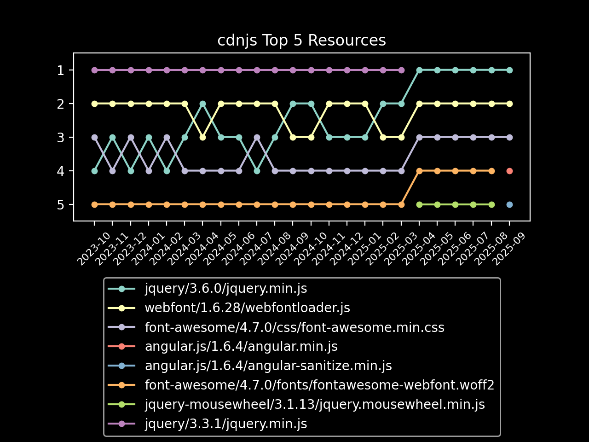

# cdnjs February 2023 Usage Stats

Information provided directly by Cloudflare for the `cdnjs.cloudflare.com` domain. ⛅️

- [Key highlights](#key-highlights)
  - [Library highlights](#library-highlights)
- [Total number of requests](#total-number-of-requests)
- [Total bandwidth usage](#total-bandwidth-usage)
- [Top 100 requested resources](#top-100-requested-resources)

## Key highlights

- This month (February 2023), cdnjs served **nearly 241 billion requests**. 🖥
- This month, cdnjs used **a huge consumption of 5.03 PB of data** to serve these requests. 📤
- That's **nearly 180 terabytes of data and 8.6 billion requests every day** (averaged). 🤯
- In February, **each request to cdnjs used only 20.88 KB of data on average**. 🔍
 
### Library highlights

- The top libraries overall (in the top 100 assets) this month were jquery, font-awesome,
  and gsap.
  - Across the 24.57 billion requests for jquery,
    990.82 TB of bandwidth was consumed.
  - font-awesome received 15.22 billion requests and consumed 469.64 TB
    of bandwidth, with gsap assets in the top 100 getting 7.87 billion requests and
    using 202.10 TB of bandwidth to be served.
  - webfont came in 4th this month with 3.84 billion requests, and
    angular.js in 5th with 3.77 billion.
- The top asset on the CDN this month was jquery.min.js from version 3.6.0 of
  jquery, reaching a total of 8.29 billion requests and using 221.26 TB
  of bandwidth to serve the file.
  - jquery (3.3.1/jquery.min.js) came in second with
    7.49 billion requests, followed by font-awesome
    (4.7.0/css/font-awesome.min.css) with 5.55 billion requests.

| Total Requests & Bandwidth | Avg. Daily Requests & Bandwidth |
|---|---|
|  |  |

| Top 5 Resources | Top 5 Libraries |
|---|---|
|  |  |

## Total number of requests

> The first important stat that we are given is the total number of requests sent to cdnjs.cloudflare.com.
> 
> Cloudflare provides this number to us at a 1% sample for the whole month, giving 2,407,515,738 at 1%.

When multiplied up to 100%, this results in cdnjs serving approximately 240,751,573,800 requests in February.

**Nearly 241 billion requests or approximately 8.6 billion requests every day of February**. 📈

## Total bandwidth usage

> Another great stat that Cloudflare has given us again is the bandwidth usage for the cdnjs.cloudflare.com domain.
> 
> This number, like total requests, is provided at a 1% sample for the month and in gigabytes: 50,279.5 GB.

When multiplied up to be 100%, this produces the estimate of 5,027,950.0 GB of bandwidth used for this month by
 cdnjs, or 5.03 PB.

**This gives cdnjs a huge bandwidth consumption of 5.03 petabytes of data for requests this month**. 🤯

## Top 100 requested resources

> These are provided at a 1% sample for the whole of February.
> Bandwidth is measured in gigabytes.
> This data, as well as previous months' data, is available in the SQLite data.db file.

| # | Requests | Bandwidth | cdnjs Resource URL |
|---|----------|-----------|--------------------|
| 1   | 82,942,950 | 2,212.57 | [cdnjs.cloudflare.com/ajax/libs/jquery/3.6.0/jquery.min.js](https://cdnjs.cloudflare.com/ajax/libs/jquery/3.6.0/jquery.min.js)                                                             |
| 2   | 74,852,865 | 5,331.59 | [cdnjs.cloudflare.com/ajax/libs/jquery/3.3.1/jquery.min.js](https://cdnjs.cloudflare.com/ajax/libs/jquery/3.3.1/jquery.min.js)                                                             |
| 3   | 55,486,081 |   349.75 | [cdnjs.cloudflare.com/ajax/libs/font-awesome/4.7.0/css/font-awesome.min.css](https://cdnjs.cloudflare.com/ajax/libs/font-awesome/4.7.0/css/font-awesome.min.css)                           |
| 4   | 39,804,552 | 2,811.44 | [cdnjs.cloudflare.com/ajax/libs/font-awesome/4.7.0/fonts/fontawesome-webfont.woff2](https://cdnjs.cloudflare.com/ajax/libs/font-awesome/4.7.0/fonts/fontawesome-webfont.woff2)             |
| 5   | 38,414,433 |   201.90 | [cdnjs.cloudflare.com/ajax/libs/webfont/1.6.28/webfontloader.js](https://cdnjs.cloudflare.com/ajax/libs/webfont/1.6.28/webfontloader.js)                                                   |
| 6   | 29,070,165 |    56.64 | [cdnjs.cloudflare.com/ajax/libs/jquery-mousewheel/3.1.13/jquery.mousewheel.min.js](https://cdnjs.cloudflare.com/ajax/libs/jquery-mousewheel/3.1.13/jquery.mousewheel.min.js)               |
| 7   | 23,004,765 |   289.52 | [cdnjs.cloudflare.com/ajax/libs/lodash.js/4.17.11/lodash.core.min.js](https://cdnjs.cloudflare.com/ajax/libs/lodash.js/4.17.11/lodash.core.min.js)                                         |
| 8   | 21,903,210 |   588.90 | [cdnjs.cloudflare.com/ajax/libs/jquery/3.4.1/jquery.min.js](https://cdnjs.cloudflare.com/ajax/libs/jquery/3.4.1/jquery.min.js)                                                             |
| 9   | 20,072,350 |   522.62 | [cdnjs.cloudflare.com/ajax/libs/jquery/3.5.1/jquery.min.js](https://cdnjs.cloudflare.com/ajax/libs/jquery/3.5.1/jquery.min.js)                                                             |
| 10  | 18,334,334 |    27.29 | [cdnjs.cloudflare.com/ajax/libs/jquery-cookie/1.4.1/jquery.cookie.min.js](https://cdnjs.cloudflare.com/ajax/libs/jquery-cookie/1.4.1/jquery.cookie.min.js)                                 |
| 11  | 17,045,555 |   494.93 | [cdnjs.cloudflare.com/ajax/libs/jquery/1.12.4/jquery.min.js](https://cdnjs.cloudflare.com/ajax/libs/jquery/1.12.4/jquery.min.js)                                                           |
| 12  | 13,317,910 |   424.79 | [cdnjs.cloudflare.com/ajax/libs/webcomponentsjs/2.6.0/webcomponents-bundle.js](https://cdnjs.cloudflare.com/ajax/libs/webcomponentsjs/2.6.0/webcomponents-bundle.js)                       |
| 13  | 13,090,227 |    55.86 | [cdnjs.cloudflare.com/ajax/libs/jquery-migrate/1.4.1/jquery-migrate.min.js](https://cdnjs.cloudflare.com/ajax/libs/jquery-migrate/1.4.1/jquery-migrate.min.js)                             |
| 14  | 12,662,267 |   127.16 | [cdnjs.cloudflare.com/ajax/libs/fingerprintjs2/2.1.2/fingerprint2.min.js](https://cdnjs.cloudflare.com/ajax/libs/fingerprintjs2/2.1.2/fingerprint2.min.js)                                 |
| 15  | 12,351,382 |    88.49 | [cdnjs.cloudflare.com/ajax/libs/popper.js/1.14.7/umd/popper.min.js](https://cdnjs.cloudflare.com/ajax/libs/popper.js/1.14.7/umd/popper.min.js)                                             |
| 16  | 12,211,357 |   275.08 | [cdnjs.cloudflare.com/ajax/libs/gsap/3.8.0/gsap.min.js](https://cdnjs.cloudflare.com/ajax/libs/gsap/3.8.0/gsap.min.js)                                                                     |
| 17  | 11,844,002 |    69.06 | [cdnjs.cloudflare.com/ajax/libs/postscribe/2.0.8/postscribe.min.js](https://cdnjs.cloudflare.com/ajax/libs/postscribe/2.0.8/postscribe.min.js)                                             |
| 18  | 10,416,779 |   343.28 | [cdnjs.cloudflare.com/ajax/libs/angular.js/1.2.22/angular.min.js](https://cdnjs.cloudflare.com/ajax/libs/angular.js/1.2.22/angular.min.js)                                                 |
| 19  | 9,882,151  |     9.84 | [cdnjs.cloudflare.com/ajax/libs/color-thief/2.3.0/color-thief.umd.js](https://cdnjs.cloudflare.com/ajax/libs/color-thief/2.3.0/color-thief.umd.js)                                         |
| 20  | 9,839,049  |    76.93 | [cdnjs.cloudflare.com/ajax/libs/angular-ui-utils/0.1.1/angular-ui-utils.min.js](https://cdnjs.cloudflare.com/ajax/libs/angular-ui-utils/0.1.1/angular-ui-utils.min.js)                     |
| 21  | 9,774,190  |    71.29 | [cdnjs.cloudflare.com/ajax/libs/angular-ui-router/0.2.10/angular-ui-router.min.js](https://cdnjs.cloudflare.com/ajax/libs/angular-ui-router/0.2.10/angular-ui-router.min.js)               |
| 22  | 9,557,941  |    28.52 | [cdnjs.cloudflare.com/ajax/libs/angular.js/1.2.22/angular-sanitize.min.js](https://cdnjs.cloudflare.com/ajax/libs/angular.js/1.2.22/angular-sanitize.min.js)                               |
| 23  | 9,499,282  |    13.41 | [cdnjs.cloudflare.com/ajax/libs/angular.js/1.2.22/angular-cookies.min.js](https://cdnjs.cloudflare.com/ajax/libs/angular.js/1.2.22/angular-cookies.min.js)                                 |
| 24  | 9,467,943  |    17.86 | [cdnjs.cloudflare.com/ajax/libs/angular-dynamic-locale/0.1.27/tmhDynamicLocale.min.js](https://cdnjs.cloudflare.com/ajax/libs/angular-dynamic-locale/0.1.27/tmhDynamicLocale.min.js)       |
| 25  | 9,451,293  |    17.50 | [cdnjs.cloudflare.com/ajax/libs/angular-ui/0.4.0/angular-ui-ieshiv.js](https://cdnjs.cloudflare.com/ajax/libs/angular-ui/0.4.0/angular-ui-ieshiv.js)                                       |
| 26  | 8,614,919  |    26.29 | [cdnjs.cloudflare.com/ajax/libs/infinity/0.2.2/infinity.min.js](https://cdnjs.cloudflare.com/ajax/libs/infinity/0.2.2/infinity.min.js)                                                     |
| 27  | 8,474,086  |    70.64 | [cdnjs.cloudflare.com/ajax/libs/font-awesome/5.15.3/css/all.min.css](https://cdnjs.cloudflare.com/ajax/libs/font-awesome/5.15.3/css/all.min.css)                                           |
| 28  | 8,456,143  |    93.61 | [cdnjs.cloudflare.com/ajax/libs/font-awesome/5.15.4/css/all.min.css](https://cdnjs.cloudflare.com/ajax/libs/font-awesome/5.15.4/css/all.min.css)                                           |
| 29  | 8,261,698  |    38.00 | [cdnjs.cloudflare.com/ajax/libs/angular.js/1.2.22/angular-animate.min.js](https://cdnjs.cloudflare.com/ajax/libs/angular.js/1.2.22/angular-animate.min.js)                                 |
| 30  | 7,898,725  |    53.53 | [cdnjs.cloudflare.com/ajax/libs/popper.js/1.12.9/umd/popper.min.js](https://cdnjs.cloudflare.com/ajax/libs/popper.js/1.12.9/umd/popper.min.js)                                             |
| 31  | 7,783,787  |   637.07 | [cdnjs.cloudflare.com/ajax/libs/hls.js/1.1.5/hls.min.js](https://cdnjs.cloudflare.com/ajax/libs/hls.js/1.1.5/hls.min.js)                                                                   |
| 32  | 7,666,165  |    38.90 | [cdnjs.cloudflare.com/ajax/libs/animate.css/4.1.1/animate.min.css](https://cdnjs.cloudflare.com/ajax/libs/animate.css/4.1.1/animate.min.css)                                               |
| 33  | 7,598,479  |    16.02 | [cdnjs.cloudflare.com/ajax/libs/jquery.lazyload/1.9.1/jquery.lazyload.min.js](https://cdnjs.cloudflare.com/ajax/libs/jquery.lazyload/1.9.1/jquery.lazyload.min.js)                         |
| 34  | 7,475,730  |   169.50 | [cdnjs.cloudflare.com/ajax/libs/gsap/3.9.1/gsap.min.js](https://cdnjs.cloudflare.com/ajax/libs/gsap/3.9.1/gsap.min.js)                                                                     |
| 35  | 7,344,402  |   251.46 | [cdnjs.cloudflare.com/ajax/libs/gsap/1.19.1/TweenMax.min.js](https://cdnjs.cloudflare.com/ajax/libs/gsap/1.19.1/TweenMax.min.js)                                                           |
| 36  | 7,311,124  |   188.18 | [cdnjs.cloudflare.com/ajax/libs/jquery/2.2.4/jquery.min.js](https://cdnjs.cloudflare.com/ajax/libs/jquery/2.2.4/jquery.min.js)                                                             |
| 37  | 7,310,907  |    70.38 | [cdnjs.cloudflare.com/ajax/libs/slick-carousel/1.8.1/slick.min.js](https://cdnjs.cloudflare.com/ajax/libs/slick-carousel/1.8.1/slick.min.js)                                               |
| 38  | 7,220,222  |   161.48 | [cdnjs.cloudflare.com/ajax/libs/gsap/3.6.0/gsap.min.js](https://cdnjs.cloudflare.com/ajax/libs/gsap/3.6.0/gsap.min.js)                                                                     |
| 39  | 7,124,968  |    74.28 | [cdnjs.cloudflare.com/ajax/libs/OwlCarousel2/2.3.4/owl.carousel.min.js](https://cdnjs.cloudflare.com/ajax/libs/OwlCarousel2/2.3.4/owl.carousel.min.js)                                     |
| 40  | 7,078,548  |    48.94 | [cdnjs.cloudflare.com/ajax/libs/popper.js/1.14.3/umd/popper.min.js](https://cdnjs.cloudflare.com/ajax/libs/popper.js/1.14.3/umd/popper.min.js)                                             |
| 41  | 7,006,886  |   396.41 | [cdnjs.cloudflare.com/ajax/libs/jqueryui/1.12.1/jquery-ui.min.js](https://cdnjs.cloudflare.com/ajax/libs/jqueryui/1.12.1/jquery-ui.min.js)                                                 |
| 42  | 6,609,300  |    41.66 | [cdnjs.cloudflare.com/ajax/libs/cookieconsent2/3.0.3/cookieconsent.min.js](https://cdnjs.cloudflare.com/ajax/libs/cookieconsent2/3.0.3/cookieconsent.min.js)                               |
| 43  | 6,526,401  |    42.64 | [cdnjs.cloudflare.com/ajax/libs/font-awesome/4.7.0/css/font-awesome.css](https://cdnjs.cloudflare.com/ajax/libs/font-awesome/4.7.0/css/font-awesome.css)                                   |
| 44  | 6,515,821  |    11.78 | [cdnjs.cloudflare.com/ajax/libs/OwlCarousel2/2.3.4/assets/owl.carousel.min.css](https://cdnjs.cloudflare.com/ajax/libs/OwlCarousel2/2.3.4/assets/owl.carousel.min.css)                     |
| 45  | 6,469,202  |    38.52 | [cdnjs.cloudflare.com/ajax/libs/underscore.js/1.8.3/underscore-min.js](https://cdnjs.cloudflare.com/ajax/libs/underscore.js/1.8.3/underscore-min.js)                                       |
| 46  | 6,456,956  |   168.93 | [cdnjs.cloudflare.com/ajax/libs/jquery/3.2.1/jquery.min.js](https://cdnjs.cloudflare.com/ajax/libs/jquery/3.2.1/jquery.min.js)                                                             |
| 47  | 6,419,896  |   198.33 | [cdnjs.cloudflare.com/ajax/libs/gsap/latest/TweenMax.min.js](https://cdnjs.cloudflare.com/ajax/libs/gsap/latest/TweenMax.min.js)                                                           |
| 48  | 6,378,239  |    29.87 | [cdnjs.cloudflare.com/ajax/libs/modernizr/2.8.3/modernizr.min.js](https://cdnjs.cloudflare.com/ajax/libs/modernizr/2.8.3/modernizr.min.js)                                                 |
| 49  | 6,154,400  |   435.53 | [cdnjs.cloudflare.com/ajax/libs/font-awesome/5.11.2/webfonts/fa-solid-900.woff2](https://cdnjs.cloudflare.com/ajax/libs/font-awesome/5.11.2/webfonts/fa-solid-900.woff2)                   |
| 50  | 6,116,415  |    60.28 | [cdnjs.cloudflare.com/ajax/libs/slick-carousel/1.9.0/slick.min.js](https://cdnjs.cloudflare.com/ajax/libs/slick-carousel/1.9.0/slick.min.js)                                               |
| 51  | 6,053,870  |     8.29 | [cdnjs.cloudflare.com/ajax/libs/slick-carousel/1.6.0/slick.min.css](https://cdnjs.cloudflare.com/ajax/libs/slick-carousel/1.6.0/slick.min.css)                                             |
| 52  | 5,987,191  |    11.38 | [cdnjs.cloudflare.com/ajax/libs/cookieconsent2/3.0.3/cookieconsent.min.css](https://cdnjs.cloudflare.com/ajax/libs/cookieconsent2/3.0.3/cookieconsent.min.css)                             |
| 53  | 5,966,036  |   434.44 | [cdnjs.cloudflare.com/ajax/libs/font-awesome/5.15.4/webfonts/fa-solid-900.woff2](https://cdnjs.cloudflare.com/ajax/libs/font-awesome/5.15.4/webfonts/fa-solid-900.woff2)                   |
| 54  | 5,825,124  |   135.35 | [cdnjs.cloudflare.com/ajax/libs/gsap/3.10.4/gsap.min.js](https://cdnjs.cloudflare.com/ajax/libs/gsap/3.10.4/gsap.min.js)                                                                   |
| 55  | 5,762,111  |    30.57 | [cdnjs.cloudflare.com/ajax/libs/crypto-js/3.1.2/rollups/aes.js](https://cdnjs.cloudflare.com/ajax/libs/crypto-js/3.1.2/rollups/aes.js)                                                     |
| 56  | 5,717,516  |   731.73 | [cdnjs.cloudflare.com/ajax/libs/video.js/7.18.1/video.min.js](https://cdnjs.cloudflare.com/ajax/libs/video.js/7.18.1/video.min.js)                                                         |
| 57  | 5,666,044  |    21.42 | [cdnjs.cloudflare.com/ajax/libs/animate.css/3.5.2/animate.min.css](https://cdnjs.cloudflare.com/ajax/libs/animate.css/3.5.2/animate.min.css)                                               |
| 58  | 5,534,253  |   120.75 | [cdnjs.cloudflare.com/ajax/libs/gsap/3.5.1/gsap.min.js](https://cdnjs.cloudflare.com/ajax/libs/gsap/3.5.1/gsap.min.js)                                                                     |
| 59  | 5,444,931  |   134.89 | [cdnjs.cloudflare.com/ajax/libs/jquery/2.1.3/jquery.min.js](https://cdnjs.cloudflare.com/ajax/libs/jquery/2.1.3/jquery.min.js)                                                             |
| 60  | 5,373,593  |    50.72 | [cdnjs.cloudflare.com/ajax/libs/video.js/7.11.7/alt/video-js-cdn.min.css](https://cdnjs.cloudflare.com/ajax/libs/video.js/7.11.7/alt/video-js-cdn.min.css)                                 |
| 61  | 5,163,967  |   252.13 | [cdnjs.cloudflare.com/ajax/libs/font-awesome/5.15.3/webfonts/fa-solid-900.woff2](https://cdnjs.cloudflare.com/ajax/libs/font-awesome/5.15.3/webfonts/fa-solid-900.woff2)                   |
| 62  | 4,964,064  |     7.97 | [cdnjs.cloudflare.com/ajax/libs/slick-carousel/1.6.0/slick-theme.min.css](https://cdnjs.cloudflare.com/ajax/libs/slick-carousel/1.6.0/slick-theme.min.css)                                 |
| 63  | 4,945,131  |   139.78 | [cdnjs.cloudflare.com/ajax/libs/jquery/1.9.1/jquery.min.js](https://cdnjs.cloudflare.com/ajax/libs/jquery/1.9.1/jquery.min.js)                                                             |
| 64  | 4,753,591  |     6.57 | [cdnjs.cloudflare.com/ajax/libs/slick-carousel/1.8.1/slick.min.css](https://cdnjs.cloudflare.com/ajax/libs/slick-carousel/1.8.1/slick.min.css)                                             |
| 65  | 4,745,654  |   125.76 | [cdnjs.cloudflare.com/ajax/libs/jquery/3.6.1/jquery.min.js](https://cdnjs.cloudflare.com/ajax/libs/jquery/3.6.1/jquery.min.js)                                                             |
| 66  | 4,591,856  |    16.53 | [cdnjs.cloudflare.com/ajax/libs/Swiper/4.0.7/css/swiper.min.css](https://cdnjs.cloudflare.com/ajax/libs/Swiper/4.0.7/css/swiper.min.css)                                                   |
| 67  | 4,581,329  |     6.32 | [cdnjs.cloudflare.com/ajax/libs/slick-carousel/1.9.0/slick.min.css](https://cdnjs.cloudflare.com/ajax/libs/slick-carousel/1.9.0/slick.min.css)                                             |
| 68  | 4,514,693  |    48.37 | [cdnjs.cloudflare.com/ajax/libs/font-awesome/5.13.0/css/all.min.css](https://cdnjs.cloudflare.com/ajax/libs/font-awesome/5.13.0/css/all.min.css)                                           |
| 69  | 4,496,993  |    12.37 | [cdnjs.cloudflare.com/ajax/libs/spin.js/2.3.2/spin.min.js](https://cdnjs.cloudflare.com/ajax/libs/spin.js/2.3.2/spin.min.js)                                                               |
| 70  | 4,361,054  |   149.38 | [cdnjs.cloudflare.com/ajax/libs/gsap/2.1.2/TweenMax.min.js](https://cdnjs.cloudflare.com/ajax/libs/gsap/2.1.2/TweenMax.min.js)                                                             |
| 71  | 4,272,681  |   146.55 | [cdnjs.cloudflare.com/ajax/libs/gsap/2.1.3/TweenMax.min.js](https://cdnjs.cloudflare.com/ajax/libs/gsap/2.1.3/TweenMax.min.js)                                                             |
| 72  | 4,229,287  |   382.69 | [cdnjs.cloudflare.com/ajax/libs/line-awesome/1.3.0/line-awesome/fonts/la-solid-900.woff2](https://cdnjs.cloudflare.com/ajax/libs/line-awesome/1.3.0/line-awesome/fonts/la-solid-900.woff2) |
| 73  | 4,156,703  |    43.61 | [cdnjs.cloudflare.com/ajax/libs/font-awesome/5.11.2/css/all.min.css](https://cdnjs.cloudflare.com/ajax/libs/font-awesome/5.11.2/css/all.min.css)                                           |
| 74  | 4,121,430  |    77.72 | [cdnjs.cloudflare.com/ajax/libs/fancybox/3.5.7/jquery.fancybox.min.js](https://cdnjs.cloudflare.com/ajax/libs/fancybox/3.5.7/jquery.fancybox.min.js)                                       |
| 75  | 4,090,329  |     6.07 | [cdnjs.cloudflare.com/ajax/libs/jqueryui-touch-punch/0.2.3/jquery.ui.touch-punch.min.js](https://cdnjs.cloudflare.com/ajax/libs/jqueryui-touch-punch/0.2.3/jquery.ui.touch-punch.min.js)   |
| 76  | 4,084,383  |    69.08 | [cdnjs.cloudflare.com/ajax/libs/font-awesome/6.1.1/css/all.min.css](https://cdnjs.cloudflare.com/ajax/libs/font-awesome/6.1.1/css/all.min.css)                                             |
| 77  | 4,061,297  |     3.91 | [cdnjs.cloudflare.com/ajax/libs/JavaScript-autoComplete/1.0.4/auto-complete.min.css](https://cdnjs.cloudflare.com/ajax/libs/JavaScript-autoComplete/1.0.4/auto-complete.min.css)           |
| 78  | 4,006,653  |     9.21 | [cdnjs.cloudflare.com/ajax/libs/jquery-modal/0.9.1/jquery.modal.min.js](https://cdnjs.cloudflare.com/ajax/libs/jquery-modal/0.9.1/jquery.modal.min.js)                                     |
| 79  | 4,000,505  |    99.71 | [cdnjs.cloudflare.com/ajax/libs/gsap/3.11.3/gsap.min.js](https://cdnjs.cloudflare.com/ajax/libs/gsap/3.11.3/gsap.min.js)                                                                   |
| 80  | 3,995,084  |    52.91 | [cdnjs.cloudflare.com/ajax/libs/line-awesome/1.3.0/line-awesome/css/line-awesome.min.css](https://cdnjs.cloudflare.com/ajax/libs/line-awesome/1.3.0/line-awesome/css/line-awesome.min.css) |
| 81  | 3,977,867  |     8.09 | [cdnjs.cloudflare.com/ajax/libs/jquery-mousewheel/3.1.12/jquery.mousewheel.min.js](https://cdnjs.cloudflare.com/ajax/libs/jquery-mousewheel/3.1.12/jquery.mousewheel.min.js)               |
| 82  | 3,965,467  |     4.62 | [cdnjs.cloudflare.com/ajax/libs/JavaScript-autoComplete/1.0.4/auto-complete.min.js](https://cdnjs.cloudflare.com/ajax/libs/JavaScript-autoComplete/1.0.4/auto-complete.min.js)             |
| 83  | 3,927,207  |    15.92 | [cdnjs.cloudflare.com/ajax/libs/json3/3.3.2/json3.min.js](https://cdnjs.cloudflare.com/ajax/libs/json3/3.3.2/json3.min.js)                                                                 |
| 84  | 3,883,588  |     9.31 | [cdnjs.cloudflare.com/ajax/libs/jquery-modal/0.9.1/jquery.modal.min.css](https://cdnjs.cloudflare.com/ajax/libs/jquery-modal/0.9.1/jquery.modal.min.css)                                   |
| 85  | 3,723,410  |    12.29 | [cdnjs.cloudflare.com/ajax/libs/animate.css/3.7.2/animate.min.css](https://cdnjs.cloudflare.com/ajax/libs/animate.css/3.7.2/animate.min.css)                                               |
| 86  | 3,704,890  |    81.85 | [cdnjs.cloudflare.com/ajax/libs/gsap/3.6.1/gsap.min.js](https://cdnjs.cloudflare.com/ajax/libs/gsap/3.6.1/gsap.min.js)                                                                     |
| 87  | 3,679,560  |     5.97 | [cdnjs.cloudflare.com/ajax/libs/slick-carousel/1.8.1/slick-theme.min.css](https://cdnjs.cloudflare.com/ajax/libs/slick-carousel/1.8.1/slick-theme.min.css)                                 |
| 88  | 3,678,739  |   478.14 | [cdnjs.cloudflare.com/ajax/libs/video.js/7.20.0/video.min.js](https://cdnjs.cloudflare.com/ajax/libs/video.js/7.20.0/video.min.js)                                                         |
| 89  | 3,649,968  |    80.59 | [cdnjs.cloudflare.com/ajax/libs/snowplow/2.16.3/sp.min.js](https://cdnjs.cloudflare.com/ajax/libs/snowplow/2.16.3/sp.min.js)                                                               |
| 90  | 3,583,592  |    41.07 | [cdnjs.cloudflare.com/ajax/libs/tiny-slider/2.9.2/min/tiny-slider.js](https://cdnjs.cloudflare.com/ajax/libs/tiny-slider/2.9.2/min/tiny-slider.js)                                         |
| 91  | 3,562,460  |    47.01 | [cdnjs.cloudflare.com/ajax/libs/moment.js/2.24.0/moment.min.js](https://cdnjs.cloudflare.com/ajax/libs/moment.js/2.24.0/moment.min.js)                                                     |
| 92  | 3,560,695  |    10.67 | [cdnjs.cloudflare.com/ajax/libs/jquery.imagesloaded/3.1.8/imagesloaded.pkgd.min.js](https://cdnjs.cloudflare.com/ajax/libs/jquery.imagesloaded/3.1.8/imagesloaded.pkgd.min.js)             |
| 93  | 3,531,953  |   116.97 | [cdnjs.cloudflare.com/ajax/libs/gsap/1.20.5/TweenMax.min.js](https://cdnjs.cloudflare.com/ajax/libs/gsap/1.20.5/TweenMax.min.js)                                                           |
| 94  | 3,475,336  |    12.56 | [cdnjs.cloudflare.com/ajax/libs/fancybox/3.5.7/jquery.fancybox.min.css](https://cdnjs.cloudflare.com/ajax/libs/fancybox/3.5.7/jquery.fancybox.min.css)                                     |
| 95  | 3,461,899  |     6.45 | [cdnjs.cloudflare.com/ajax/libs/gsap/1.18.5/plugins/TextPlugin.min.js](https://cdnjs.cloudflare.com/ajax/libs/gsap/1.18.5/plugins/TextPlugin.min.js)                                       |
| 96  | 3,450,562  |    57.43 | [cdnjs.cloudflare.com/ajax/libs/moment.js/2.29.1/moment.min.js](https://cdnjs.cloudflare.com/ajax/libs/moment.js/2.29.1/moment.min.js)                                                     |
| 97  | 3,425,480  |    45.15 | [cdnjs.cloudflare.com/ajax/libs/font-awesome/5.15.4/webfonts/fa-regular-400.woff2](https://cdnjs.cloudflare.com/ajax/libs/font-awesome/5.15.4/webfonts/fa-regular-400.woff2)               |
| 98  | 3,419,457  |    15.38 | [cdnjs.cloudflare.com/ajax/libs/jquery-migrate/3.3.2/jquery-migrate.min.js](https://cdnjs.cloudflare.com/ajax/libs/jquery-migrate/3.3.2/jquery-migrate.min.js)                             |
| 99  | 3,399,154  |    22.10 | [cdnjs.cloudflare.com/ajax/libs/cookieconsent2/3.1.0/cookieconsent.min.js](https://cdnjs.cloudflare.com/ajax/libs/cookieconsent2/3.1.0/cookieconsent.min.js)                               |
| 100 | 3,362,349  |   108.13 | [cdnjs.cloudflare.com/ajax/libs/gsap/1.19.0/TweenMax.min.js](https://cdnjs.cloudflare.com/ajax/libs/gsap/1.19.0/TweenMax.min.js)                                                           |

Author: [Matt (IPv4) Cowley](https://mattcowley.co.uk) - If there are any errors, please let me know and I will
 endeavour to correct them.
