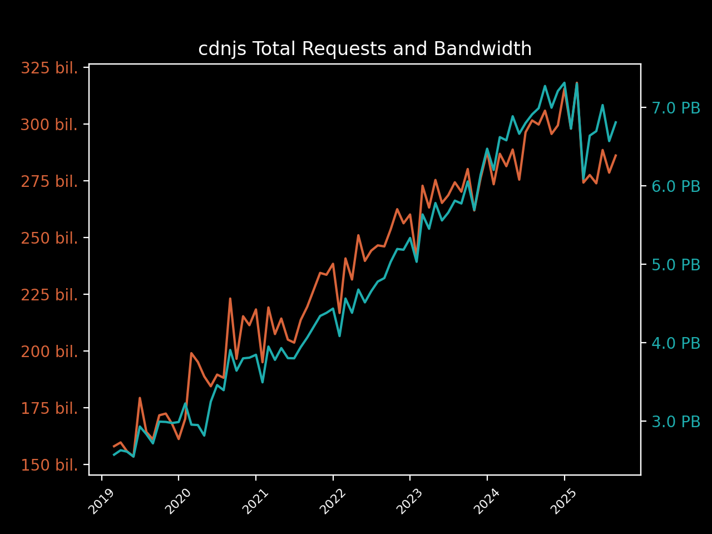

# cdnjs January 2024 Usage Stats

Information provided directly by Cloudflare for the `cdnjs.cloudflare.com` domain. ⛅️

- [Key highlights](#key-highlights)
  - [Library highlights](#library-highlights)
- [Total number of requests](#total-number-of-requests)
- [Total bandwidth usage](#total-bandwidth-usage)
- [Top 100 requested resources](#top-100-requested-resources)

## Key highlights

- cdnjs served **just under 288 billion requests** in January 2024. 🖥
- cdnjs used **a massive consumption of 6.47 PB of data** to serve these requests this month. 📤
- That's **nearly 209 terabytes of data and 9.3 billion requests every day** (averaged). 🤯
- In January, **each request to cdnjs (on average) used only 22.47 KB of data**. 🔍
 
### Library highlights

- The top libraries overall (in the top 100 assets) this month were jquery, font-awesome,
  and webfont.
  - Across the 32.00 billion requests for jquery,
    1,472.27 TB of bandwidth was consumed.
  - font-awesome received 19.14 billion requests and consumed 630.73 TB
    of bandwidth, with webfont assets in the top 100 getting 10.34 billion requests and
    using 53.26 TB of bandwidth to be served.
  - gsap came in 4th this month with 8.02 billion requests, and
    angular.js in 5th with 5.62 billion.
- The top asset on the CDN this month was jquery.min.js from version 3.3.1 of
  jquery, reaching a total of 12.77 billion requests and using 959.39 TB
  of bandwidth to serve the file.
  - webfont (1.6.28/webfontloader.js) came in second with
    10.34 billion requests, followed by jquery
    (3.6.0/jquery.min.js) with 8.11 billion requests.

| Total Requests & Bandwidth | Avg. Daily Requests & Bandwidth |
|---|---|
|  |  |

| Top 5 Resources | Top 5 Libraries |
|---|---|
|  |  |

## Total number of requests

> The first important stat that we are given is the total number of requests sent to cdnjs.cloudflare.com.
> 
> Cloudflare provides this number to us at a 1% sample for the whole month, giving 2,879,808,869 at 1%.

When multiplied up to 100%, this results in cdnjs serving approximately 287,980,886,900 requests in January.

**Just under 288 billion requests or roughly 9.3 billion requests every day of January**. 📈

## Total bandwidth usage

> Another great stat that Cloudflare has given us again is the bandwidth usage for the cdnjs.cloudflare.com domain.
> 
> This number, like total requests, is provided at a 1% sample for the month and in gigabytes: 64,703.86 GB.

When multiplied up to be 100%, this produces the estimate of 6,470,386.0 GB of bandwidth used for this month by
 cdnjs, or 6.47 PB.

**This gives cdnjs a massive bandwidth consumption of 6.47 petabytes of data for requests in January**. 🤯

## Top 100 requested resources

> These are provided at a 1% sample for the whole of January.
> Bandwidth is measured in gigabytes.
> This data, as well as previous months' data, is available in the SQLite data.db file.

| # | Requests | Bandwidth | cdnjs Resource URL |
|---|----------|-----------|--------------------|
| 1   | 127,697,998 | 9,593.90 | [cdnjs.cloudflare.com/ajax/libs/jquery/3.3.1/jquery.min.js](https://cdnjs.cloudflare.com/ajax/libs/jquery/3.3.1/jquery.min.js)                                                                         |
| 2   | 103,356,677 |   532.61 | [cdnjs.cloudflare.com/ajax/libs/webfont/1.6.28/webfontloader.js](https://cdnjs.cloudflare.com/ajax/libs/webfont/1.6.28/webfontloader.js)                                                               |
| 3   | 81,104,709  | 2,161.21 | [cdnjs.cloudflare.com/ajax/libs/jquery/3.6.0/jquery.min.js](https://cdnjs.cloudflare.com/ajax/libs/jquery/3.6.0/jquery.min.js)                                                                         |
| 4   | 64,789,551  |   405.81 | [cdnjs.cloudflare.com/ajax/libs/font-awesome/4.7.0/css/font-awesome.min.css](https://cdnjs.cloudflare.com/ajax/libs/font-awesome/4.7.0/css/font-awesome.min.css)                                       |
| 5   | 40,991,077  | 2,902.79 | [cdnjs.cloudflare.com/ajax/libs/font-awesome/4.7.0/fonts/fontawesome-webfont.woff2](https://cdnjs.cloudflare.com/ajax/libs/font-awesome/4.7.0/fonts/fontawesome-webfont.woff2)                         |
| 6   | 32,783,991  |    66.30 | [cdnjs.cloudflare.com/ajax/libs/jquery-mousewheel/3.1.13/jquery.mousewheel.min.js](https://cdnjs.cloudflare.com/ajax/libs/jquery-mousewheel/3.1.13/jquery.mousewheel.min.js)                           |
| 7   | 27,234,313  |   724.05 | [cdnjs.cloudflare.com/ajax/libs/jquery/3.4.1/jquery.min.js](https://cdnjs.cloudflare.com/ajax/libs/jquery/3.4.1/jquery.min.js)                                                                         |
| 8   | 26,025,732  |   677.79 | [cdnjs.cloudflare.com/ajax/libs/jquery/3.5.1/jquery.min.js](https://cdnjs.cloudflare.com/ajax/libs/jquery/3.5.1/jquery.min.js)                                                                         |
| 9   | 22,061,944  |   634.38 | [cdnjs.cloudflare.com/ajax/libs/jquery/1.12.4/jquery.min.js](https://cdnjs.cloudflare.com/ajax/libs/jquery/1.12.4/jquery.min.js)                                                                       |
| 10  | 21,214,642  |    32.00 | [cdnjs.cloudflare.com/ajax/libs/jquery-cookie/1.4.1/jquery.cookie.min.js](https://cdnjs.cloudflare.com/ajax/libs/jquery-cookie/1.4.1/jquery.cookie.min.js)                                             |
| 11  | 20,942,566  |   120.91 | [cdnjs.cloudflare.com/ajax/libs/postscribe/2.0.8/postscribe.min.js](https://cdnjs.cloudflare.com/ajax/libs/postscribe/2.0.8/postscribe.min.js)                                                         |
| 12  | 16,882,849  |   169.19 | [cdnjs.cloudflare.com/ajax/libs/fingerprintjs2/2.1.2/fingerprint2.min.js](https://cdnjs.cloudflare.com/ajax/libs/fingerprintjs2/2.1.2/fingerprint2.min.js)                                             |
| 13  | 16,346,637  |    69.29 | [cdnjs.cloudflare.com/ajax/libs/jquery-migrate/1.4.1/jquery-migrate.min.js](https://cdnjs.cloudflare.com/ajax/libs/jquery-migrate/1.4.1/jquery-migrate.min.js)                                         |
| 14  | 15,613,657  |   509.19 | [cdnjs.cloudflare.com/ajax/libs/angular.js/1.2.22/angular.min.js](https://cdnjs.cloudflare.com/ajax/libs/angular.js/1.2.22/angular.min.js)                                                             |
| 15  | 15,051,171  |   189.72 | [cdnjs.cloudflare.com/ajax/libs/lodash.js/4.17.11/lodash.core.min.js](https://cdnjs.cloudflare.com/ajax/libs/lodash.js/4.17.11/lodash.core.min.js)                                                     |
| 16  | 14,540,247  |   112.85 | [cdnjs.cloudflare.com/ajax/libs/angular-ui-utils/0.1.1/angular-ui-utils.min.js](https://cdnjs.cloudflare.com/ajax/libs/angular-ui-utils/0.1.1/angular-ui-utils.min.js)                                 |
| 17  | 14,461,634  |   104.94 | [cdnjs.cloudflare.com/ajax/libs/angular-ui-router/0.2.10/angular-ui-router.min.js](https://cdnjs.cloudflare.com/ajax/libs/angular-ui-router/0.2.10/angular-ui-router.min.js)                           |
| 18  | 14,166,502  |    42.24 | [cdnjs.cloudflare.com/ajax/libs/angular.js/1.2.22/angular-sanitize.min.js](https://cdnjs.cloudflare.com/ajax/libs/angular.js/1.2.22/angular-sanitize.min.js)                                           |
| 19  | 14,024,672  |    19.93 | [cdnjs.cloudflare.com/ajax/libs/angular.js/1.2.22/angular-cookies.min.js](https://cdnjs.cloudflare.com/ajax/libs/angular.js/1.2.22/angular-cookies.min.js)                                             |
| 20  | 13,996,436  |    25.88 | [cdnjs.cloudflare.com/ajax/libs/angular-ui/0.4.0/angular-ui-ieshiv.js](https://cdnjs.cloudflare.com/ajax/libs/angular-ui/0.4.0/angular-ui-ieshiv.js)                                                   |
| 21  | 13,992,659  |    26.41 | [cdnjs.cloudflare.com/ajax/libs/angular-dynamic-locale/0.1.27/tmhDynamicLocale.min.js](https://cdnjs.cloudflare.com/ajax/libs/angular-dynamic-locale/0.1.27/tmhDynamicLocale.min.js)                   |
| 22  | 12,795,713  |    39.64 | [cdnjs.cloudflare.com/ajax/libs/infinity/0.2.2/infinity.min.js](https://cdnjs.cloudflare.com/ajax/libs/infinity/0.2.2/infinity.min.js)                                                                 |
| 23  | 12,429,766  |    57.04 | [cdnjs.cloudflare.com/ajax/libs/angular.js/1.2.22/angular-animate.min.js](https://cdnjs.cloudflare.com/ajax/libs/angular.js/1.2.22/angular-animate.min.js)                                             |
| 24  | 11,801,688  |    59.60 | [cdnjs.cloudflare.com/ajax/libs/animate.css/4.1.1/animate.min.css](https://cdnjs.cloudflare.com/ajax/libs/animate.css/4.1.1/animate.min.css)                                                           |
| 25  | 11,792,225  | 1,068.81 | [cdnjs.cloudflare.com/ajax/libs/line-awesome/1.3.0/line-awesome/fonts/la-solid-900.woff2](https://cdnjs.cloudflare.com/ajax/libs/line-awesome/1.3.0/line-awesome/fonts/la-solid-900.woff2)             |
| 26  | 10,945,820  |   105.28 | [cdnjs.cloudflare.com/ajax/libs/slick-carousel/1.8.1/slick.min.js](https://cdnjs.cloudflare.com/ajax/libs/slick-carousel/1.8.1/slick.min.js)                                                           |
| 27  | 10,798,202  |    76.98 | [cdnjs.cloudflare.com/ajax/libs/popper.js/1.14.7/umd/popper.min.js](https://cdnjs.cloudflare.com/ajax/libs/popper.js/1.14.7/umd/popper.min.js)                                                         |
| 28  | 10,531,658  |   138.54 | [cdnjs.cloudflare.com/ajax/libs/line-awesome/1.3.0/line-awesome/css/line-awesome.min.css](https://cdnjs.cloudflare.com/ajax/libs/line-awesome/1.3.0/line-awesome/css/line-awesome.min.css)             |
| 29  | 10,275,546  |    90.52 | [cdnjs.cloudflare.com/ajax/libs/font-awesome/5.15.3/css/all.min.css](https://cdnjs.cloudflare.com/ajax/libs/font-awesome/5.15.3/css/all.min.css)                                                       |
| 30  | 10,173,138  |   105.17 | [cdnjs.cloudflare.com/ajax/libs/OwlCarousel2/2.3.4/owl.carousel.min.js](https://cdnjs.cloudflare.com/ajax/libs/OwlCarousel2/2.3.4/owl.carousel.min.js)                                                 |
| 31  | 10,086,569  |    34.69 | [cdnjs.cloudflare.com/ajax/libs/jquery.devbridge-autocomplete/1.2.7/jquery.autocomplete.min.js](https://cdnjs.cloudflare.com/ajax/libs/jquery.devbridge-autocomplete/1.2.7/jquery.autocomplete.min.js) |
| 32  | 9,981,143   |   223.36 | [cdnjs.cloudflare.com/ajax/libs/gsap/3.9.1/gsap.min.js](https://cdnjs.cloudflare.com/ajax/libs/gsap/3.9.1/gsap.min.js)                                                                                 |
| 33  | 9,851,697   |   218.00 | [cdnjs.cloudflare.com/ajax/libs/gsap/3.8.0/gsap.min.js](https://cdnjs.cloudflare.com/ajax/libs/gsap/3.8.0/gsap.min.js)                                                                                 |
| 34  | 9,773,238   |   136.71 | [cdnjs.cloudflare.com/ajax/libs/crypto-js/4.1.1/crypto-js.min.js](https://cdnjs.cloudflare.com/ajax/libs/crypto-js/4.1.1/crypto-js.min.js)                                                             |
| 35  | 8,751,657   |    59.12 | [cdnjs.cloudflare.com/ajax/libs/popper.js/1.12.9/umd/popper.min.js](https://cdnjs.cloudflare.com/ajax/libs/popper.js/1.12.9/umd/popper.min.js)                                                         |
| 36  | 8,629,633   |   210.83 | [cdnjs.cloudflare.com/ajax/libs/gsap/3.11.4/gsap.min.js](https://cdnjs.cloudflare.com/ajax/libs/gsap/3.11.4/gsap.min.js)                                                                               |
| 37  | 8,308,719   |    14.95 | [cdnjs.cloudflare.com/ajax/libs/OwlCarousel2/2.3.4/assets/owl.carousel.min.css](https://cdnjs.cloudflare.com/ajax/libs/OwlCarousel2/2.3.4/assets/owl.carousel.min.css)                                 |
| 38  | 8,031,995   |   147.74 | [cdnjs.cloudflare.com/ajax/libs/font-awesome/6.4.2/css/all.min.css](https://cdnjs.cloudflare.com/ajax/libs/font-awesome/6.4.2/css/all.min.css)                                                         |
| 39  | 7,931,731   |   207.03 | [cdnjs.cloudflare.com/ajax/libs/jquery/3.2.1/jquery.min.js](https://cdnjs.cloudflare.com/ajax/libs/jquery/3.2.1/jquery.min.js)                                                                         |
| 40  | 7,852,509   |    84.73 | [cdnjs.cloudflare.com/ajax/libs/font-awesome/5.15.4/css/all.min.css](https://cdnjs.cloudflare.com/ajax/libs/font-awesome/5.15.4/css/all.min.css)                                                       |
| 41  | 7,742,263   |    10.91 | [cdnjs.cloudflare.com/ajax/libs/slick-carousel/1.8.1/slick.min.css](https://cdnjs.cloudflare.com/ajax/libs/slick-carousel/1.8.1/slick.min.css)                                                         |
| 42  | 7,496,004   |   192.74 | [cdnjs.cloudflare.com/ajax/libs/jquery/2.2.4/jquery.min.js](https://cdnjs.cloudflare.com/ajax/libs/jquery/2.2.4/jquery.min.js)                                                                         |
| 43  | 7,201,496   |    71.76 | [cdnjs.cloudflare.com/ajax/libs/slick-carousel/1.9.0/slick.min.js](https://cdnjs.cloudflare.com/ajax/libs/slick-carousel/1.9.0/slick.min.js)                                                           |
| 44  | 6,825,284   |     9.38 | [cdnjs.cloudflare.com/ajax/libs/slick-carousel/1.6.0/slick.min.css](https://cdnjs.cloudflare.com/ajax/libs/slick-carousel/1.6.0/slick.min.css)                                                         |
| 45  | 6,731,589   |    63.30 | [cdnjs.cloudflare.com/ajax/libs/video.js/7.11.7/alt/video-js-cdn.min.css](https://cdnjs.cloudflare.com/ajax/libs/video.js/7.11.7/alt/video-js-cdn.min.css)                                             |
| 46  | 6,698,341   |   178.20 | [cdnjs.cloudflare.com/ajax/libs/jquery/3.7.1/jquery.min.js](https://cdnjs.cloudflare.com/ajax/libs/jquery/3.7.1/jquery.min.js)                                                                         |
| 47  | 6,671,079   |   841.46 | [cdnjs.cloudflare.com/ajax/libs/video.js/7.18.1/video.min.js](https://cdnjs.cloudflare.com/ajax/libs/video.js/7.18.1/video.min.js)                                                                     |
| 48  | 6,360,824   |   144.55 | [cdnjs.cloudflare.com/ajax/libs/gsap/3.10.4/gsap.min.js](https://cdnjs.cloudflare.com/ajax/libs/gsap/3.10.4/gsap.min.js)                                                                               |
| 49  | 6,323,879   |   191.09 | [cdnjs.cloudflare.com/ajax/libs/gsap/latest/TweenMax.min.js](https://cdnjs.cloudflare.com/ajax/libs/gsap/latest/TweenMax.min.js)                                                                       |
| 50  | 6,287,133   |   344.97 | [cdnjs.cloudflare.com/ajax/libs/jqueryui/1.12.1/jquery-ui.min.js](https://cdnjs.cloudflare.com/ajax/libs/jqueryui/1.12.1/jquery-ui.min.js)                                                             |
| 51  | 6,284,433   |    43.47 | [cdnjs.cloudflare.com/ajax/libs/popper.js/1.14.3/umd/popper.min.js](https://cdnjs.cloudflare.com/ajax/libs/popper.js/1.14.3/umd/popper.min.js)                                                         |
| 52  | 6,277,177   |    37.53 | [cdnjs.cloudflare.com/ajax/libs/underscore.js/1.8.3/underscore-min.js](https://cdnjs.cloudflare.com/ajax/libs/underscore.js/1.8.3/underscore-min.js)                                                   |
| 53  | 6,222,592   |   153.01 | [cdnjs.cloudflare.com/ajax/libs/gsap/3.12.2/gsap.min.js](https://cdnjs.cloudflare.com/ajax/libs/gsap/3.12.2/gsap.min.js)                                                                               |
| 54  | 6,174,272   |   542.35 | [cdnjs.cloudflare.com/ajax/libs/hls.js/1.4.10/hls.min.js](https://cdnjs.cloudflare.com/ajax/libs/hls.js/1.4.10/hls.min.js)                                                                             |
| 55  | 6,039,732   |     9.04 | [cdnjs.cloudflare.com/ajax/libs/jqueryui-touch-punch/0.2.3/jquery.ui.touch-punch.min.js](https://cdnjs.cloudflare.com/ajax/libs/jqueryui-touch-punch/0.2.3/jquery.ui.touch-punch.min.js)               |
| 56  | 6,028,288   |    10.19 | [cdnjs.cloudflare.com/ajax/libs/slick-carousel/1.8.1/slick-theme.min.css](https://cdnjs.cloudflare.com/ajax/libs/slick-carousel/1.8.1/slick-theme.min.css)                                             |
| 57  | 5,953,469   |   328.17 | [cdnjs.cloudflare.com/ajax/libs/font-awesome/5.15.3/webfonts/fa-solid-900.woff2](https://cdnjs.cloudflare.com/ajax/libs/font-awesome/5.15.3/webfonts/fa-solid-900.woff2)                               |
| 58  | 5,770,427   |   125.76 | [cdnjs.cloudflare.com/ajax/libs/gsap/3.6.1/gsap.min.js](https://cdnjs.cloudflare.com/ajax/libs/gsap/3.6.1/gsap.min.js)                                                                                 |
| 59  | 5,683,907   |   139.60 | [cdnjs.cloudflare.com/ajax/libs/gsap/3.11.5/gsap.min.js](https://cdnjs.cloudflare.com/ajax/libs/gsap/3.11.5/gsap.min.js)                                                                               |
| 60  | 5,628,339   |     9.05 | [cdnjs.cloudflare.com/ajax/libs/slick-carousel/1.6.0/slick-theme.min.css](https://cdnjs.cloudflare.com/ajax/libs/slick-carousel/1.6.0/slick-theme.min.css)                                             |
| 61  | 5,544,076   |    92.37 | [cdnjs.cloudflare.com/ajax/libs/font-awesome/6.1.1/css/all.min.css](https://cdnjs.cloudflare.com/ajax/libs/font-awesome/6.1.1/css/all.min.css)                                                         |
| 62  | 5,530,058   |    22.44 | [cdnjs.cloudflare.com/ajax/libs/animate.css/3.5.2/animate.min.css](https://cdnjs.cloudflare.com/ajax/libs/animate.css/3.5.2/animate.min.css)                                                           |
| 63  | 5,433,893   |    35.10 | [cdnjs.cloudflare.com/ajax/libs/font-awesome/4.7.0/css/font-awesome.css](https://cdnjs.cloudflare.com/ajax/libs/font-awesome/4.7.0/css/font-awesome.css)                                               |
| 64  | 5,425,595   |    57.19 | [cdnjs.cloudflare.com/ajax/libs/font-awesome/5.13.0/css/all.min.css](https://cdnjs.cloudflare.com/ajax/libs/font-awesome/5.13.0/css/all.min.css)                                                       |
| 65  | 5,425,215   |    11.34 | [cdnjs.cloudflare.com/ajax/libs/jquery.lazyload/1.9.1/jquery.lazyload.min.js](https://cdnjs.cloudflare.com/ajax/libs/jquery.lazyload/1.9.1/jquery.lazyload.min.js)                                     |
| 66  | 5,397,686   |   129.59 | [cdnjs.cloudflare.com/ajax/libs/jquery/2.1.3/jquery.min.js](https://cdnjs.cloudflare.com/ajax/libs/jquery/2.1.3/jquery.min.js)                                                                         |
| 67  | 5,381,895   |   398.47 | [cdnjs.cloudflare.com/ajax/libs/hls.js/1.1.5/hls.min.js](https://cdnjs.cloudflare.com/ajax/libs/hls.js/1.1.5/hls.min.js)                                                                               |
| 68  | 5,318,720   |    33.28 | [cdnjs.cloudflare.com/ajax/libs/cookieconsent2/3.0.3/cookieconsent.min.js](https://cdnjs.cloudflare.com/ajax/libs/cookieconsent2/3.0.3/cookieconsent.min.js)                                           |
| 69  | 5,297,262   |   536.74 | [cdnjs.cloudflare.com/ajax/libs/font-awesome/6.4.2/webfonts/fa-brands-400.woff2](https://cdnjs.cloudflare.com/ajax/libs/font-awesome/6.4.2/webfonts/fa-brands-400.woff2)                               |
| 70  | 5,286,340   |   726.59 | [cdnjs.cloudflare.com/ajax/libs/font-awesome/6.4.2/webfonts/fa-solid-900.woff2](https://cdnjs.cloudflare.com/ajax/libs/font-awesome/6.4.2/webfonts/fa-solid-900.woff2)                                 |
| 71  | 5,231,916   |     7.43 | [cdnjs.cloudflare.com/ajax/libs/slick-carousel/1.9.0/slick.min.css](https://cdnjs.cloudflare.com/ajax/libs/slick-carousel/1.9.0/slick.min.css)                                                         |
| 72  | 5,201,133   |    67.69 | [cdnjs.cloudflare.com/ajax/libs/line-awesome/1.3.0/line-awesome/fonts/la-regular-400.woff2](https://cdnjs.cloudflare.com/ajax/libs/line-awesome/1.3.0/line-awesome/fonts/la-regular-400.woff2)         |
| 73  | 5,159,342   |    14.23 | [cdnjs.cloudflare.com/ajax/libs/spin.js/2.3.2/spin.min.js](https://cdnjs.cloudflare.com/ajax/libs/spin.js/2.3.2/spin.min.js)                                                                           |
| 74  | 4,956,326   |    23.24 | [cdnjs.cloudflare.com/ajax/libs/modernizr/2.8.3/modernizr.min.js](https://cdnjs.cloudflare.com/ajax/libs/modernizr/2.8.3/modernizr.min.js)                                                             |
| 75  | 4,806,897   |    10.13 | [cdnjs.cloudflare.com/ajax/libs/cropperjs/1.6.1/cropper.css](https://cdnjs.cloudflare.com/ajax/libs/cropperjs/1.6.1/cropper.css)                                                                       |
| 76  | 4,679,188   |     4.53 | [cdnjs.cloudflare.com/ajax/libs/JavaScript-autoComplete/1.0.4/auto-complete.min.css](https://cdnjs.cloudflare.com/ajax/libs/JavaScript-autoComplete/1.0.4/auto-complete.min.css)                       |
| 77  | 4,620,749   |    17.31 | [cdnjs.cloudflare.com/ajax/libs/js-sha256/0.9.0/sha256.min.js](https://cdnjs.cloudflare.com/ajax/libs/js-sha256/0.9.0/sha256.min.js)                                                                   |
| 78  | 4,614,907   |    85.22 | [cdnjs.cloudflare.com/ajax/libs/fancybox/3.5.7/jquery.fancybox.min.js](https://cdnjs.cloudflare.com/ajax/libs/fancybox/3.5.7/jquery.fancybox.min.js)                                                   |
| 79  | 4,611,227   |     5.13 | [cdnjs.cloudflare.com/ajax/libs/JavaScript-autoComplete/1.0.4/auto-complete.min.js](https://cdnjs.cloudflare.com/ajax/libs/JavaScript-autoComplete/1.0.4/auto-complete.min.js)                         |
| 80  | 4,611,067   |    86.48 | [cdnjs.cloudflare.com/ajax/libs/font-awesome/6.5.1/css/all.min.css](https://cdnjs.cloudflare.com/ajax/libs/font-awesome/6.5.1/css/all.min.css)                                                         |
| 81  | 4,581,562   |   330.69 | [cdnjs.cloudflare.com/ajax/libs/font-awesome/5.15.4/webfonts/fa-solid-900.woff2](https://cdnjs.cloudflare.com/ajax/libs/font-awesome/5.15.4/webfonts/fa-solid-900.woff2)                               |
| 82  | 4,543,804   |   151.42 | [cdnjs.cloudflare.com/ajax/libs/gsap/2.1.2/TweenMax.min.js](https://cdnjs.cloudflare.com/ajax/libs/gsap/2.1.2/TweenMax.min.js)                                                                         |
| 83  | 4,506,023   |   197.74 | [cdnjs.cloudflare.com/ajax/libs/intl-tel-input/18.2.1/js/utils.min.js](https://cdnjs.cloudflare.com/ajax/libs/intl-tel-input/18.2.1/js/utils.min.js)                                                   |
| 84  | 4,503,282   |   151.80 | [cdnjs.cloudflare.com/ajax/libs/gsap/2.1.3/TweenMax.min.js](https://cdnjs.cloudflare.com/ajax/libs/gsap/2.1.3/TweenMax.min.js)                                                                         |
| 85  | 4,473,503   |     8.44 | [cdnjs.cloudflare.com/ajax/libs/cookieconsent2/3.0.3/cookieconsent.min.css](https://cdnjs.cloudflare.com/ajax/libs/cookieconsent2/3.0.3/cookieconsent.min.css)                                         |
| 86  | 4,445,472   |    72.42 | [cdnjs.cloudflare.com/ajax/libs/moment.js/2.29.1/moment.min.js](https://cdnjs.cloudflare.com/ajax/libs/moment.js/2.29.1/moment.min.js)                                                                 |
| 87  | 4,443,374   |   313.64 | [cdnjs.cloudflare.com/ajax/libs/font-awesome/5.11.2/webfonts/fa-solid-900.woff2](https://cdnjs.cloudflare.com/ajax/libs/font-awesome/5.11.2/webfonts/fa-solid-900.woff2)                               |
| 88  | 4,416,641   |    96.15 | [cdnjs.cloudflare.com/ajax/libs/gsap/3.6.0/gsap.min.js](https://cdnjs.cloudflare.com/ajax/libs/gsap/3.6.0/gsap.min.js)                                                                                 |
| 89  | 4,411,677   |   114.72 | [cdnjs.cloudflare.com/ajax/libs/jquery/3.6.1/jquery.min.js](https://cdnjs.cloudflare.com/ajax/libs/jquery/3.6.1/jquery.min.js)                                                                         |
| 90  | 4,367,686   |    80.45 | [cdnjs.cloudflare.com/ajax/libs/font-awesome/6.4.0/css/all.min.css](https://cdnjs.cloudflare.com/ajax/libs/font-awesome/6.4.0/css/all.min.css)                                                         |
| 91  | 4,340,049   |    19.62 | [cdnjs.cloudflare.com/ajax/libs/jquery-migrate/3.3.2/jquery-migrate.min.js](https://cdnjs.cloudflare.com/ajax/libs/jquery-migrate/3.3.2/jquery-migrate.min.js)                                         |
| 92  | 4,295,686   |    44.37 | [cdnjs.cloudflare.com/ajax/libs/font-awesome/5.11.2/css/all.min.css](https://cdnjs.cloudflare.com/ajax/libs/font-awesome/5.11.2/css/all.min.css)                                                       |
| 93  | 4,291,445   |    21.55 | [cdnjs.cloudflare.com/ajax/libs/crypto-js/3.1.2/rollups/aes.js](https://cdnjs.cloudflare.com/ajax/libs/crypto-js/3.1.2/rollups/aes.js)                                                                 |
| 94  | 4,261,904   |    17.12 | [cdnjs.cloudflare.com/ajax/libs/json3/3.3.2/json3.min.js](https://cdnjs.cloudflare.com/ajax/libs/json3/3.3.2/json3.min.js)                                                                             |
| 95  | 4,183,723   |    43.92 | [cdnjs.cloudflare.com/ajax/libs/font-awesome/5.15.1/css/all.min.css](https://cdnjs.cloudflare.com/ajax/libs/font-awesome/5.15.1/css/all.min.css)                                                       |
| 96  | 4,007,687   |    85.70 | [cdnjs.cloudflare.com/ajax/libs/gsap/3.5.1/gsap.min.js](https://cdnjs.cloudflare.com/ajax/libs/gsap/3.5.1/gsap.min.js)                                                                                 |
| 97  | 3,993,846   |     9.15 | [cdnjs.cloudflare.com/ajax/libs/jquery-modal/0.9.1/jquery.modal.min.js](https://cdnjs.cloudflare.com/ajax/libs/jquery-modal/0.9.1/jquery.modal.min.js)                                                 |
| 98  | 3,980,609   |   109.07 | [cdnjs.cloudflare.com/ajax/libs/jquery/3.7.0/jquery.min.js](https://cdnjs.cloudflare.com/ajax/libs/jquery/3.7.0/jquery.min.js)                                                                         |
| 99  | 3,937,775   |    14.14 | [cdnjs.cloudflare.com/ajax/libs/fancybox/3.5.7/jquery.fancybox.min.css](https://cdnjs.cloudflare.com/ajax/libs/fancybox/3.5.7/jquery.fancybox.min.css)                                                 |
| 100 | 3,929,898   |     9.95 | [cdnjs.cloudflare.com/ajax/libs/gsap/3.9.1/ScrollToPlugin.min.js](https://cdnjs.cloudflare.com/ajax/libs/gsap/3.9.1/ScrollToPlugin.min.js)                                                             |

Author: [Matt (IPv4) Cowley](https://mattcowley.co.uk) - If there are any errors, please let me know and I will
 endeavour to correct them.
