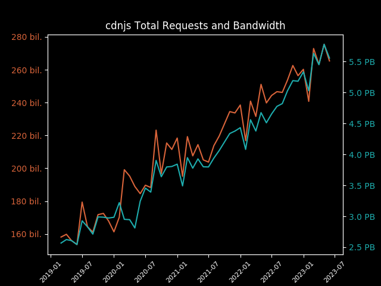
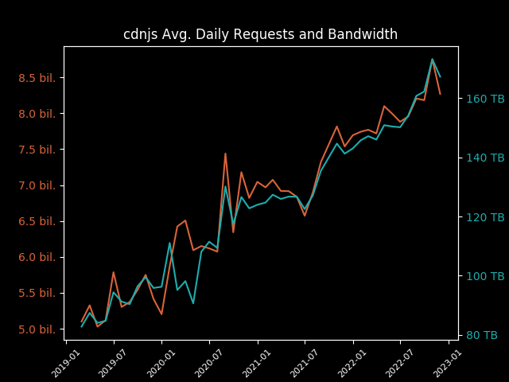
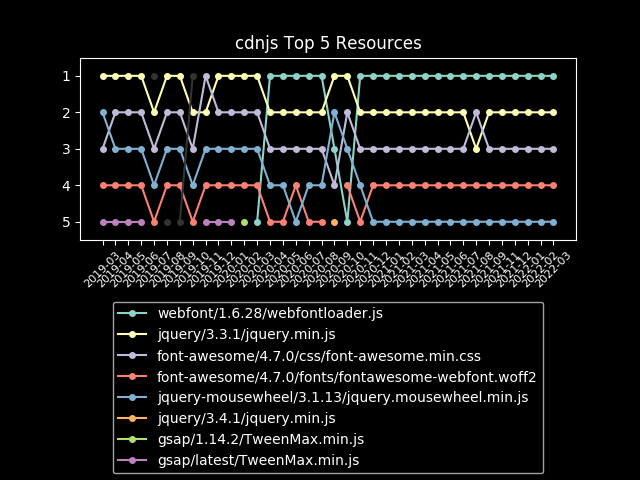
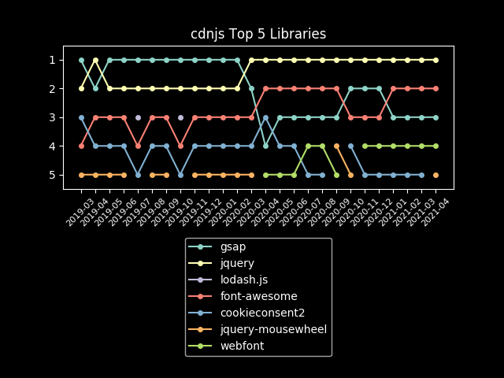

# cdnjs May 2024 Usage Stats

Information provided directly by Cloudflare for the `cdnjs.cloudflare.com` domain. ⛅️

- [Key highlights](#key-highlights)
  - [Library highlights](#library-highlights)
- [Total number of requests](#total-number-of-requests)
- [Total bandwidth usage](#total-bandwidth-usage)
- [Top 100 requested resources](#top-100-requested-resources)

## Key highlights

- cdnjs served **just under 289 billion requests** in May 2024. 🖥
- cdnjs used **a huge consumption of 6.88 PB of data** to serve these requests this month. 📤
- That works out to **over 222 TB of data and 9.3 billion requests every day** (averaged). 🤯
- In May, **each request to cdnjs (on average) used only 23.83 KB of data**. 🔍
 
### Library highlights

- The top libraries overall (in the top 100 assets) this month were jquery, font-awesome,
  and webfont.
  - Across the 32.40 billion requests for jquery,
    1,591.01 TB of bandwidth was consumed.
  - font-awesome received 20.11 billion requests and consumed 718.26 TB
    of bandwidth, with webfont assets in the top 100 getting 9.47 billion requests and
    using 48.59 TB of bandwidth to be served.
  - gsap came in 4th this month with 7.77 billion requests, and
    angular.js in 5th with 5.34 billion.
- The top asset on the CDN this month was jquery.min.js from version 3.3.1 of
  jquery, reaching a total of 14.82 billion requests and using 1,122.05 TB
  of bandwidth to serve the file.
  - webfont (1.6.28/webfontloader.js) came in second with
    9.47 billion requests, followed by jquery
    (3.6.0/jquery.min.js) with 7.36 billion requests.

| Total Requests & Bandwidth | Avg. Daily Requests & Bandwidth |
|---|---|
|  |  |

| Top 5 Resources | Top 5 Libraries |
|---|---|
|  |  |

## Total number of requests

> The first important stat that we are given is the total number of requests sent to cdnjs.cloudflare.com.
> 
> Cloudflare provides this number to us at a 1% sample for the whole month, giving 2,888,717,969 at 1%.

When multiplied up to 100%, this results in cdnjs serving approximately 288,871,796,900 requests in May.

**Just under 289 billion requests or around 9.3 billion requests each day of May**. 📈

## Total bandwidth usage

> Another great stat that Cloudflare has given us again is the bandwidth usage for the cdnjs.cloudflare.com domain.
> 
> This number, like total requests, is provided at a 1% sample for the month and in gigabytes: 68,842.13 GB.

When multiplied up to be 100%, this produces the estimate of 6,884,213.0 GB of bandwidth used for this month by
 cdnjs, or 6.88 PB.

**This gives cdnjs a huge bandwidth consumption of 6.88 petabytes of data for requests this month**. 🤯

## Top 100 requested resources

> These are provided at a 1% sample for the whole of May.
> Bandwidth is measured in gigabytes.
> This data, as well as previous months' data, is available in the SQLite data.db file.

| # | Requests | Bandwidth | cdnjs Resource URL |
|---|----------|-----------|--------------------|
| 1  | 148,220,050 | 11,220.45 | [cdnjs.cloudflare.com/ajax/libs/jquery/3.3.1/jquery.min.js](https://cdnjs.cloudflare.com/ajax/libs/jquery/3.3.1/jquery.min.js)                                                                         |
| 2  | 94,668,676  |    485.95 | [cdnjs.cloudflare.com/ajax/libs/webfont/1.6.28/webfontloader.js](https://cdnjs.cloudflare.com/ajax/libs/webfont/1.6.28/webfontloader.js)                                                               |
| 3  | 73,568,947  |  1,964.34 | [cdnjs.cloudflare.com/ajax/libs/jquery/3.6.0/jquery.min.js](https://cdnjs.cloudflare.com/ajax/libs/jquery/3.6.0/jquery.min.js)                                                                         |
| 4  | 63,278,718  |    395.44 | [cdnjs.cloudflare.com/ajax/libs/font-awesome/4.7.0/css/font-awesome.min.css](https://cdnjs.cloudflare.com/ajax/libs/font-awesome/4.7.0/css/font-awesome.min.css)                                       |
| 5  | 40,108,541  |  2,832.33 | [cdnjs.cloudflare.com/ajax/libs/font-awesome/4.7.0/fonts/fontawesome-webfont.woff2](https://cdnjs.cloudflare.com/ajax/libs/font-awesome/4.7.0/fonts/fontawesome-webfont.woff2)                         |
| 6  | 27,091,794  |     54.34 | [cdnjs.cloudflare.com/ajax/libs/jquery-mousewheel/3.1.13/jquery.mousewheel.min.js](https://cdnjs.cloudflare.com/ajax/libs/jquery-mousewheel/3.1.13/jquery.mousewheel.min.js)                           |
| 7  | 24,692,968  |    641.17 | [cdnjs.cloudflare.com/ajax/libs/jquery/3.5.1/jquery.min.js](https://cdnjs.cloudflare.com/ajax/libs/jquery/3.5.1/jquery.min.js)                                                                         |
| 8  | 20,545,530  |  2,603.21 | [cdnjs.cloudflare.com/ajax/libs/three.js/0.159.0/three.min.js](https://cdnjs.cloudflare.com/ajax/libs/three.js/0.159.0/three.min.js)                                                                   |
| 9  | 20,267,629  |    582.64 | [cdnjs.cloudflare.com/ajax/libs/jquery/1.12.4/jquery.min.js](https://cdnjs.cloudflare.com/ajax/libs/jquery/1.12.4/jquery.min.js)                                                                       |
| 10 | 20,067,717  |     30.32 | [cdnjs.cloudflare.com/ajax/libs/jquery-cookie/1.4.1/jquery.cookie.min.js](https://cdnjs.cloudflare.com/ajax/libs/jquery-cookie/1.4.1/jquery.cookie.min.js)                                             |
| 11 | 19,108,933  |    507.14 | [cdnjs.cloudflare.com/ajax/libs/jquery/3.4.1/jquery.min.js](https://cdnjs.cloudflare.com/ajax/libs/jquery/3.4.1/jquery.min.js)                                                                         |
| 12 | 17,314,872  |    173.23 | [cdnjs.cloudflare.com/ajax/libs/fingerprintjs2/2.1.2/fingerprint2.min.js](https://cdnjs.cloudflare.com/ajax/libs/fingerprintjs2/2.1.2/fingerprint2.min.js)                                             |
| 13 | 16,116,442  |    203.75 | [cdnjs.cloudflare.com/ajax/libs/lodash.js/4.17.11/lodash.core.min.js](https://cdnjs.cloudflare.com/ajax/libs/lodash.js/4.17.11/lodash.core.min.js)                                                     |
| 14 | 15,742,650  |     90.62 | [cdnjs.cloudflare.com/ajax/libs/postscribe/2.0.8/postscribe.min.js](https://cdnjs.cloudflare.com/ajax/libs/postscribe/2.0.8/postscribe.min.js)                                                         |
| 15 | 15,297,702  |     64.76 | [cdnjs.cloudflare.com/ajax/libs/jquery-migrate/1.4.1/jquery-migrate.min.js](https://cdnjs.cloudflare.com/ajax/libs/jquery-migrate/1.4.1/jquery-migrate.min.js)                                         |
| 16 | 14,802,953  |    482.43 | [cdnjs.cloudflare.com/ajax/libs/angular.js/1.2.22/angular.min.js](https://cdnjs.cloudflare.com/ajax/libs/angular.js/1.2.22/angular.min.js)                                                             |
| 17 | 13,810,453  |    107.03 | [cdnjs.cloudflare.com/ajax/libs/angular-ui-utils/0.1.1/angular-ui-utils.min.js](https://cdnjs.cloudflare.com/ajax/libs/angular-ui-utils/0.1.1/angular-ui-utils.min.js)                                 |
| 18 | 13,698,447  |     99.28 | [cdnjs.cloudflare.com/ajax/libs/angular-ui-router/0.2.10/angular-ui-router.min.js](https://cdnjs.cloudflare.com/ajax/libs/angular-ui-router/0.2.10/angular-ui-router.min.js)                           |
| 19 | 13,431,302  |     39.99 | [cdnjs.cloudflare.com/ajax/libs/angular.js/1.2.22/angular-sanitize.min.js](https://cdnjs.cloudflare.com/ajax/libs/angular.js/1.2.22/angular-sanitize.min.js)                                           |
| 20 | 13,285,473  |     18.85 | [cdnjs.cloudflare.com/ajax/libs/angular.js/1.2.22/angular-cookies.min.js](https://cdnjs.cloudflare.com/ajax/libs/angular.js/1.2.22/angular-cookies.min.js)                                             |
| 21 | 13,274,563  |     24.51 | [cdnjs.cloudflare.com/ajax/libs/angular-ui/0.4.0/angular-ui-ieshiv.js](https://cdnjs.cloudflare.com/ajax/libs/angular-ui/0.4.0/angular-ui-ieshiv.js)                                                   |
| 22 | 13,274,354  |     25.02 | [cdnjs.cloudflare.com/ajax/libs/angular-dynamic-locale/0.1.27/tmhDynamicLocale.min.js](https://cdnjs.cloudflare.com/ajax/libs/angular-dynamic-locale/0.1.27/tmhDynamicLocale.min.js)                   |
| 23 | 13,168,906  |     40.93 | [cdnjs.cloudflare.com/ajax/libs/infinity/0.2.2/infinity.min.js](https://cdnjs.cloudflare.com/ajax/libs/infinity/0.2.2/infinity.min.js)                                                                 |
| 24 | 12,113,358  |    114.27 | [cdnjs.cloudflare.com/ajax/libs/slick-carousel/1.8.1/slick.min.js](https://cdnjs.cloudflare.com/ajax/libs/slick-carousel/1.8.1/slick.min.js)                                                           |
| 25 | 11,854,538  |     54.35 | [cdnjs.cloudflare.com/ajax/libs/angular.js/1.2.22/angular-animate.min.js](https://cdnjs.cloudflare.com/ajax/libs/angular.js/1.2.22/angular-animate.min.js)                                             |
| 26 | 11,844,736  |    164.94 | [cdnjs.cloudflare.com/ajax/libs/crypto-js/4.1.1/crypto-js.min.js](https://cdnjs.cloudflare.com/ajax/libs/crypto-js/4.1.1/crypto-js.min.js)                                                             |
| 27 | 11,344,082  |    207.95 | [cdnjs.cloudflare.com/ajax/libs/font-awesome/6.4.2/css/all.min.css](https://cdnjs.cloudflare.com/ajax/libs/font-awesome/6.4.2/css/all.min.css)                                                         |
| 28 | 11,113,004  |     75.02 | [cdnjs.cloudflare.com/ajax/libs/popper.js/1.12.9/umd/popper.min.js](https://cdnjs.cloudflare.com/ajax/libs/popper.js/1.12.9/umd/popper.min.js)                                                         |
| 29 | 10,721,156  |    285.28 | [cdnjs.cloudflare.com/ajax/libs/jquery/3.7.1/jquery.min.js](https://cdnjs.cloudflare.com/ajax/libs/jquery/3.7.1/jquery.min.js)                                                                         |
| 30 | 10,619,361  |     65.00 | [cdnjs.cloudflare.com/ajax/libs/animate.css/4.1.1/animate.min.css](https://cdnjs.cloudflare.com/ajax/libs/animate.css/4.1.1/animate.min.css)                                                           |
| 31 | 9,919,383   |    102.61 | [cdnjs.cloudflare.com/ajax/libs/OwlCarousel2/2.3.4/owl.carousel.min.js](https://cdnjs.cloudflare.com/ajax/libs/OwlCarousel2/2.3.4/owl.carousel.min.js)                                                 |
| 32 | 9,839,391   |     70.45 | [cdnjs.cloudflare.com/ajax/libs/popper.js/1.14.7/umd/popper.min.js](https://cdnjs.cloudflare.com/ajax/libs/popper.js/1.14.7/umd/popper.min.js)                                                         |
| 33 | 9,766,631   |     90.45 | [cdnjs.cloudflare.com/ajax/libs/font-awesome/5.15.3/css/all.min.css](https://cdnjs.cloudflare.com/ajax/libs/font-awesome/5.15.3/css/all.min.css)                                                       |
| 34 | 9,332,653   |    102.36 | [cdnjs.cloudflare.com/ajax/libs/font-awesome/5.15.4/css/all.min.css](https://cdnjs.cloudflare.com/ajax/libs/font-awesome/5.15.4/css/all.min.css)                                                       |
| 35 | 9,111,051   |     31.19 | [cdnjs.cloudflare.com/ajax/libs/jquery.devbridge-autocomplete/1.2.7/jquery.autocomplete.min.js](https://cdnjs.cloudflare.com/ajax/libs/jquery.devbridge-autocomplete/1.2.7/jquery.autocomplete.min.js) |
| 36 | 8,830,832   |    195.67 | [cdnjs.cloudflare.com/ajax/libs/gsap/3.9.1/gsap.min.js](https://cdnjs.cloudflare.com/ajax/libs/gsap/3.9.1/gsap.min.js)                                                                                 |
| 37 | 8,126,867   |     14.61 | [cdnjs.cloudflare.com/ajax/libs/OwlCarousel2/2.3.4/assets/owl.carousel.min.css](https://cdnjs.cloudflare.com/ajax/libs/OwlCarousel2/2.3.4/assets/owl.carousel.min.css)                                 |
| 38 | 7,677,837   |     10.68 | [cdnjs.cloudflare.com/ajax/libs/slick-carousel/1.8.1/slick.min.css](https://cdnjs.cloudflare.com/ajax/libs/slick-carousel/1.8.1/slick.min.css)                                                         |
| 39 | 7,447,449   |    181.55 | [cdnjs.cloudflare.com/ajax/libs/gsap/3.11.4/gsap.min.js](https://cdnjs.cloudflare.com/ajax/libs/gsap/3.11.4/gsap.min.js)                                                                               |
| 40 | 7,222,023   |    159.32 | [cdnjs.cloudflare.com/ajax/libs/gsap/3.8.0/gsap.min.js](https://cdnjs.cloudflare.com/ajax/libs/gsap/3.8.0/gsap.min.js)                                                                                 |
| 41 | 7,095,751   |    154.63 | [cdnjs.cloudflare.com/ajax/libs/gsap/3.6.1/gsap.min.js](https://cdnjs.cloudflare.com/ajax/libs/gsap/3.6.1/gsap.min.js)                                                                                 |
| 42 | 7,025,056   |    173.13 | [cdnjs.cloudflare.com/ajax/libs/gsap/3.12.2/gsap.min.js](https://cdnjs.cloudflare.com/ajax/libs/gsap/3.12.2/gsap.min.js)                                                                               |
| 43 | 6,916,314   |     68.97 | [cdnjs.cloudflare.com/ajax/libs/slick-carousel/1.9.0/slick.min.js](https://cdnjs.cloudflare.com/ajax/libs/slick-carousel/1.9.0/slick.min.js)                                                           |
| 44 | 6,887,725   |    128.83 | [cdnjs.cloudflare.com/ajax/libs/font-awesome/6.5.1/css/all.min.css](https://cdnjs.cloudflare.com/ajax/libs/font-awesome/6.5.1/css/all.min.css)                                                         |
| 45 | 6,867,187   |     72.64 | [cdnjs.cloudflare.com/ajax/libs/font-awesome/5.13.0/css/all.min.css](https://cdnjs.cloudflare.com/ajax/libs/font-awesome/5.13.0/css/all.min.css)                                                       |
| 46 | 6,721,550   |    608.03 | [cdnjs.cloudflare.com/ajax/libs/line-awesome/1.3.0/line-awesome/fonts/la-solid-900.woff2](https://cdnjs.cloudflare.com/ajax/libs/line-awesome/1.3.0/line-awesome/fonts/la-solid-900.woff2)             |
| 47 | 6,649,339   |    671.19 | [cdnjs.cloudflare.com/ajax/libs/font-awesome/6.4.2/webfonts/fa-brands-400.woff2](https://cdnjs.cloudflare.com/ajax/libs/font-awesome/6.4.2/webfonts/fa-brands-400.woff2)                               |
| 48 | 6,602,091   |    902.43 | [cdnjs.cloudflare.com/ajax/libs/font-awesome/6.4.2/webfonts/fa-solid-900.woff2](https://cdnjs.cloudflare.com/ajax/libs/font-awesome/6.4.2/webfonts/fa-solid-900.woff2)                                 |
| 49 | 6,518,129   |    166.26 | [cdnjs.cloudflare.com/ajax/libs/jquery/2.2.4/jquery.min.js](https://cdnjs.cloudflare.com/ajax/libs/jquery/2.2.4/jquery.min.js)                                                                         |
| 50 | 6,492,565   |    171.08 | [cdnjs.cloudflare.com/ajax/libs/jquery/3.2.1/jquery.min.js](https://cdnjs.cloudflare.com/ajax/libs/jquery/3.2.1/jquery.min.js)                                                                         |
| 51 | 6,408,181   |     15.78 | [cdnjs.cloudflare.com/ajax/libs/TimeMe.js/2.0.0/timeme.min.js](https://cdnjs.cloudflare.com/ajax/libs/TimeMe.js/2.0.0/timeme.min.js)                                                                   |
| 52 | 6,357,249   |      8.70 | [cdnjs.cloudflare.com/ajax/libs/slick-carousel/1.6.0/slick.min.css](https://cdnjs.cloudflare.com/ajax/libs/slick-carousel/1.6.0/slick.min.css)                                                         |
| 53 | 6,356,154   |     83.04 | [cdnjs.cloudflare.com/ajax/libs/line-awesome/1.3.0/line-awesome/css/line-awesome.min.css](https://cdnjs.cloudflare.com/ajax/libs/line-awesome/1.3.0/line-awesome/css/line-awesome.min.css)             |
| 54 | 6,350,911   |      9.45 | [cdnjs.cloudflare.com/ajax/libs/jqueryui-touch-punch/0.2.3/jquery.ui.touch-punch.min.js](https://cdnjs.cloudflare.com/ajax/libs/jqueryui-touch-punch/0.2.3/jquery.ui.touch-punch.min.js)               |
| 55 | 6,322,054   |    339.99 | [cdnjs.cloudflare.com/ajax/libs/jqueryui/1.12.1/jquery-ui.min.js](https://cdnjs.cloudflare.com/ajax/libs/jqueryui/1.12.1/jquery-ui.min.js)                                                             |
| 56 | 6,268,098   |     59.26 | [cdnjs.cloudflare.com/ajax/libs/video.js/7.11.7/alt/video-js-cdn.min.css](https://cdnjs.cloudflare.com/ajax/libs/video.js/7.11.7/alt/video-js-cdn.min.css)                                             |
| 57 | 6,144,519   |    165.13 | [cdnjs.cloudflare.com/ajax/libs/emojione/2.1.4/lib/js/emojione.min.js](https://cdnjs.cloudflare.com/ajax/libs/emojione/2.1.4/lib/js/emojione.min.js)                                                   |
| 58 | 6,079,296   |      9.96 | [cdnjs.cloudflare.com/ajax/libs/slick-carousel/1.8.1/slick-theme.min.css](https://cdnjs.cloudflare.com/ajax/libs/slick-carousel/1.8.1/slick-theme.min.css)                                             |
| 59 | 6,075,362   |     84.94 | [cdnjs.cloudflare.com/ajax/libs/crypto-js/4.0.0/crypto-js.min.js](https://cdnjs.cloudflare.com/ajax/libs/crypto-js/4.0.0/crypto-js.min.js)                                                             |
| 60 | 6,000,084   |    149.21 | [cdnjs.cloudflare.com/ajax/libs/jquery/2.1.3/jquery.min.js](https://cdnjs.cloudflare.com/ajax/libs/jquery/2.1.3/jquery.min.js)                                                                         |
| 61 | 5,988,020   |     41.28 | [cdnjs.cloudflare.com/ajax/libs/popper.js/1.14.3/umd/popper.min.js](https://cdnjs.cloudflare.com/ajax/libs/popper.js/1.14.3/umd/popper.min.js)                                                         |
| 62 | 5,635,097   |     94.59 | [cdnjs.cloudflare.com/ajax/libs/font-awesome/6.1.1/css/all.min.css](https://cdnjs.cloudflare.com/ajax/libs/font-awesome/6.1.1/css/all.min.css)                                                         |
| 63 | 5,587,671   |    295.94 | [cdnjs.cloudflare.com/ajax/libs/font-awesome/5.15.3/webfonts/fa-solid-900.woff2](https://cdnjs.cloudflare.com/ajax/libs/font-awesome/5.15.3/webfonts/fa-solid-900.woff2)                               |
| 64 | 5,563,063   |     35.71 | [cdnjs.cloudflare.com/ajax/libs/font-awesome/4.7.0/css/font-awesome.css](https://cdnjs.cloudflare.com/ajax/libs/font-awesome/4.7.0/css/font-awesome.css)                                               |
| 65 | 5,557,729   |     33.23 | [cdnjs.cloudflare.com/ajax/libs/underscore.js/1.8.3/underscore-min.js](https://cdnjs.cloudflare.com/ajax/libs/underscore.js/1.8.3/underscore-min.js)                                                   |
| 66 | 5,553,927   |    401.99 | [cdnjs.cloudflare.com/ajax/libs/font-awesome/5.15.4/webfonts/fa-solid-900.woff2](https://cdnjs.cloudflare.com/ajax/libs/font-awesome/5.15.4/webfonts/fa-solid-900.woff2)                               |
| 67 | 5,459,802   |    134.22 | [cdnjs.cloudflare.com/ajax/libs/gsap/3.11.5/gsap.min.js](https://cdnjs.cloudflare.com/ajax/libs/gsap/3.11.5/gsap.min.js)                                                                               |
| 68 | 5,256,232   |    119.32 | [cdnjs.cloudflare.com/ajax/libs/gsap/3.10.4/gsap.min.js](https://cdnjs.cloudflare.com/ajax/libs/gsap/3.10.4/gsap.min.js)                                                                               |
| 69 | 5,188,096   |    180.27 | [cdnjs.cloudflare.com/ajax/libs/Swiper/11.0.5/swiper-bundle.min.js](https://cdnjs.cloudflare.com/ajax/libs/Swiper/11.0.5/swiper-bundle.min.js)                                                         |
| 70 | 5,170,559   |    746.99 | [cdnjs.cloudflare.com/ajax/libs/font-awesome/6.5.1/webfonts/fa-solid-900.woff2](https://cdnjs.cloudflare.com/ajax/libs/font-awesome/6.5.1/webfonts/fa-solid-900.woff2)                                 |
| 71 | 5,163,254   |      8.27 | [cdnjs.cloudflare.com/ajax/libs/slick-carousel/1.6.0/slick-theme.min.css](https://cdnjs.cloudflare.com/ajax/libs/slick-carousel/1.6.0/slick-theme.min.css)                                             |
| 72 | 5,131,711   |    171.28 | [cdnjs.cloudflare.com/ajax/libs/gsap/2.1.2/TweenMax.min.js](https://cdnjs.cloudflare.com/ajax/libs/gsap/2.1.2/TweenMax.min.js)                                                                         |
| 73 | 5,117,729   |    126.55 | [cdnjs.cloudflare.com/ajax/libs/gsap/3.12.5/gsap.min.js](https://cdnjs.cloudflare.com/ajax/libs/gsap/3.12.5/gsap.min.js)                                                                               |
| 74 | 5,115,001   |    660.51 | [cdnjs.cloudflare.com/ajax/libs/video.js/7.21.5/video.min.js](https://cdnjs.cloudflare.com/ajax/libs/video.js/7.21.5/video.min.js)                                                                     |
| 75 | 5,113,542   |     95.18 | [cdnjs.cloudflare.com/ajax/libs/fancybox/3.5.7/jquery.fancybox.min.js](https://cdnjs.cloudflare.com/ajax/libs/fancybox/3.5.7/jquery.fancybox.min.js)                                                   |
| 76 | 4,965,824   |    149.59 | [cdnjs.cloudflare.com/ajax/libs/gsap/latest/TweenMax.min.js](https://cdnjs.cloudflare.com/ajax/libs/gsap/latest/TweenMax.min.js)                                                                       |
| 77 | 4,904,751   |    159.96 | [cdnjs.cloudflare.com/ajax/libs/gsap/2.1.3/TweenMax.min.js](https://cdnjs.cloudflare.com/ajax/libs/gsap/2.1.3/TweenMax.min.js)                                                                         |
| 78 | 4,891,522   |     24.32 | [cdnjs.cloudflare.com/ajax/libs/crypto-js/3.1.2/rollups/aes.js](https://cdnjs.cloudflare.com/ajax/libs/crypto-js/3.1.2/rollups/aes.js)                                                                 |
| 79 | 4,839,111   |     26.02 | [cdnjs.cloudflare.com/ajax/libs/Swiper/11.0.5/swiper-bundle.css](https://cdnjs.cloudflare.com/ajax/libs/Swiper/11.0.5/swiper-bundle.css)                                                               |
| 80 | 4,781,178   |     30.25 | [cdnjs.cloudflare.com/ajax/libs/cookieconsent2/3.0.3/cookieconsent.min.js](https://cdnjs.cloudflare.com/ajax/libs/cookieconsent2/3.0.3/cookieconsent.min.js)                                           |
| 81 | 4,733,920   |    100.94 | [cdnjs.cloudflare.com/ajax/libs/gsap/3.5.1/gsap.min.js](https://cdnjs.cloudflare.com/ajax/libs/gsap/3.5.1/gsap.min.js)                                                                                 |
| 82 | 4,717,757   |     22.14 | [cdnjs.cloudflare.com/ajax/libs/modernizr/2.8.3/modernizr.min.js](https://cdnjs.cloudflare.com/ajax/libs/modernizr/2.8.3/modernizr.min.js)                                                             |
| 83 | 4,704,701   |     11.73 | [cdnjs.cloudflare.com/ajax/libs/videojs-hotkeys/0.2.28/videojs.hotkeys.min.js](https://cdnjs.cloudflare.com/ajax/libs/videojs-hotkeys/0.2.28/videojs.hotkeys.min.js)                                   |
| 84 | 4,687,934   |      9.81 | [cdnjs.cloudflare.com/ajax/libs/jquery.lazyload/1.9.1/jquery.lazyload.min.js](https://cdnjs.cloudflare.com/ajax/libs/jquery.lazyload/1.9.1/jquery.lazyload.min.js)                                     |
| 85 | 4,631,959   |     12.76 | [cdnjs.cloudflare.com/ajax/libs/spin.js/2.3.2/spin.min.js](https://cdnjs.cloudflare.com/ajax/libs/spin.js/2.3.2/spin.min.js)                                                                           |
| 86 | 4,621,859   |      6.42 | [cdnjs.cloudflare.com/ajax/libs/slick-carousel/1.9.0/slick.min.css](https://cdnjs.cloudflare.com/ajax/libs/slick-carousel/1.9.0/slick.min.css)                                                         |
| 87 | 4,479,525   |    109.38 | [cdnjs.cloudflare.com/ajax/libs/gsap/3.11.3/gsap.min.js](https://cdnjs.cloudflare.com/ajax/libs/gsap/3.11.3/gsap.min.js)                                                                               |
| 88 | 4,476,926   |     82.26 | [cdnjs.cloudflare.com/ajax/libs/font-awesome/6.4.0/css/all.min.css](https://cdnjs.cloudflare.com/ajax/libs/font-awesome/6.4.0/css/all.min.css)                                                         |
| 89 | 4,439,125   |     16.61 | [cdnjs.cloudflare.com/ajax/libs/js-sha256/0.9.0/sha256.min.js](https://cdnjs.cloudflare.com/ajax/libs/js-sha256/0.9.0/sha256.min.js)                                                                   |
| 90 | 4,373,864   |    114.76 | [cdnjs.cloudflare.com/ajax/libs/jquery/3.6.1/jquery.min.js](https://cdnjs.cloudflare.com/ajax/libs/jquery/3.6.1/jquery.min.js)                                                                         |
| 91 | 4,372,200   |     15.95 | [cdnjs.cloudflare.com/ajax/libs/fancybox/3.5.7/jquery.fancybox.min.css](https://cdnjs.cloudflare.com/ajax/libs/fancybox/3.5.7/jquery.fancybox.min.css)                                                 |
| 92 | 4,276,544   |     50.35 | [cdnjs.cloudflare.com/ajax/libs/twitter-bootstrap/4.0.0/js/bootstrap.min.js](https://cdnjs.cloudflare.com/ajax/libs/twitter-bootstrap/4.0.0/js/bootstrap.min.js)                                       |
| 93 | 4,272,412   |     17.10 | [cdnjs.cloudflare.com/ajax/libs/json3/3.3.2/json3.min.js](https://cdnjs.cloudflare.com/ajax/libs/json3/3.3.2/json3.min.js)                                                                             |
| 94 | 4,237,117   |     45.86 | [cdnjs.cloudflare.com/ajax/libs/font-awesome/5.15.1/css/all.min.css](https://cdnjs.cloudflare.com/ajax/libs/font-awesome/5.15.1/css/all.min.css)                                                       |
| 95 | 4,099,522   |     19.20 | [cdnjs.cloudflare.com/ajax/libs/animate.css/3.5.2/animate.min.css](https://cdnjs.cloudflare.com/ajax/libs/animate.css/3.5.2/animate.min.css)                                                           |
| 96 | 4,098,856   |     63.00 | [cdnjs.cloudflare.com/ajax/libs/twitter-bootstrap/4.0.0/css/bootstrap.min.css](https://cdnjs.cloudflare.com/ajax/libs/twitter-bootstrap/4.0.0/css/bootstrap.min.css)                                   |
| 97 | 4,079,743   |    107.72 | [cdnjs.cloudflare.com/ajax/libs/jquery/3.7.0/jquery.min.js](https://cdnjs.cloudflare.com/ajax/libs/jquery/3.7.0/jquery.min.js)                                                                         |
| 98 | 4,029,372   |     66.24 | [cdnjs.cloudflare.com/ajax/libs/moment.js/2.29.1/moment.min.js](https://cdnjs.cloudflare.com/ajax/libs/moment.js/2.29.1/moment.min.js)                                                                 |
| 99 | 4,026,085   |     75.68 | [cdnjs.cloudflare.com/ajax/libs/font-awesome/6.5.2/css/all.min.css](https://cdnjs.cloudflare.com/ajax/libs/font-awesome/6.5.2/css/all.min.css)                                                         |

Author: [Matt (IPv4) Cowley](https://mattcowley.co.uk) - If there are any errors, please let me know and I will
 endeavour to correct them.
