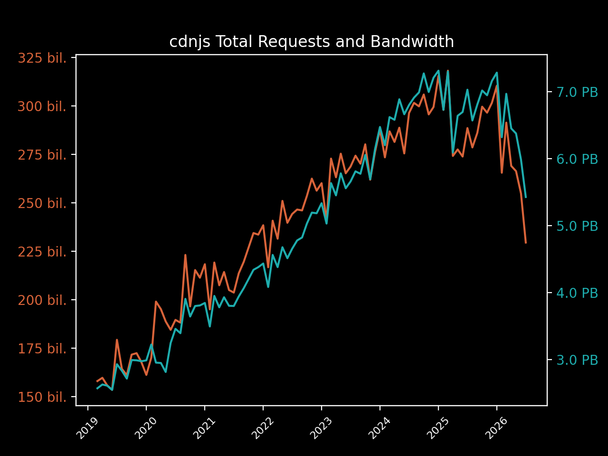
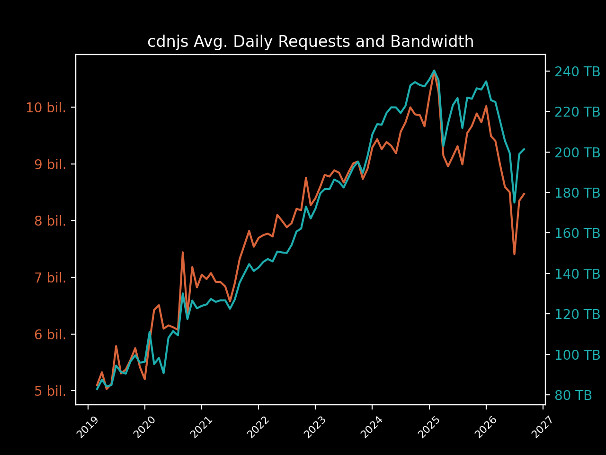
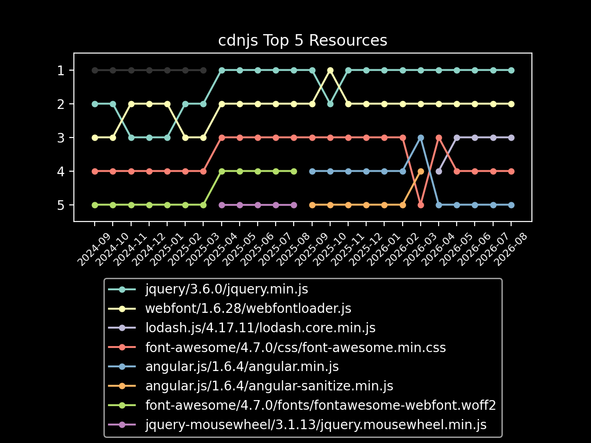
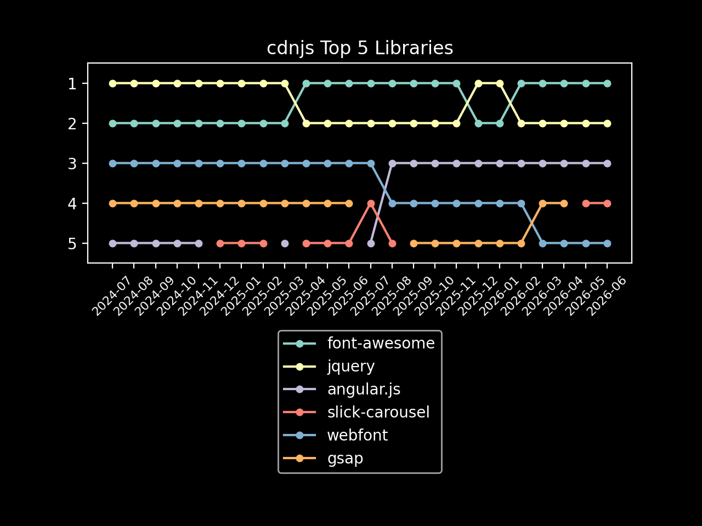

# cdnjs August 2026 Usage Stats

Information provided directly by Cloudflare for the `cdnjs.cloudflare.com` domain. ⛅️

- [Key highlights](#key-highlights)
  - [Library highlights](#library-highlights)
- [Total number of requests](#total-number-of-requests)
- [Total bandwidth usage](#total-bandwidth-usage)
- [Top 100 requested resources](#top-100-requested-resources)

## Key highlights

- This month (August 2026), cdnjs served **nearly 259 billion requests**. 🖥
- This month, cdnjs used **a huge consumption of 6.17 PB of data** to serve these requests. 📤
- That works out to **just under 199 TB of data and 8.3 billion requests every day** (averaged). 🤯
- In August, **each request to cdnjs used only 23.83 KB of data on average**. 🔍
 
### Library highlights

- The top libraries overall (in the top 100 assets) this month were font-awesome, jquery,
  and angular.js.
  - Across the 31.15 billion requests for font-awesome,
    1,698.21 TB of bandwidth was consumed.
  - jquery received 17.25 billion requests and consumed 466.68 TB
    of bandwidth, with angular.js assets in the top 100 getting 11.62 billion requests and
    using 145.82 TB of bandwidth to be served.
  - webfont came in 4th this month with 5.73 billion requests, and
    slick-carousel in 5th with 5.27 billion.
- The top asset on the CDN this month was jquery.min.js from version 3.6.0 of
  jquery, reaching a total of 8.77 billion requests and using 235.35 TB
  of bandwidth to serve the file.
  - webfont (1.6.28/webfontloader.js) came in second with
    5.73 billion requests, followed by lodash.js
    (4.17.11/lodash.core.min.js) with 5.04 billion requests.

| Total Requests & Bandwidth | Avg. Daily Requests & Bandwidth |
|---|---|
|  |  |

| Top 5 Resources | Top 5 Libraries |
|---|---|
|  |  |

## Total number of requests

> The first important stat that we are given is the total number of requests sent to cdnjs.cloudflare.com.
> 
> Cloudflare provides this number to us at a 1% sample for the whole month, giving 2,587,684,639 at 1%.

When multiplied up to 100%, this results in cdnjs serving approximately 258,768,463,900 requests in August.

**Nearly 259 billion requests or around 8.3 billion requests every day of August**. 📈

## Total bandwidth usage

> Another great stat that Cloudflare has given us again is the bandwidth usage for the cdnjs.cloudflare.com domain.
> 
> This number, like total requests, is provided at a 1% sample for the month and in gigabytes: 61,667.05 GB.

When multiplied up to be 100%, this produces the estimate of 6,166,705.0 GB of bandwidth used for this month by
 cdnjs, or 6.17 PB.

**This gives cdnjs a huge bandwidth consumption of 6.17 petabytes of data for requests this month**. 🤯

## Top 100 requested resources

> These are provided at a 1% sample for the whole of August.
> Bandwidth is measured in gigabytes.
> This data, as well as previous months' data, is available in the SQLite data.db file.

| # | Requests | Bandwidth | cdnjs Resource URL |
|---|----------|-----------|--------------------|
| 1  | 87,657,506 | 2,353.51 | [cdnjs.cloudflare.com/ajax/libs/jquery/3.6.0/jquery.min.js](https://cdnjs.cloudflare.com/ajax/libs/jquery/3.6.0/jquery.min.js)                                                           |
| 2  | 57,292,575 |   289.09 | [cdnjs.cloudflare.com/ajax/libs/webfont/1.6.28/webfontloader.js](https://cdnjs.cloudflare.com/ajax/libs/webfont/1.6.28/webfontloader.js)                                                 |
| 3  | 50,430,441 |   634.29 | [cdnjs.cloudflare.com/ajax/libs/lodash.js/4.17.11/lodash.core.min.js](https://cdnjs.cloudflare.com/ajax/libs/lodash.js/4.17.11/lodash.core.min.js)                                       |
| 4  | 40,544,717 |   254.37 | [cdnjs.cloudflare.com/ajax/libs/font-awesome/4.7.0/css/font-awesome.min.css](https://cdnjs.cloudflare.com/ajax/libs/font-awesome/4.7.0/css/font-awesome.min.css)                         |
| 5  | 31,455,737 |   825.05 | [cdnjs.cloudflare.com/ajax/libs/angular.js/1.6.4/angular.min.js](https://cdnjs.cloudflare.com/ajax/libs/angular.js/1.6.4/angular.min.js)                                                 |
| 6  | 31,437,831 |    63.19 | [cdnjs.cloudflare.com/ajax/libs/angular.js/1.6.4/angular-sanitize.min.js](https://cdnjs.cloudflare.com/ajax/libs/angular.js/1.6.4/angular-sanitize.min.js)                               |
| 7  | 26,580,467 |   263.53 | [cdnjs.cloudflare.com/ajax/libs/fingerprintjs2/2.1.2/fingerprint2.min.js](https://cdnjs.cloudflare.com/ajax/libs/fingerprintjs2/2.1.2/fingerprint2.min.js)                               |
| 8  | 26,028,369 |   698.62 | [cdnjs.cloudflare.com/ajax/libs/jquery/3.7.1/jquery.min.js](https://cdnjs.cloudflare.com/ajax/libs/jquery/3.7.1/jquery.min.js)                                                           |
| 9  | 22,673,603 | 1,634.83 | [cdnjs.cloudflare.com/ajax/libs/font-awesome/4.7.0/fonts/fontawesome-webfont.woff2](https://cdnjs.cloudflare.com/ajax/libs/font-awesome/4.7.0/fonts/fontawesome-webfont.woff2)           |
| 10 | 22,302,300 |   414.79 | [cdnjs.cloudflare.com/ajax/libs/font-awesome/6.5.2/css/all.min.css](https://cdnjs.cloudflare.com/ajax/libs/font-awesome/6.5.2/css/all.min.css)                                           |
| 11 | 20,796,308 |    39.07 | [cdnjs.cloudflare.com/ajax/libs/jquery-mousewheel/3.1.13/jquery.mousewheel.min.js](https://cdnjs.cloudflare.com/ajax/libs/jquery-mousewheel/3.1.13/jquery.mousewheel.min.js)             |
| 12 | 19,738,431 | 2,884.91 | [cdnjs.cloudflare.com/ajax/libs/font-awesome/6.5.2/webfonts/fa-solid-900.woff2](https://cdnjs.cloudflare.com/ajax/libs/font-awesome/6.5.2/webfonts/fa-solid-900.woff2)                   |
| 13 | 17,790,721 |   358.32 | [cdnjs.cloudflare.com/ajax/libs/font-awesome/6.4.0/css/all.min.css](https://cdnjs.cloudflare.com/ajax/libs/font-awesome/6.4.0/css/all.min.css)                                           |
| 14 | 17,622,417 |   337.32 | [cdnjs.cloudflare.com/ajax/libs/font-awesome/6.5.1/css/all.min.css](https://cdnjs.cloudflare.com/ajax/libs/font-awesome/6.5.1/css/all.min.css)                                           |
| 15 | 16,220,415 |   473.29 | [cdnjs.cloudflare.com/ajax/libs/jquery/1.12.4/jquery.min.js](https://cdnjs.cloudflare.com/ajax/libs/jquery/1.12.4/jquery.min.js)                                                         |
| 16 | 14,104,843 |    59.49 | [cdnjs.cloudflare.com/ajax/libs/jquery-migrate/1.4.1/jquery-migrate.min.js](https://cdnjs.cloudflare.com/ajax/libs/jquery-migrate/1.4.1/jquery-migrate.min.js)                           |
| 17 | 13,836,594 |   499.05 | [cdnjs.cloudflare.com/ajax/libs/html2canvas/1.4.1/html2canvas.min.js](https://cdnjs.cloudflare.com/ajax/libs/html2canvas/1.4.1/html2canvas.min.js)                                       |
| 18 | 13,728,367 |   459.57 | [cdnjs.cloudflare.com/ajax/libs/angular.js/1.2.22/angular.min.js](https://cdnjs.cloudflare.com/ajax/libs/angular.js/1.2.22/angular.min.js)                                               |
| 19 | 13,495,722 |   145.31 | [cdnjs.cloudflare.com/ajax/libs/font-awesome/5.15.4/css/all.min.css](https://cdnjs.cloudflare.com/ajax/libs/font-awesome/5.15.4/css/all.min.css)                                         |
| 20 | 13,249,133 |   324.64 | [cdnjs.cloudflare.com/ajax/libs/font-awesome/6.5.2/webfonts/fa-regular-400.woff2](https://cdnjs.cloudflare.com/ajax/libs/font-awesome/6.5.2/webfonts/fa-regular-400.woff2)               |
| 21 | 13,208,579 |   356.34 | [cdnjs.cloudflare.com/ajax/libs/jquery/3.3.1/jquery.min.js](https://cdnjs.cloudflare.com/ajax/libs/jquery/3.3.1/jquery.min.js)                                                           |
| 22 | 13,046,040 |   131.00 | [cdnjs.cloudflare.com/ajax/libs/fingerprintjs2/2.1.5/fingerprint2.min.js](https://cdnjs.cloudflare.com/ajax/libs/fingerprintjs2/2.1.5/fingerprint2.min.js)                               |
| 23 | 12,896,205 |   101.64 | [cdnjs.cloudflare.com/ajax/libs/angular-ui-utils/0.1.1/angular-ui-utils.min.js](https://cdnjs.cloudflare.com/ajax/libs/angular-ui-utils/0.1.1/angular-ui-utils.min.js)                   |
| 24 | 12,802,041 |    94.10 | [cdnjs.cloudflare.com/ajax/libs/angular-ui-router/0.2.10/angular-ui-router.min.js](https://cdnjs.cloudflare.com/ajax/libs/angular-ui-router/0.2.10/angular-ui-router.min.js)             |
| 25 | 12,729,801 |    18.29 | [cdnjs.cloudflare.com/ajax/libs/jquery-cookie/1.4.1/jquery.cookie.min.js](https://cdnjs.cloudflare.com/ajax/libs/jquery-cookie/1.4.1/jquery.cookie.min.js)                               |
| 26 | 12,667,176 |    37.12 | [cdnjs.cloudflare.com/ajax/libs/angular.js/1.2.22/angular-sanitize.min.js](https://cdnjs.cloudflare.com/ajax/libs/angular.js/1.2.22/angular-sanitize.min.js)                             |
| 27 | 12,613,318 |   174.52 | [cdnjs.cloudflare.com/ajax/libs/crypto-js/4.1.1/crypto-js.min.js](https://cdnjs.cloudflare.com/ajax/libs/crypto-js/4.1.1/crypto-js.min.js)                                               |
| 28 | 12,559,234 |    16.52 | [cdnjs.cloudflare.com/ajax/libs/angular.js/1.2.22/angular-cookies.min.js](https://cdnjs.cloudflare.com/ajax/libs/angular.js/1.2.22/angular-cookies.min.js)                               |
| 29 | 12,522,025 |    22.01 | [cdnjs.cloudflare.com/ajax/libs/angular-ui/0.4.0/angular-ui-ieshiv.js](https://cdnjs.cloudflare.com/ajax/libs/angular-ui/0.4.0/angular-ui-ieshiv.js)                                     |
| 30 | 12,515,357 |    22.53 | [cdnjs.cloudflare.com/ajax/libs/angular-dynamic-locale/0.1.27/tmhDynamicLocale.min.js](https://cdnjs.cloudflare.com/ajax/libs/angular-dynamic-locale/0.1.27/tmhDynamicLocale.min.js)     |
| 31 | 12,366,089 |   120.71 | [cdnjs.cloudflare.com/ajax/libs/slick-carousel/1.8.1/slick.min.js](https://cdnjs.cloudflare.com/ajax/libs/slick-carousel/1.8.1/slick.min.js)                                             |
| 32 | 12,285,402 | 1,720.47 | [cdnjs.cloudflare.com/ajax/libs/font-awesome/6.4.0/webfonts/fa-solid-900.woff2](https://cdnjs.cloudflare.com/ajax/libs/font-awesome/6.4.0/webfonts/fa-solid-900.woff2)                   |
| 33 | 12,220,405 |   326.94 | [cdnjs.cloudflare.com/ajax/libs/jquery/3.5.1/jquery.min.js](https://cdnjs.cloudflare.com/ajax/libs/jquery/3.5.1/jquery.min.js)                                                           |
| 34 | 12,157,597 | 1,774.23 | [cdnjs.cloudflare.com/ajax/libs/font-awesome/6.5.1/webfonts/fa-solid-900.woff2](https://cdnjs.cloudflare.com/ajax/libs/font-awesome/6.5.1/webfonts/fa-solid-900.woff2)                   |
| 35 | 10,610,069 |   260.62 | [cdnjs.cloudflare.com/ajax/libs/gsap/3.12.2/gsap.min.js](https://cdnjs.cloudflare.com/ajax/libs/gsap/3.12.2/gsap.min.js)                                                                 |
| 36 | 10,568,276 |    48.74 | [cdnjs.cloudflare.com/ajax/libs/angular.js/1.2.22/angular-animate.min.js](https://cdnjs.cloudflare.com/ajax/libs/angular.js/1.2.22/angular-animate.min.js)                               |
| 37 | 10,533,832 |    53.92 | [cdnjs.cloudflare.com/ajax/libs/animate.css/4.1.1/animate.min.css](https://cdnjs.cloudflare.com/ajax/libs/animate.css/4.1.1/animate.min.css)                                             |
| 38 | 10,475,077 |   167.57 | [cdnjs.cloudflare.com/ajax/libs/font-awesome/6.0.0-beta3/css/all.min.css](https://cdnjs.cloudflare.com/ajax/libs/font-awesome/6.0.0-beta3/css/all.min.css)                               |
| 39 | 10,436,529 |   264.54 | [cdnjs.cloudflare.com/ajax/libs/gsap/3.12.5/gsap.min.js](https://cdnjs.cloudflare.com/ajax/libs/gsap/3.12.5/gsap.min.js)                                                                 |
| 40 | 9,577,935  |    67.57 | [cdnjs.cloudflare.com/ajax/libs/nosleep/0.12.0/NoSleep.min.js](https://cdnjs.cloudflare.com/ajax/libs/nosleep/0.12.0/NoSleep.min.js)                                                     |
| 41 | 9,485,318  |    43.45 | [cdnjs.cloudflare.com/ajax/libs/compressorjs/1.2.1/compressor.min.js](https://cdnjs.cloudflare.com/ajax/libs/compressorjs/1.2.1/compressor.min.js)                                       |
| 42 | 9,474,192  |   184.44 | [cdnjs.cloudflare.com/ajax/libs/font-awesome/6.5.0/css/all.min.css](https://cdnjs.cloudflare.com/ajax/libs/font-awesome/6.5.0/css/all.min.css)                                           |
| 43 | 9,392,113  |   174.02 | [cdnjs.cloudflare.com/ajax/libs/font-awesome/6.4.2/css/all.min.css](https://cdnjs.cloudflare.com/ajax/libs/font-awesome/6.4.2/css/all.min.css)                                           |
| 44 | 9,016,314  |   162.29 | [cdnjs.cloudflare.com/ajax/libs/font-awesome/6.7.2/css/all.min.css](https://cdnjs.cloudflare.com/ajax/libs/font-awesome/6.7.2/css/all.min.css)                                           |
| 45 | 8,864,638  |   135.60 | [cdnjs.cloudflare.com/ajax/libs/font-awesome/6.0.0/css/all.min.css](https://cdnjs.cloudflare.com/ajax/libs/font-awesome/6.0.0/css/all.min.css)                                           |
| 46 | 8,759,023  |   238.29 | [cdnjs.cloudflare.com/ajax/libs/jquery/3.4.1/jquery.min.js](https://cdnjs.cloudflare.com/ajax/libs/jquery/3.4.1/jquery.min.js)                                                           |
| 47 | 8,695,785  |    11.01 | [cdnjs.cloudflare.com/ajax/libs/slick-carousel/1.8.1/slick.min.css](https://cdnjs.cloudflare.com/ajax/libs/slick-carousel/1.8.1/slick.min.css)                                           |
| 48 | 8,400,536  |    87.69 | [cdnjs.cloudflare.com/ajax/libs/OwlCarousel2/2.3.4/owl.carousel.min.js](https://cdnjs.cloudflare.com/ajax/libs/OwlCarousel2/2.3.4/owl.carousel.min.js)                                   |
| 49 | 8,222,660  |    46.69 | [cdnjs.cloudflare.com/ajax/libs/postscribe/2.0.8/postscribe.min.js](https://cdnjs.cloudflare.com/ajax/libs/postscribe/2.0.8/postscribe.min.js)                                           |
| 50 | 8,000,324  |   241.21 | [cdnjs.cloudflare.com/ajax/libs/gsap/latest/TweenMax.min.js](https://cdnjs.cloudflare.com/ajax/libs/gsap/latest/TweenMax.min.js)                                                         |
| 51 | 7,871,003  |   195.08 | [cdnjs.cloudflare.com/ajax/libs/gsap/3.13.0/gsap.min.js](https://cdnjs.cloudflare.com/ajax/libs/gsap/3.13.0/gsap.min.js)                                                                 |
| 52 | 7,609,252  |   558.91 | [cdnjs.cloudflare.com/ajax/libs/font-awesome/5.15.4/webfonts/fa-solid-900.woff2](https://cdnjs.cloudflare.com/ajax/libs/font-awesome/5.15.4/webfonts/fa-solid-900.woff2)                 |
| 53 | 7,507,300  |    12.72 | [cdnjs.cloudflare.com/ajax/libs/OwlCarousel2/2.3.4/assets/owl.carousel.min.css](https://cdnjs.cloudflare.com/ajax/libs/OwlCarousel2/2.3.4/assets/owl.carousel.min.css)                   |
| 54 | 7,165,704  |    26.35 | [cdnjs.cloudflare.com/ajax/libs/js-sha256/0.9.0/sha256.min.js](https://cdnjs.cloudflare.com/ajax/libs/js-sha256/0.9.0/sha256.min.js)                                                     |
| 55 | 6,680,752  |    66.75 | [cdnjs.cloudflare.com/ajax/libs/slick-carousel/1.9.0/slick.min.js](https://cdnjs.cloudflare.com/ajax/libs/slick-carousel/1.9.0/slick.min.js)                                             |
| 56 | 6,555,095  |     9.89 | [cdnjs.cloudflare.com/ajax/libs/slick-carousel/1.8.1/slick-theme.min.css](https://cdnjs.cloudflare.com/ajax/libs/slick-carousel/1.8.1/slick-theme.min.css)                               |
| 57 | 6,555,018  |   145.99 | [cdnjs.cloudflare.com/ajax/libs/snowplow/2.16.3/sp.min.js](https://cdnjs.cloudflare.com/ajax/libs/snowplow/2.16.3/sp.min.js)                                                             |
| 58 | 6,535,954  |    42.88 | [cdnjs.cloudflare.com/ajax/libs/qrcodejs/1.0.0/qrcode.min.js](https://cdnjs.cloudflare.com/ajax/libs/qrcodejs/1.0.0/qrcode.min.js)                                                       |
| 59 | 6,533,739  |   763.67 | [cdnjs.cloudflare.com/ajax/libs/font-awesome/6.0.0-beta3/webfonts/fa-solid-900.woff2](https://cdnjs.cloudflare.com/ajax/libs/font-awesome/6.0.0-beta3/webfonts/fa-solid-900.woff2)       |
| 60 | 6,329,395  |    90.73 | [cdnjs.cloudflare.com/ajax/libs/crypto-js/4.0.0/crypto-js.min.js](https://cdnjs.cloudflare.com/ajax/libs/crypto-js/4.0.0/crypto-js.min.js)                                               |
| 61 | 6,207,253  |   860.58 | [cdnjs.cloudflare.com/ajax/libs/font-awesome/6.4.2/webfonts/fa-solid-900.woff2](https://cdnjs.cloudflare.com/ajax/libs/font-awesome/6.4.2/webfonts/fa-solid-900.woff2)                   |
| 62 | 6,195,911  |    44.24 | [cdnjs.cloudflare.com/ajax/libs/popper.js/1.14.7/umd/popper.min.js](https://cdnjs.cloudflare.com/ajax/libs/popper.js/1.14.7/umd/popper.min.js)                                           |
| 63 | 6,134,171  |   905.11 | [cdnjs.cloudflare.com/ajax/libs/font-awesome/6.7.2/webfonts/fa-solid-900.woff2](https://cdnjs.cloudflare.com/ajax/libs/font-awesome/6.7.2/webfonts/fa-solid-900.woff2)                   |
| 64 | 5,962,965  |    65.77 | [cdnjs.cloudflare.com/ajax/libs/font-awesome/5.15.3/css/all.min.css](https://cdnjs.cloudflare.com/ajax/libs/font-awesome/5.15.3/css/all.min.css)                                         |
| 65 | 5,670,039  |   616.52 | [cdnjs.cloudflare.com/ajax/libs/font-awesome/6.5.1/webfonts/fa-brands-400.woff2](https://cdnjs.cloudflare.com/ajax/libs/font-awesome/6.5.1/webfonts/fa-brands-400.woff2)                 |
| 66 | 5,663,224  |   826.41 | [cdnjs.cloudflare.com/ajax/libs/font-awesome/6.5.0/webfonts/fa-solid-900.woff2](https://cdnjs.cloudflare.com/ajax/libs/font-awesome/6.5.0/webfonts/fa-solid-900.woff2)                   |
| 67 | 5,640,661  |   104.08 | [cdnjs.cloudflare.com/ajax/libs/font-awesome/6.6.0/css/all.min.css](https://cdnjs.cloudflare.com/ajax/libs/font-awesome/6.6.0/css/all.min.css)                                           |
| 68 | 5,487,576  |   557.83 | [cdnjs.cloudflare.com/ajax/libs/font-awesome/6.4.2/webfonts/fa-brands-400.woff2](https://cdnjs.cloudflare.com/ajax/libs/font-awesome/6.4.2/webfonts/fa-brands-400.woff2)                 |
| 69 | 5,305,794  |     7.25 | [cdnjs.cloudflare.com/ajax/libs/jqueryui-touch-punch/0.2.3/jquery.ui.touch-punch.min.js](https://cdnjs.cloudflare.com/ajax/libs/jqueryui-touch-punch/0.2.3/jquery.ui.touch-punch.min.js) |
| 70 | 5,205,532  |     6.52 | [cdnjs.cloudflare.com/ajax/libs/slick-carousel/1.6.0/slick.min.css](https://cdnjs.cloudflare.com/ajax/libs/slick-carousel/1.6.0/slick.min.css)                                           |
| 71 | 5,201,019  |   100.19 | [cdnjs.cloudflare.com/ajax/libs/crypto-js/4.2.0/crypto-js.min.js](https://cdnjs.cloudflare.com/ajax/libs/crypto-js/4.2.0/crypto-js.min.js)                                               |
| 72 | 5,162,659  |   116.35 | [cdnjs.cloudflare.com/ajax/libs/gsap/3.10.4/gsap.min.js](https://cdnjs.cloudflare.com/ajax/libs/gsap/3.10.4/gsap.min.js)                                                                 |
| 73 | 5,062,883  |   512.02 | [cdnjs.cloudflare.com/ajax/libs/font-awesome/6.4.0/webfonts/fa-brands-400.woff2](https://cdnjs.cloudflare.com/ajax/libs/font-awesome/6.4.0/webfonts/fa-brands-400.woff2)                 |
| 74 | 4,831,231  |    90.90 | [cdnjs.cloudflare.com/ajax/libs/fancybox/3.5.7/jquery.fancybox.min.js](https://cdnjs.cloudflare.com/ajax/libs/fancybox/3.5.7/jquery.fancybox.min.js)                                     |
| 75 | 4,788,628  |     7.12 | [cdnjs.cloudflare.com/ajax/libs/slick-carousel/1.6.0/slick-theme.min.css](https://cdnjs.cloudflare.com/ajax/libs/slick-carousel/1.6.0/slick-theme.min.css)                               |
| 76 | 4,574,700  |     5.52 | [cdnjs.cloudflare.com/ajax/libs/OwlCarousel2/2.3.4/assets/owl.theme.default.min.css](https://cdnjs.cloudflare.com/ajax/libs/OwlCarousel2/2.3.4/assets/owl.theme.default.min.css)         |
| 77 | 4,526,587  |   124.59 | [cdnjs.cloudflare.com/ajax/libs/gsap/2.1.3/TweenMax.min.js](https://cdnjs.cloudflare.com/ajax/libs/gsap/2.1.3/TweenMax.min.js)                                                           |
| 78 | 4,522,460  |    23.48 | [cdnjs.cloudflare.com/ajax/libs/plyr/3.6.8/plyr.css](https://cdnjs.cloudflare.com/ajax/libs/plyr/3.6.8/plyr.css)                                                                         |
| 79 | 4,464,065  |     5.66 | [cdnjs.cloudflare.com/ajax/libs/slick-carousel/1.9.0/slick.min.css](https://cdnjs.cloudflare.com/ajax/libs/slick-carousel/1.9.0/slick.min.css)                                           |
| 80 | 4,449,317  |    72.75 | [cdnjs.cloudflare.com/ajax/libs/font-awesome/7.0.1/css/all.min.css](https://cdnjs.cloudflare.com/ajax/libs/font-awesome/7.0.1/css/all.min.css)                                           |
| 81 | 4,432,069  |    29.84 | [cdnjs.cloudflare.com/ajax/libs/popper.js/1.12.9/umd/popper.min.js](https://cdnjs.cloudflare.com/ajax/libs/popper.js/1.12.9/umd/popper.min.js)                                           |
| 82 | 4,301,309  |   111.96 | [cdnjs.cloudflare.com/ajax/libs/jquery/2.2.4/jquery.min.js](https://cdnjs.cloudflare.com/ajax/libs/jquery/2.2.4/jquery.min.js)                                                           |
| 83 | 4,293,125  |    27.79 | [cdnjs.cloudflare.com/ajax/libs/font-awesome/4.7.0/css/font-awesome.css](https://cdnjs.cloudflare.com/ajax/libs/font-awesome/4.7.0/css/font-awesome.css)                                 |
| 84 | 4,174,114  |    14.38 | [cdnjs.cloudflare.com/ajax/libs/fancybox/3.5.7/jquery.fancybox.min.css](https://cdnjs.cloudflare.com/ajax/libs/fancybox/3.5.7/jquery.fancybox.min.css)                                   |
| 85 | 4,159,015  |    69.76 | [cdnjs.cloudflare.com/ajax/libs/moment.js/2.30.1/moment.min.js](https://cdnjs.cloudflare.com/ajax/libs/moment.js/2.30.1/moment.min.js)                                                   |
| 86 | 4,151,644  |   361.08 | [cdnjs.cloudflare.com/ajax/libs/hls.js/1.4.3/hls.min.js](https://cdnjs.cloudflare.com/ajax/libs/hls.js/1.4.3/hls.min.js)                                                                 |
| 87 | 4,091,301  |   110.87 | [cdnjs.cloudflare.com/ajax/libs/plyr/3.6.8/plyr.min.js](https://cdnjs.cloudflare.com/ajax/libs/plyr/3.6.8/plyr.min.js)                                                                   |
| 88 | 4,085,131  |   107.85 | [cdnjs.cloudflare.com/ajax/libs/jquery/3.2.1/jquery.min.js](https://cdnjs.cloudflare.com/ajax/libs/jquery/3.2.1/jquery.min.js)                                                           |
| 89 | 3,946,621  |    24.54 | [cdnjs.cloudflare.com/ajax/libs/qrious/4.0.2/qrious.min.js](https://cdnjs.cloudflare.com/ajax/libs/qrious/4.0.2/qrious.min.js)                                                           |
| 90 | 3,929,599  |    15.28 | [cdnjs.cloudflare.com/ajax/libs/slick-carousel/1.8.1/ajax-loader.gif](https://cdnjs.cloudflare.com/ajax/libs/slick-carousel/1.8.1/ajax-loader.gif)                                       |
| 91 | 3,923,921  |    22.86 | [cdnjs.cloudflare.com/ajax/libs/magnific-popup.js/1.1.0/jquery.magnific-popup.min.js](https://cdnjs.cloudflare.com/ajax/libs/magnific-popup.js/1.1.0/jquery.magnific-popup.min.js)       |
| 92 | 3,909,791  |    15.00 | [cdnjs.cloudflare.com/ajax/libs/lazysizes/5.3.2/lazysizes.min.js](https://cdnjs.cloudflare.com/ajax/libs/lazysizes/5.3.2/lazysizes.min.js)                                               |
| 93 | 3,865,666  |    26.30 | [cdnjs.cloudflare.com/ajax/libs/animejs/3.1.0/anime.min.js](https://cdnjs.cloudflare.com/ajax/libs/animejs/3.1.0/anime.min.js)                                                           |
| 94 | 3,738,340  |     8.01 | [cdnjs.cloudflare.com/ajax/libs/angular.js/1.2.22/angular-touch.min.js](https://cdnjs.cloudflare.com/ajax/libs/angular.js/1.2.22/angular-touch.min.js)                                   |
| 95 | 3,713,081  |    27.54 | [cdnjs.cloudflare.com/ajax/libs/underscore.js/1.13.7/underscore-min.js](https://cdnjs.cloudflare.com/ajax/libs/underscore.js/1.13.7/underscore-min.js)                                   |
| 96 | 3,693,425  |   437.57 | [cdnjs.cloudflare.com/ajax/libs/font-awesome/6.0.0/webfonts/fa-solid-900.woff2](https://cdnjs.cloudflare.com/ajax/libs/font-awesome/6.0.0/webfonts/fa-solid-900.woff2)                   |
| 97 | 3,689,002  |     7.19 | [cdnjs.cloudflare.com/ajax/libs/jquery.lazyload/1.9.1/jquery.lazyload.min.js](https://cdnjs.cloudflare.com/ajax/libs/jquery.lazyload/1.9.1/jquery.lazyload.min.js)                       |
| 98 | 3,674,456  |    25.54 | [cdnjs.cloudflare.com/ajax/libs/popper.js/1.14.3/umd/popper.min.js](https://cdnjs.cloudflare.com/ajax/libs/popper.js/1.14.3/umd/popper.min.js)                                           |

Author: [Matt (IPv4) Cowley](https://mattcowley.co.uk) - If there are any errors, please let me know and I will
 endeavour to correct them.
