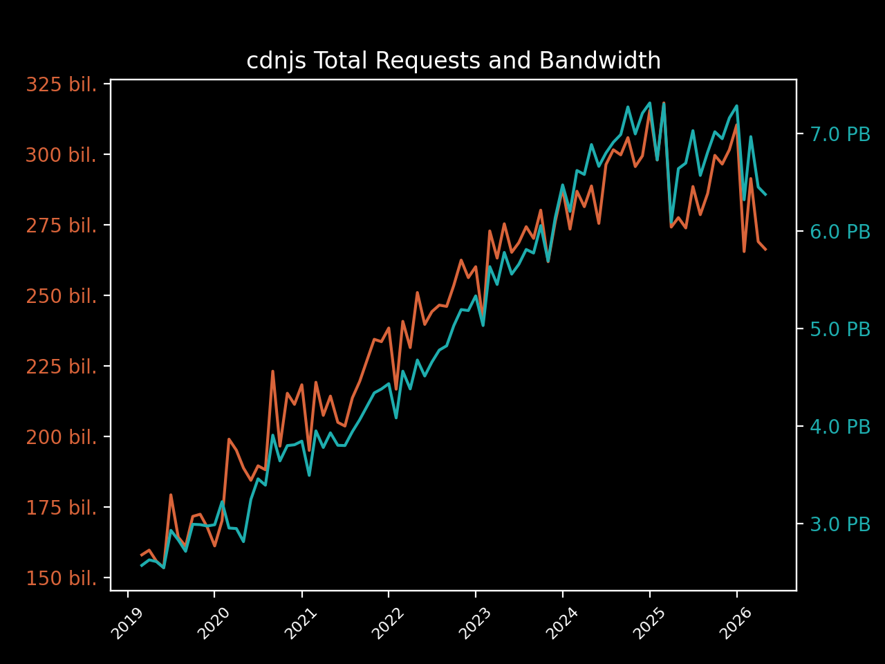
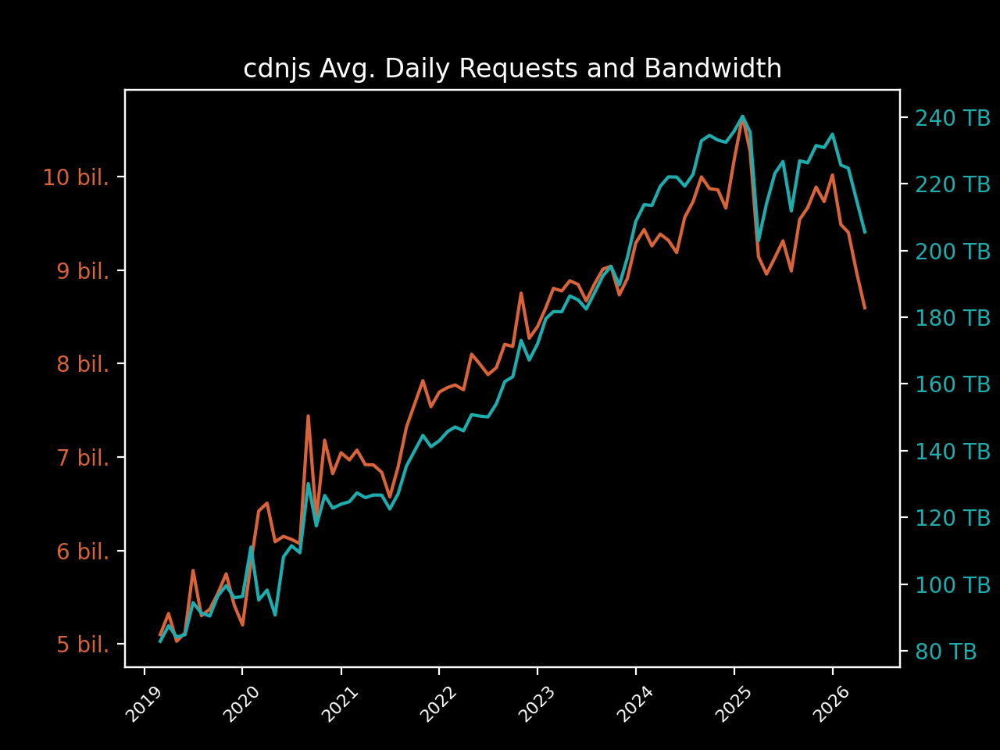
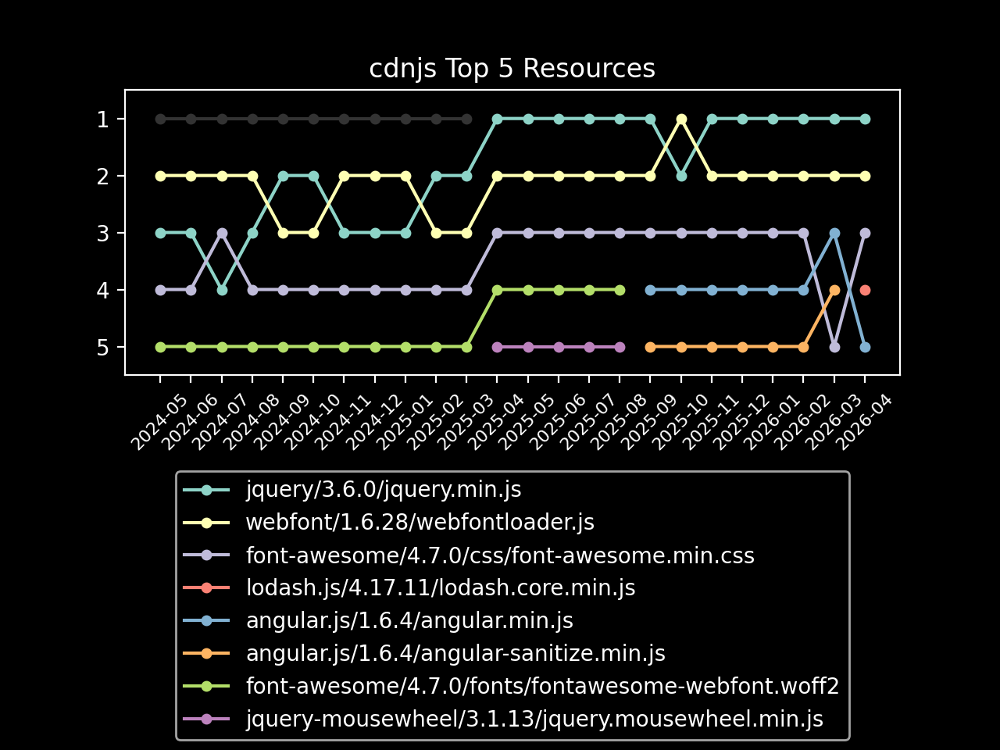
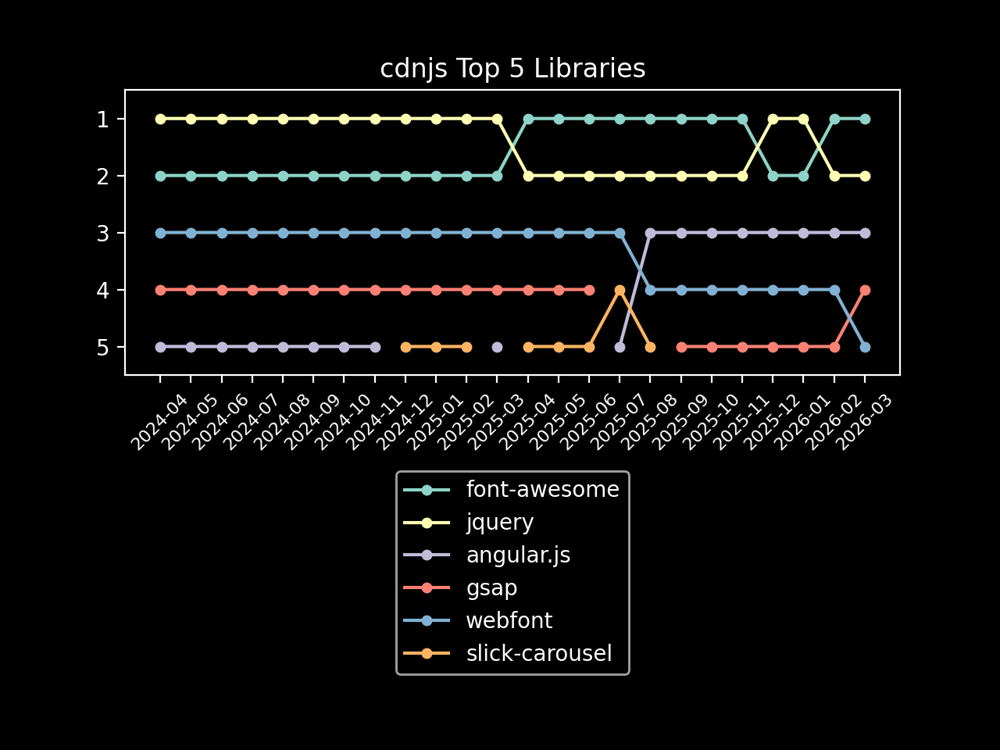

# cdnjs May 2026 Usage Stats

Information provided directly by Cloudflare for the `cdnjs.cloudflare.com` domain. ⛅️

- [Key highlights](#key-highlights)
  - [Library highlights](#library-highlights)
- [Total number of requests](#total-number-of-requests)
- [Total bandwidth usage](#total-bandwidth-usage)
- [Top 100 requested resources](#top-100-requested-resources)

## Key highlights

- cdnjs served **over 266 billion requests** in May 2026. 🖥
- cdnjs used **a huge consumption of 6.37 PB of data** to serve these requests this month. 📤
- That's **nearly 206 terabytes of data and 8.6 billion requests every day** (averaged). 🤯
- In May, **each request to cdnjs used only 23.92 KB of data on average**. 🔍
 
### Library highlights

- The top libraries overall (in the top 100 assets) this month were font-awesome, jquery,
  and angular.js.
  - Across the 31.16 billion requests for font-awesome,
    1,644.97 TB of bandwidth was consumed.
  - jquery received 23.00 billion requests and consumed 605.16 TB
    of bandwidth, with angular.js assets in the top 100 getting 11.67 billion requests and
    using 144.68 TB of bandwidth to be served.
  - slick-carousel came in 4th this month with 6.01 billion requests, and
    webfont in 5th with 5.63 billion.
- The top asset on the CDN this month was jquery.min.js from version 3.6.0 of
  jquery, reaching a total of 13.93 billion requests and using 374.32 TB
  of bandwidth to serve the file.
  - webfont (1.6.28/webfontloader.js) came in second with
    5.63 billion requests, followed by lodash.js
    (4.17.11/lodash.core.min.js) with 5.42 billion requests.

| Total Requests & Bandwidth | Avg. Daily Requests & Bandwidth |
|---|---|
|  |  |

| Top 5 Resources | Top 5 Libraries |
|---|---|
|  |  |

## Total number of requests

> The first important stat that we are given is the total number of requests sent to cdnjs.cloudflare.com.
> 
> Cloudflare provides this number to us at a 1% sample for the whole month, giving 2,664,525,467 at 1%.

When multiplied up to 100%, this results in cdnjs serving approximately 266,452,546,700 requests in May.

**Over 266 billion requests or around 8.6 billion requests each day of May**. 📈

## Total bandwidth usage

> Another great stat that Cloudflare has given us again is the bandwidth usage for the cdnjs.cloudflare.com domain.
> 
> This number, like total requests, is provided at a 1% sample for the month and in gigabytes: 63,733.06 GB.

When multiplied up to be 100%, this produces the estimate of 6,373,306.0 GB of bandwidth used for this month by
 cdnjs, or 6.37 PB.

**This gives cdnjs a huge bandwidth consumption of 6.37 petabytes of data for requests this month**. 🤯

## Top 100 requested resources

> These are provided at a 1% sample for the whole of May.
> Bandwidth is measured in gigabytes.
> This data, as well as previous months' data, is available in the SQLite data.db file.

| # | Requests | Bandwidth | cdnjs Resource URL |
|---|----------|-----------|--------------------|
| 1  | 139,305,819 | 3,743.25 | [cdnjs.cloudflare.com/ajax/libs/jquery/3.6.0/jquery.min.js](https://cdnjs.cloudflare.com/ajax/libs/jquery/3.6.0/jquery.min.js)                                                           |
| 2  | 56,307,801  |   286.16 | [cdnjs.cloudflare.com/ajax/libs/webfont/1.6.28/webfontloader.js](https://cdnjs.cloudflare.com/ajax/libs/webfont/1.6.28/webfontloader.js)                                                 |
| 3  | 54,177,765  |   681.75 | [cdnjs.cloudflare.com/ajax/libs/lodash.js/4.17.11/lodash.core.min.js](https://cdnjs.cloudflare.com/ajax/libs/lodash.js/4.17.11/lodash.core.min.js)                                       |
| 4  | 39,789,212  |   254.45 | [cdnjs.cloudflare.com/ajax/libs/font-awesome/4.7.0/css/font-awesome.min.css](https://cdnjs.cloudflare.com/ajax/libs/font-awesome/4.7.0/css/font-awesome.min.css)                         |
| 5  | 34,630,285  |   859.97 | [cdnjs.cloudflare.com/ajax/libs/angular.js/1.6.4/angular.min.js](https://cdnjs.cloudflare.com/ajax/libs/angular.js/1.6.4/angular.min.js)                                                 |
| 6  | 34,469,367  |    69.46 | [cdnjs.cloudflare.com/ajax/libs/angular.js/1.6.4/angular-sanitize.min.js](https://cdnjs.cloudflare.com/ajax/libs/angular.js/1.6.4/angular-sanitize.min.js)                               |
| 7  | 23,136,792  |   231.26 | [cdnjs.cloudflare.com/ajax/libs/fingerprintjs2/2.1.2/fingerprint2.min.js](https://cdnjs.cloudflare.com/ajax/libs/fingerprintjs2/2.1.2/fingerprint2.min.js)                               |
| 8  | 22,296,571  | 1,554.16 | [cdnjs.cloudflare.com/ajax/libs/font-awesome/4.7.0/fonts/fontawesome-webfont.woff2](https://cdnjs.cloudflare.com/ajax/libs/font-awesome/4.7.0/fonts/fontawesome-webfont.woff2)           |
| 9  | 21,735,255  |   583.71 | [cdnjs.cloudflare.com/ajax/libs/jquery/3.7.1/jquery.min.js](https://cdnjs.cloudflare.com/ajax/libs/jquery/3.7.1/jquery.min.js)                                                           |
| 10 | 20,795,345  |   386.18 | [cdnjs.cloudflare.com/ajax/libs/font-awesome/6.5.2/css/all.min.css](https://cdnjs.cloudflare.com/ajax/libs/font-awesome/6.5.2/css/all.min.css)                                           |
| 11 | 19,007,144  | 2,757.52 | [cdnjs.cloudflare.com/ajax/libs/font-awesome/6.5.2/webfonts/fa-solid-900.woff2](https://cdnjs.cloudflare.com/ajax/libs/font-awesome/6.5.2/webfonts/fa-solid-900.woff2)                   |
| 12 | 18,922,648  |    36.48 | [cdnjs.cloudflare.com/ajax/libs/jquery-mousewheel/3.1.13/jquery.mousewheel.min.js](https://cdnjs.cloudflare.com/ajax/libs/jquery-mousewheel/3.1.13/jquery.mousewheel.min.js)             |
| 13 | 17,926,648  |   334.23 | [cdnjs.cloudflare.com/ajax/libs/font-awesome/6.4.0/css/all.min.css](https://cdnjs.cloudflare.com/ajax/libs/font-awesome/6.4.0/css/all.min.css)                                           |
| 14 | 16,214,136  |   342.59 | [cdnjs.cloudflare.com/ajax/libs/jquery/3.5.1/jquery.min.js](https://cdnjs.cloudflare.com/ajax/libs/jquery/3.5.1/jquery.min.js)                                                           |
| 15 | 15,340,307  |   309.78 | [cdnjs.cloudflare.com/ajax/libs/font-awesome/6.5.1/css/all.min.css](https://cdnjs.cloudflare.com/ajax/libs/font-awesome/6.5.1/css/all.min.css)                                           |
| 16 | 15,286,886  |   428.91 | [cdnjs.cloudflare.com/ajax/libs/jquery/1.12.4/jquery.min.js](https://cdnjs.cloudflare.com/ajax/libs/jquery/1.12.4/jquery.min.js)                                                         |
| 17 | 13,968,102  |   421.29 | [cdnjs.cloudflare.com/ajax/libs/angular.js/1.2.22/angular.min.js](https://cdnjs.cloudflare.com/ajax/libs/angular.js/1.2.22/angular.min.js)                                               |
| 18 | 13,941,759  |   148.56 | [cdnjs.cloudflare.com/ajax/libs/font-awesome/5.15.4/css/all.min.css](https://cdnjs.cloudflare.com/ajax/libs/font-awesome/5.15.4/css/all.min.css)                                         |
| 19 | 13,537,433  |   487.99 | [cdnjs.cloudflare.com/ajax/libs/html2canvas/1.4.1/html2canvas.min.js](https://cdnjs.cloudflare.com/ajax/libs/html2canvas/1.4.1/html2canvas.min.js)                                       |
| 20 | 13,473,903  |   185.58 | [cdnjs.cloudflare.com/ajax/libs/crypto-js/4.1.1/crypto-js.min.js](https://cdnjs.cloudflare.com/ajax/libs/crypto-js/4.1.1/crypto-js.min.js)                                               |
| 21 | 13,228,558  |   324.20 | [cdnjs.cloudflare.com/ajax/libs/font-awesome/6.5.2/webfonts/fa-regular-400.woff2](https://cdnjs.cloudflare.com/ajax/libs/font-awesome/6.5.2/webfonts/fa-regular-400.woff2)               |
| 22 | 13,120,724  |    54.83 | [cdnjs.cloudflare.com/ajax/libs/jquery-migrate/1.4.1/jquery-migrate.min.js](https://cdnjs.cloudflare.com/ajax/libs/jquery-migrate/1.4.1/jquery-migrate.min.js)                           |
| 23 | 12,975,615  |   341.81 | [cdnjs.cloudflare.com/ajax/libs/jquery/3.3.1/jquery.min.js](https://cdnjs.cloudflare.com/ajax/libs/jquery/3.3.1/jquery.min.js)                                                           |
| 24 | 12,582,501  | 1,720.52 | [cdnjs.cloudflare.com/ajax/libs/font-awesome/6.4.0/webfonts/fa-solid-900.woff2](https://cdnjs.cloudflare.com/ajax/libs/font-awesome/6.4.0/webfonts/fa-solid-900.woff2)                   |
| 25 | 12,361,158  |   116.60 | [cdnjs.cloudflare.com/ajax/libs/slick-carousel/1.8.1/slick.min.js](https://cdnjs.cloudflare.com/ajax/libs/slick-carousel/1.8.1/slick.min.js)                                             |
| 26 | 12,249,292  |    18.27 | [cdnjs.cloudflare.com/ajax/libs/jquery-cookie/1.4.1/jquery.cookie.min.js](https://cdnjs.cloudflare.com/ajax/libs/jquery-cookie/1.4.1/jquery.cookie.min.js)                               |
| 27 | 12,097,303  |    93.29 | [cdnjs.cloudflare.com/ajax/libs/angular-ui-utils/0.1.1/angular-ui-utils.min.js](https://cdnjs.cloudflare.com/ajax/libs/angular-ui-utils/0.1.1/angular-ui-utils.min.js)                   |
| 28 | 12,018,614  |    86.62 | [cdnjs.cloudflare.com/ajax/libs/angular-ui-router/0.2.10/angular-ui-router.min.js](https://cdnjs.cloudflare.com/ajax/libs/angular-ui-router/0.2.10/angular-ui-router.min.js)             |
| 29 | 11,898,924  |    34.86 | [cdnjs.cloudflare.com/ajax/libs/angular.js/1.2.22/angular-sanitize.min.js](https://cdnjs.cloudflare.com/ajax/libs/angular.js/1.2.22/angular-sanitize.min.js)                             |
| 30 | 11,832,288  |    16.20 | [cdnjs.cloudflare.com/ajax/libs/angular.js/1.2.22/angular-cookies.min.js](https://cdnjs.cloudflare.com/ajax/libs/angular.js/1.2.22/angular-cookies.min.js)                               |
| 31 | 11,780,188  |    21.17 | [cdnjs.cloudflare.com/ajax/libs/angular-ui/0.4.0/angular-ui-ieshiv.js](https://cdnjs.cloudflare.com/ajax/libs/angular-ui/0.4.0/angular-ui-ieshiv.js)                                     |
| 32 | 11,779,820  |    21.62 | [cdnjs.cloudflare.com/ajax/libs/angular-dynamic-locale/0.1.27/tmhDynamicLocale.min.js](https://cdnjs.cloudflare.com/ajax/libs/angular-dynamic-locale/0.1.27/tmhDynamicLocale.min.js)     |
| 33 | 11,435,298  |   293.09 | [cdnjs.cloudflare.com/ajax/libs/jquery/3.4.1/jquery.min.js](https://cdnjs.cloudflare.com/ajax/libs/jquery/3.4.1/jquery.min.js)                                                           |
| 34 | 11,200,174  |    55.69 | [cdnjs.cloudflare.com/ajax/libs/animate.css/4.1.1/animate.min.css](https://cdnjs.cloudflare.com/ajax/libs/animate.css/4.1.1/animate.min.css)                                             |
| 35 | 11,175,672  | 1,601.95 | [cdnjs.cloudflare.com/ajax/libs/font-awesome/6.5.1/webfonts/fa-solid-900.woff2](https://cdnjs.cloudflare.com/ajax/libs/font-awesome/6.5.1/webfonts/fa-solid-900.woff2)                   |
| 36 | 11,051,697  |   163.61 | [cdnjs.cloudflare.com/ajax/libs/font-awesome/6.0.0-beta3/css/all.min.css](https://cdnjs.cloudflare.com/ajax/libs/font-awesome/6.0.0-beta3/css/all.min.css)                               |
| 37 | 10,633,082  |   260.14 | [cdnjs.cloudflare.com/ajax/libs/gsap/3.12.2/gsap.min.js](https://cdnjs.cloudflare.com/ajax/libs/gsap/3.12.2/gsap.min.js)                                                                 |
| 38 | 9,925,946   |    45.03 | [cdnjs.cloudflare.com/ajax/libs/angular.js/1.2.22/angular-animate.min.js](https://cdnjs.cloudflare.com/ajax/libs/angular.js/1.2.22/angular-animate.min.js)                               |
| 39 | 9,593,502   |   242.67 | [cdnjs.cloudflare.com/ajax/libs/gsap/3.12.5/gsap.min.js](https://cdnjs.cloudflare.com/ajax/libs/gsap/3.12.5/gsap.min.js)                                                                 |
| 40 | 9,363,926   |   141.99 | [cdnjs.cloudflare.com/ajax/libs/font-awesome/6.0.0/css/all.min.css](https://cdnjs.cloudflare.com/ajax/libs/font-awesome/6.0.0/css/all.min.css)                                           |
| 41 | 9,313,650   |   170.74 | [cdnjs.cloudflare.com/ajax/libs/font-awesome/6.4.2/css/all.min.css](https://cdnjs.cloudflare.com/ajax/libs/font-awesome/6.4.2/css/all.min.css)                                           |
| 42 | 9,285,611   |    66.19 | [cdnjs.cloudflare.com/ajax/libs/nosleep/0.12.0/NoSleep.min.js](https://cdnjs.cloudflare.com/ajax/libs/nosleep/0.12.0/NoSleep.min.js)                                                     |
| 43 | 9,172,941   |    42.66 | [cdnjs.cloudflare.com/ajax/libs/compressorjs/1.2.1/compressor.min.js](https://cdnjs.cloudflare.com/ajax/libs/compressorjs/1.2.1/compressor.min.js)                                       |
| 44 | 9,066,529   |    51.83 | [cdnjs.cloudflare.com/ajax/libs/postscribe/2.0.8/postscribe.min.js](https://cdnjs.cloudflare.com/ajax/libs/postscribe/2.0.8/postscribe.min.js)                                           |
| 45 | 8,590,965   |    88.88 | [cdnjs.cloudflare.com/ajax/libs/OwlCarousel2/2.3.4/owl.carousel.min.js](https://cdnjs.cloudflare.com/ajax/libs/OwlCarousel2/2.3.4/owl.carousel.min.js)                                   |
| 46 | 8,506,418   |   210.72 | [cdnjs.cloudflare.com/ajax/libs/gsap/3.13.0/gsap.min.js](https://cdnjs.cloudflare.com/ajax/libs/gsap/3.13.0/gsap.min.js)                                                                 |
| 47 | 8,455,498   |    11.21 | [cdnjs.cloudflare.com/ajax/libs/slick-carousel/1.8.1/slick.min.css](https://cdnjs.cloudflare.com/ajax/libs/slick-carousel/1.8.1/slick.min.css)                                           |
| 48 | 8,298,370   |   157.06 | [cdnjs.cloudflare.com/ajax/libs/font-awesome/6.5.0/css/all.min.css](https://cdnjs.cloudflare.com/ajax/libs/font-awesome/6.5.0/css/all.min.css)                                           |
| 49 | 8,067,799   |   142.07 | [cdnjs.cloudflare.com/ajax/libs/font-awesome/6.7.2/css/all.min.css](https://cdnjs.cloudflare.com/ajax/libs/font-awesome/6.7.2/css/all.min.css)                                           |
| 50 | 8,008,533   |   576.45 | [cdnjs.cloudflare.com/ajax/libs/font-awesome/5.15.4/webfonts/fa-solid-900.woff2](https://cdnjs.cloudflare.com/ajax/libs/font-awesome/5.15.4/webfonts/fa-solid-900.woff2)                 |
| 51 | 7,548,936   |    13.23 | [cdnjs.cloudflare.com/ajax/libs/OwlCarousel2/2.3.4/assets/owl.carousel.min.css](https://cdnjs.cloudflare.com/ajax/libs/OwlCarousel2/2.3.4/assets/owl.carousel.min.css)                   |
| 52 | 7,422,747   |   223.77 | [cdnjs.cloudflare.com/ajax/libs/gsap/latest/TweenMax.min.js](https://cdnjs.cloudflare.com/ajax/libs/gsap/latest/TweenMax.min.js)                                                         |
| 53 | 7,174,664   |   432.45 | [cdnjs.cloudflare.com/ajax/libs/lottie-web/5.12.1/lottie.min.js](https://cdnjs.cloudflare.com/ajax/libs/lottie-web/5.12.1/lottie.min.js)                                                 |
| 54 | 7,049,434   |   809.91 | [cdnjs.cloudflare.com/ajax/libs/font-awesome/6.0.0-beta3/webfonts/fa-solid-900.woff2](https://cdnjs.cloudflare.com/ajax/libs/font-awesome/6.0.0-beta3/webfonts/fa-solid-900.woff2)       |
| 55 | 6,969,591   |    96.99 | [cdnjs.cloudflare.com/ajax/libs/crypto-js/4.0.0/crypto-js.min.js](https://cdnjs.cloudflare.com/ajax/libs/crypto-js/4.0.0/crypto-js.min.js)                                               |
| 56 | 6,904,608   |    75.19 | [cdnjs.cloudflare.com/ajax/libs/slick-carousel/1.9.0/slick.min.js](https://cdnjs.cloudflare.com/ajax/libs/slick-carousel/1.9.0/slick.min.js)                                             |
| 57 | 6,681,859   |    10.46 | [cdnjs.cloudflare.com/ajax/libs/slick-carousel/1.8.1/slick-theme.min.css](https://cdnjs.cloudflare.com/ajax/libs/slick-carousel/1.8.1/slick-theme.min.css)                               |
| 58 | 6,331,716   |    44.86 | [cdnjs.cloudflare.com/ajax/libs/popper.js/1.14.7/umd/popper.min.js](https://cdnjs.cloudflare.com/ajax/libs/popper.js/1.14.7/umd/popper.min.js)                                           |
| 59 | 6,251,084   |    40.14 | [cdnjs.cloudflare.com/ajax/libs/qrcodejs/1.0.0/qrcode.min.js](https://cdnjs.cloudflare.com/ajax/libs/qrcodejs/1.0.0/qrcode.min.js)                                                       |
| 60 | 5,954,975   |   110.65 | [cdnjs.cloudflare.com/ajax/libs/font-awesome/6.6.0/css/all.min.css](https://cdnjs.cloudflare.com/ajax/libs/font-awesome/6.6.0/css/all.min.css)                                           |
| 61 | 5,835,661   |    71.03 | [cdnjs.cloudflare.com/ajax/libs/slick-carousel/1.6.0/slick.js](https://cdnjs.cloudflare.com/ajax/libs/slick-carousel/1.6.0/slick.js)                                                     |
| 62 | 5,804,511   |     7.61 | [cdnjs.cloudflare.com/ajax/libs/slick-carousel/1.6.0/slick.min.css](https://cdnjs.cloudflare.com/ajax/libs/slick-carousel/1.6.0/slick.min.css)                                           |
| 63 | 5,781,365   |     9.90 | [cdnjs.cloudflare.com/ajax/libs/gsap/3.13.0/CSSRulePlugin.min.js](https://cdnjs.cloudflare.com/ajax/libs/gsap/3.13.0/CSSRulePlugin.min.js)                                               |
| 64 | 5,769,660   |   789.70 | [cdnjs.cloudflare.com/ajax/libs/font-awesome/6.4.2/webfonts/fa-solid-900.woff2](https://cdnjs.cloudflare.com/ajax/libs/font-awesome/6.4.2/webfonts/fa-solid-900.woff2)                   |
| 65 | 5,634,574   |   608.35 | [cdnjs.cloudflare.com/ajax/libs/font-awesome/6.5.1/webfonts/fa-brands-400.woff2](https://cdnjs.cloudflare.com/ajax/libs/font-awesome/6.5.1/webfonts/fa-brands-400.woff2)                 |
| 66 | 5,624,228   |   124.27 | [cdnjs.cloudflare.com/ajax/libs/snowplow/2.16.3/sp.min.js](https://cdnjs.cloudflare.com/ajax/libs/snowplow/2.16.3/sp.min.js)                                                             |
| 67 | 5,540,655   |   543.69 | [cdnjs.cloudflare.com/ajax/libs/font-awesome/6.4.0/webfonts/fa-brands-400.woff2](https://cdnjs.cloudflare.com/ajax/libs/font-awesome/6.4.0/webfonts/fa-brands-400.woff2)                 |
| 68 | 5,526,877   |    55.34 | [cdnjs.cloudflare.com/ajax/libs/fingerprintjs2/2.1.5/fingerprint2.min.js](https://cdnjs.cloudflare.com/ajax/libs/fingerprintjs2/2.1.5/fingerprint2.min.js)                               |
| 69 | 5,525,474   |     7.89 | [cdnjs.cloudflare.com/ajax/libs/jqueryui-touch-punch/0.2.3/jquery.ui.touch-punch.min.js](https://cdnjs.cloudflare.com/ajax/libs/jqueryui-touch-punch/0.2.3/jquery.ui.touch-punch.min.js) |
| 70 | 5,449,340   |     8.28 | [cdnjs.cloudflare.com/ajax/libs/slick-carousel/1.6.0/slick-theme.min.css](https://cdnjs.cloudflare.com/ajax/libs/slick-carousel/1.6.0/slick-theme.min.css)                               |
| 71 | 5,445,134   |   768.83 | [cdnjs.cloudflare.com/ajax/libs/font-awesome/6.7.2/webfonts/fa-solid-900.woff2](https://cdnjs.cloudflare.com/ajax/libs/font-awesome/6.7.2/webfonts/fa-solid-900.woff2)                   |
| 72 | 5,277,284   |    57.26 | [cdnjs.cloudflare.com/ajax/libs/font-awesome/5.15.3/css/all.min.css](https://cdnjs.cloudflare.com/ajax/libs/font-awesome/5.15.3/css/all.min.css)                                         |
| 73 | 5,274,362   |   119.05 | [cdnjs.cloudflare.com/ajax/libs/gsap/3.10.4/gsap.min.js](https://cdnjs.cloudflare.com/ajax/libs/gsap/3.10.4/gsap.min.js)                                                                 |
| 74 | 5,119,307   |   596.75 | [cdnjs.cloudflare.com/ajax/libs/font-awesome/6.0.0/webfonts/fa-solid-900.woff2](https://cdnjs.cloudflare.com/ajax/libs/font-awesome/6.0.0/webfonts/fa-solid-900.woff2)                   |
| 75 | 4,905,270   |   492.07 | [cdnjs.cloudflare.com/ajax/libs/font-awesome/6.4.2/webfonts/fa-brands-400.woff2](https://cdnjs.cloudflare.com/ajax/libs/font-awesome/6.4.2/webfonts/fa-brands-400.woff2)                 |
| 76 | 4,895,232   |    90.07 | [cdnjs.cloudflare.com/ajax/libs/fancybox/3.5.7/jquery.fancybox.min.js](https://cdnjs.cloudflare.com/ajax/libs/fancybox/3.5.7/jquery.fancybox.min.js)                                     |
| 77 | 4,804,480   |   108.92 | [cdnjs.cloudflare.com/ajax/libs/jquery/3.6.1/jquery.min.js](https://cdnjs.cloudflare.com/ajax/libs/jquery/3.6.1/jquery.min.js)                                                           |
| 78 | 4,700,766   |   672.14 | [cdnjs.cloudflare.com/ajax/libs/font-awesome/6.5.0/webfonts/fa-solid-900.woff2](https://cdnjs.cloudflare.com/ajax/libs/font-awesome/6.5.0/webfonts/fa-solid-900.woff2)                   |
| 79 | 4,664,051   |    31.01 | [cdnjs.cloudflare.com/ajax/libs/popper.js/1.12.9/umd/popper.min.js](https://cdnjs.cloudflare.com/ajax/libs/popper.js/1.12.9/umd/popper.min.js)                                           |
| 80 | 4,663,839   |     5.94 | [cdnjs.cloudflare.com/ajax/libs/OwlCarousel2/2.3.4/assets/owl.theme.default.min.css](https://cdnjs.cloudflare.com/ajax/libs/OwlCarousel2/2.3.4/assets/owl.theme.default.min.css)         |
| 81 | 4,581,474   |    17.01 | [cdnjs.cloudflare.com/ajax/libs/js-sha256/0.9.0/sha256.min.js](https://cdnjs.cloudflare.com/ajax/libs/js-sha256/0.9.0/sha256.min.js)                                                     |
| 82 | 4,556,835   |    23.77 | [cdnjs.cloudflare.com/ajax/libs/plyr/3.6.8/plyr.css](https://cdnjs.cloudflare.com/ajax/libs/plyr/3.6.8/plyr.css)                                                                         |
| 83 | 4,532,967   |    86.50 | [cdnjs.cloudflare.com/ajax/libs/crypto-js/4.2.0/crypto-js.min.js](https://cdnjs.cloudflare.com/ajax/libs/crypto-js/4.2.0/crypto-js.min.js)                                               |
| 84 | 4,495,977   |     5.98 | [cdnjs.cloudflare.com/ajax/libs/slick-carousel/1.9.0/slick.min.css](https://cdnjs.cloudflare.com/ajax/libs/slick-carousel/1.9.0/slick.min.css)                                           |
| 85 | 4,384,227   |    15.12 | [cdnjs.cloudflare.com/ajax/libs/fancybox/3.5.7/jquery.fancybox.min.css](https://cdnjs.cloudflare.com/ajax/libs/fancybox/3.5.7/jquery.fancybox.min.css)                                   |
| 86 | 4,362,700   |   105.67 | [cdnjs.cloudflare.com/ajax/libs/gsap/3.11.4/gsap.min.js](https://cdnjs.cloudflare.com/ajax/libs/gsap/3.11.4/gsap.min.js)                                                                 |
| 87 | 4,350,746   |   226.63 | [cdnjs.cloudflare.com/ajax/libs/bodymovin/5.7.6/lottie.min.js](https://cdnjs.cloudflare.com/ajax/libs/bodymovin/5.7.6/lottie.min.js)                                                     |
| 88 | 4,267,639   |   106.10 | [cdnjs.cloudflare.com/ajax/libs/jquery/2.2.4/jquery.min.js](https://cdnjs.cloudflare.com/ajax/libs/jquery/2.2.4/jquery.min.js)                                                           |
| 89 | 4,160,091   |    97.68 | [cdnjs.cloudflare.com/ajax/libs/font-awesome/6.4.0/webfonts/fa-regular-400.woff2](https://cdnjs.cloudflare.com/ajax/libs/font-awesome/6.4.0/webfonts/fa-regular-400.woff2)               |
| 90 | 4,143,186   |    16.37 | [cdnjs.cloudflare.com/ajax/libs/slick-carousel/1.8.1/ajax-loader.gif](https://cdnjs.cloudflare.com/ajax/libs/slick-carousel/1.8.1/ajax-loader.gif)                                       |
| 91 | 4,139,209   |    26.51 | [cdnjs.cloudflare.com/ajax/libs/font-awesome/4.7.0/css/font-awesome.css](https://cdnjs.cloudflare.com/ajax/libs/font-awesome/4.7.0/css/font-awesome.css)                                 |
| 92 | 4,000,629   |   103.26 | [cdnjs.cloudflare.com/ajax/libs/jquery/3.2.1/jquery.min.js](https://cdnjs.cloudflare.com/ajax/libs/jquery/3.2.1/jquery.min.js)                                                           |
| 93 | 3,998,677   |   111.64 | [cdnjs.cloudflare.com/ajax/libs/gsap/2.1.3/TweenMax.min.js](https://cdnjs.cloudflare.com/ajax/libs/gsap/2.1.3/TweenMax.min.js)                                                           |
| 94 | 3,966,797   |   344.55 | [cdnjs.cloudflare.com/ajax/libs/hls.js/1.4.3/hls.min.js](https://cdnjs.cloudflare.com/ajax/libs/hls.js/1.4.3/hls.min.js)                                                                 |
| 95 | 3,922,370   |   106.27 | [cdnjs.cloudflare.com/ajax/libs/plyr/3.6.8/plyr.min.js](https://cdnjs.cloudflare.com/ajax/libs/plyr/3.6.8/plyr.min.js)                                                                   |
| 96 | 3,919,129   |    40.54 | [cdnjs.cloudflare.com/ajax/libs/font-awesome/5.13.0/css/all.min.css](https://cdnjs.cloudflare.com/ajax/libs/font-awesome/5.13.0/css/all.min.css)                                         |
| 97 | 3,911,518   |    25.41 | [cdnjs.cloudflare.com/ajax/libs/popper.js/1.14.3/umd/popper.min.js](https://cdnjs.cloudflare.com/ajax/libs/popper.js/1.14.3/umd/popper.min.js)                                           |
| 98 | 3,815,152   |    92.14 | [cdnjs.cloudflare.com/ajax/libs/font-awesome/6.5.1/webfonts/fa-regular-400.woff2](https://cdnjs.cloudflare.com/ajax/libs/font-awesome/6.5.1/webfonts/fa-regular-400.woff2)               |

Author: [Matt (IPv4) Cowley](https://mattcowley.co.uk) - If there are any errors, please let me know and I will
 endeavour to correct them.
